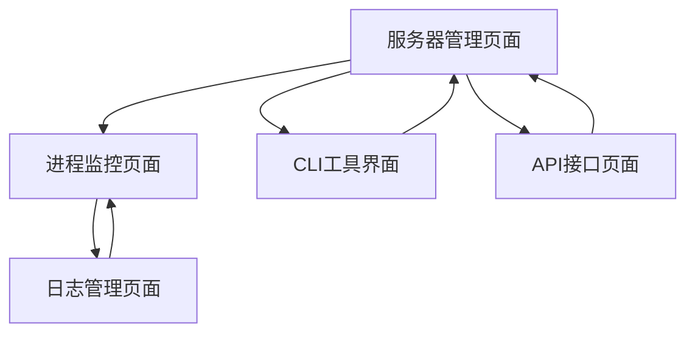

# MCP服务器技术实现架构文档

## 1. 产品概述

本文档详细说明了MCP (Model Context Protocol) 服务器在API项目中的技术实现架构，包括服务器的生成、启动、进程管理、状态监控等核心功能的实现细节。

该系统采用进程隔离的架构设计，通过CLI工具启动独立的MCP服务器进程，实现了高可用性、可扩展性和故障隔离的服务器管理方案。

## 2. 核心功能

### 2.1 用户角色

| 角色 | 注册方式 | 核心权限 |
|------|----------|----------|
| 系统管理员 | 默认访问 | 可以创建、启动、停止、监控MCP服务器 |
| 开发者 | API访问 | 可以通过API接口管理MCP服务器实例 |

### 2.2 功能模块

本系统主要包含以下核心页面和功能：

1. **服务器管理页面**: 服务器创建、配置管理、状态监控
2. **进程监控页面**: 进程生命周期管理、健康检查、日志查看
3. **CLI工具界面**: 命令行启动配置、参数设置
4. **API接口页面**: RESTful API接口管理、文档展示
5. **日志管理页面**: 系统日志、错误日志、性能监控

### 2.3 页面详情

| 页面名称 | 模块名称 | 功能描述 |
|----------|----------|----------|
| 服务器管理页面 | 服务器创建模块 | 创建新的MCP服务器实例，配置传输协议、端口、认证等参数 |
| 服务器管理页面 | 服务器配置模块 | 管理服务器配置文件，设置OpenAPI源、工作目录等 |
| 服务器管理页面 | 状态监控模块 | 实时显示服务器运行状态、连接数、响应时间等指标 |
| 进程监控页面 | 进程管理模块 | 启动、停止、重启MCP服务器进程，查看进程信息 |
| 进程监控页面 | 健康检查模块 | 定期检查进程健康状态，自动重启失败进程 |
| 进程监控页面 | 日志查看模块 | 查看进程标准输出、错误输出和系统日志 |
| CLI工具界面 | 命令行配置模块 | 配置CLI启动参数，支持stdio、sse、streamable传输模式 |
| CLI工具界面 | 参数管理模块 | 管理认证令牌、自定义头部、监听端口等启动参数 |
| API接口页面 | 接口管理模块 | 提供RESTful API用于程序化管理MCP服务器 |
| API接口页面 | 文档展示模块 | 自动生成和展示OpenAPI文档，支持在线测试 |
| 日志管理页面 | 系统日志模块 | 记录系统操作日志、错误信息和性能数据 |
| 日志管理页面 | 监控告警模块 | 监控系统资源使用情况，提供告警机制 |

## 3. 核心流程

### 3.1 MCP服务器创建和启动流程

1. **服务器配置**: 用户通过API或界面配置服务器参数（传输协议、端口、OpenAPI源等）
2. **参数验证**: 系统验证配置参数的有效性和完整性
3. **CLI命令构建**: 根据配置参数构建CLI启动命令
4. **进程启动**: 使用ProcessManagerService启动独立的MCP服务器进程
5. **健康检查**: 启动健康检查监控，确保服务器正常运行
6. **状态更新**: 更新服务器状态并发送启动成功事件

### 3.2 进程生命周期管理流程

1. **进程监控**: 持续监控进程状态和健康情况
2. **异常检测**: 检测进程异常退出或健康检查失败
3. **自动重启**: 根据重启策略自动重启失败的进程
4. **优雅停止**: 接收停止信号时优雅关闭服务器和清理资源
5. **状态同步**: 实时同步进程状态到管理系统

### 3.3 页面导航流程图



## 4. 用户界面设计

### 4.1 设计风格

- **主色调**: #2563eb (蓝色), #1f2937 (深灰色)
- **辅助色**: #10b981 (绿色), #ef4444 (红色), #f59e0b (橙色)
- **按钮样式**: 圆角按钮，支持悬停和点击效果
- **字体**: 系统默认字体，主要文本14px，标题16-20px
- **布局风格**: 卡片式布局，顶部导航栏，侧边栏菜单
- **图标风格**: 使用Heroicons或类似的现代图标库

### 4.2 页面设计概览

| 页面名称 | 模块名称 | UI元素 |
|----------|----------|--------|
| 服务器管理页面 | 服务器列表 | 表格展示服务器信息，包含状态指示器、操作按钮 |
| 服务器管理页面 | 创建服务器表单 | 模态框表单，包含传输协议选择、端口输入、认证配置 |
| 进程监控页面 | 进程状态卡片 | 卡片式布局显示进程ID、状态、CPU/内存使用率 |
| 进程监控页面 | 操作按钮组 | 启动、停止、重启按钮，使用不同颜色区分操作类型 |
| CLI工具界面 | 命令行预览 | 代码块样式显示生成的CLI命令，支持复制功能 |
| CLI工具界面 | 参数配置面板 | 表单控件配置各种CLI参数，实时更新命令预览 |
| 日志管理页面 | 日志查看器 | 滚动文本区域显示日志内容，支持搜索和过滤 |
| 日志管理页面 | 日志级别过滤 | 标签式过滤器，支持按日志级别筛选内容 |

### 4.3 响应式设计

系统采用桌面优先的响应式设计，支持移动端适配。在移动设备上，侧边栏会折叠为汉堡菜单，表格会转换为卡片式布局，确保良好的触摸交互体验。

## 5. 技术架构详解

### 5.1 核心服务组件

#### ServerLifecycleService (服务器生命周期服务)
- **职责**: 管理MCP服务器的启动和停止
- **关键方法**:
  - `startServer()`: 启动MCP服务器进程
  - `stopServer()`: 停止MCP服务器进程
  - `startStreamableServer()`: 启动流式传输服务器
  - `startSSEServer()`: 启动SSE传输服务器

#### ProcessManagerService (进程管理服务)
- **职责**: 管理子进程的生命周期
- **关键方法**:
  - `startProcess()`: 启动新进程
  - `stopProcess()`: 停止指定进程
  - `restartProcess()`: 重启进程
  - `getProcessInfo()`: 获取进程信息
  - `getProcessMetrics()`: 获取进程性能指标

#### ProcessHealthService (进程健康检查服务)
- **职责**: 监控进程健康状态
- **关键方法**:
  - `startHealthCheck()`: 开始健康检查
  - `stopHealthCheck()`: 停止健康检查
  - `performHealthCheck()`: 执行健康检查

#### ServerManagerService (服务器管理服务)
- **职责**: 协调整体服务器管理流程
- **关键功能**:
  - 监听进程生命周期事件
  - 更新服务器状态
  - 处理进程异常和重启

### 5.2 CLI工具实现

#### 命令行参数解析
```typescript
// CLI参数配置
interface CLIOptions {
  transport: 'stdio' | 'sse' | 'streamable';
  port?: number;
  endpoint?: string;
  managed?: boolean;
  autoRestart?: boolean;
  openapi: string; // URL或文件路径
  watch?: boolean;
  auth?: string; // Bearer Token
  headers?: Record<string, string>;
}
```

#### 启动命令构建
```typescript
// 构建CLI启动参数
private buildCLIArgs(config: ServerConfig): string[] {
  const args = [
    '--transport', config.transport,
    '--openapi', config.openapiUrl,
    '--managed', 'true',
    '--auto-restart', 'true'
  ];
  
  if (config.port) {
    args.push('--port', config.port.toString());
  }
  
  if (config.endpoint) {
    args.push('--endpoint', config.endpoint);
  }
  
  return args;
}
```

### 5.3 进程隔离架构

#### 进程启动流程
1. **参数验证**: 验证OpenAPI数据和配置参数
2. **CLI命令构建**: 根据传输协议构建启动命令
3. **进程配置**: 设置重启策略、健康检查、工作目录
4. **子进程启动**: 使用`child_process.spawn`启动独立进程
5. **事件监听**: 设置进程事件监听器
6. **健康检查**: 启动定期健康检查
7. **状态同步**: 发送启动成功事件

#### 进程通信机制
- **IPC通信**: 父子进程间通过IPC进行状态通信
- **健康检查**: 定期发送健康检查消息
- **信号处理**: 支持SIGTERM、SIGINT、SIGHUP信号
- **优雅关闭**: 接收关闭信号时优雅停止服务

### 5.4 状态监控实现

#### 进程状态管理
```typescript
interface ProcessInfo {
  id: string;
  pid?: number;
  status: ProcessStatus;
  startTime: Date;
  restartCount: number;
  lastHealthCheck?: Date;
  memoryUsage?: number;
  cpuUsage?: number;
}
```

#### 健康检查机制
- **检查频率**: 可配置的检查间隔（默认30秒）
- **检查方式**: 通过IPC发送健康检查消息
- **失败处理**: 连续失败达到阈值时触发重启
- **状态记录**: 记录健康检查结果和时间戳

### 5.5 日志管理系统

#### 日志收集
- **标准输出**: 捕获子进程的stdout和stderr
- **系统日志**: 记录进程启动、停止、错误等事件
- **性能日志**: 记录CPU、内存使用情况
- **操作日志**: 记录用户操作和API调用

#### 日志存储和查询
- **文件存储**: 按日期和进程ID分类存储日志文件
- **数据库记录**: 关键事件存储到数据库便于查询
- **日志轮转**: 自动清理过期日志文件
- **实时查看**: 支持实时日志流查看

## 6. API接口设计

### 6.1 服务器管理接口

```typescript
// 创建服务器
POST /api/servers
{
  "name": "string",
  "transport": "stdio|sse|streamable",
  "port": "number",
  "endpoint": "string",
  "openapiUrl": "string",
  "authToken": "string"
}

// 启动服务器
POST /api/servers/{id}/start

// 停止服务器
POST /api/servers/{id}/stop

// 获取服务器状态
GET /api/servers/{id}/status

// 获取服务器列表
GET /api/servers
```

### 6.2 进程管理接口

```typescript
// 获取进程信息
GET /api/processes/{id}

// 获取进程日志
GET /api/processes/{id}/logs

// 获取进程性能指标
GET /api/processes/{id}/metrics

// 重启进程
POST /api/processes/{id}/restart
```

## 7. 部署和配置

### 7.1 环境变量配置

```bash
# 进程管理配置
PROCESS_TIMEOUT=30000
PROCESS_MAX_RETRIES=3
PROCESS_HEALTH_CHECK_INTERVAL=30000

# MCP服务器配置
MCP_SERVER_SCRIPT_PATH=/app/scripts/mcp-server-runner.js
MCP_DEFAULT_PORT=3001
MCP_DEFAULT_TRANSPORT=streamable

# 日志配置
LOG_LEVEL=info
LOG_MAX_FILES=10
LOG_MAX_SIZE=10m
```

### 7.2 Docker部署配置

```dockerfile
# 复制脚本文件
COPY scripts/ /app/scripts/
RUN chmod +x /app/scripts/mcp-server-runner.js

# 创建必要目录
RUN mkdir -p /app/logs /app/data /app/config

# 设置工作目录
WORKDIR /app
```

## 8. 性能优化和最佳实践

### 8.1 性能优化策略

- **进程池管理**: 限制同时运行的MCP服务器数量
- **资源监控**: 监控CPU和内存使用，防止资源耗尽
- **连接复用**: 对于HTTP传输，启用连接复用
- **缓存机制**: 缓存OpenAPI文档和配置信息
- **异步处理**: 使用异步I/O处理进程通信

### 8.2 安全最佳实践

- **进程隔离**: 每个MCP服务器运行在独立进程中
- **权限控制**: 限制子进程的系统权限
- **输入验证**: 严格验证所有输入参数
- **认证机制**: 支持Bearer Token认证
- **日志脱敏**: 避免在日志中记录敏感信息

### 8.3 监控和告警

- **健康检查**: 定期检查服务器健康状态
- **性能监控**: 监控响应时间、吞吐量等指标
- **异常告警**: 进程异常时及时告警
- **资源告警**: CPU、内存使用率过高时告警
- **日志监控**: 监控错误日志和异常模式

## 9. 故障排除和维护

### 9.1 常见问题排查

- **进程启动失败**: 检查CLI参数、OpenAPI URL有效性
- **健康检查失败**: 检查进程状态、网络连接
- **内存泄漏**: 监控内存使用趋势，及时重启
- **端口冲突**: 检查端口占用情况
- **权限问题**: 检查文件和目录权限

### 9.2 维护操作

- **日志清理**: 定期清理过期日志文件
- **配置更新**: 支持热更新配置参数
- **版本升级**: 支持滚动升级，最小化服务中断
- **备份恢复**: 定期备份配置和数据
- **性能调优**: 根据监控数据调整参数

## 10. 总结

本MCP服务器技术实现架构通过进程隔离、CLI工具启动、完善的生命周期管理和监控机制，实现了高可用、可扩展、易维护的服务器管理方案。系统支持多种传输协议，提供完整的API接口，具备强大的监控和日志功能，能够满足企业级应用的需求。

通过合理的架构设计和最佳实践，系统能够有效处理进程异常、自动恢复故障、提供实时监控，为MCP服务器的稳定运行提供了可靠保障。