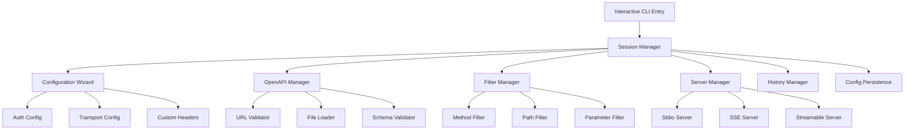
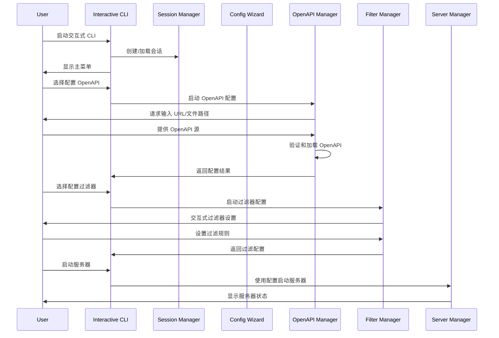

# MCP Swagger Server 交互式 CLI 技术方案

## 1. 方案可行性分析

### 1.1 现有架构优势
- **模块化设计**：现有的 `mcp-swagger-server` 已经具备良好的模块化架构，包含独立的服务器实现（stdio、sse、streamable）
- **完整的功能支持**：已支持 OpenAPI 解析、认证配置、自定义请求头、操作过滤等核心功能
- **TypeScript 实现**：类型安全，便于扩展和维护
- **丰富的依赖生态**：已集成 `@modelcontextprotocol/sdk`、`axios`、`chalk` 等成熟库

### 1.2 技术可行性
✅ **高度可行** - 基于以下技术优势：
- 现有 CLI 框架已经实现了所有核心功能
- 可以复用现有的服务器启动逻辑和配置解析
- TypeScript 生态系统提供了丰富的交互式 CLI 库
- 项目结构清晰，便于扩展

### 1.3 参考实现对比
| 特性 | Claude Code CLI | Gemini CLI | 目标实现 |
|------|----------------|------------|----------|
| 交互式界面 | ✅ | ✅ | ✅ |
| 会话管理 | ✅ | ✅ | ✅ |
| 配置向导 | ✅ | ✅ | ✅ |
| 实时预览 | ✅ | ✅ | ✅ |
| 历史记录 | ✅ | ✅ | ✅ |

## 2. 核心技术栈

### 2.1 交互式界面技术
- **inquirer.js** - 交互式命令行用户界面
- **chalk** - 终端字符串样式（已集成）
- **ora** - 优雅的终端加载指示器
- **boxen** - 在终端中创建框架
- **cli-table3** - 美观的表格显示

### 2.2 会话管理技术
- **conf** - 简单的配置管理
- **node-persist** - 本地数据持久化
- **readline** - Node.js 内置的行读取接口

### 2.3 实时功能技术
- **chokidar** - 文件监控（可选升级现有实现）
- **ws** - WebSocket 支持（用于实时状态更新）
- **blessed** - 高级终端界面库（可选）

## 3. 架构设计

### 3.1 整体架构


### 3.2 核心模块设计

#### 3.2.1 Interactive CLI Manager
```typescript
interface InteractiveCLI {
  start(): Promise<void>;
  showMainMenu(): Promise<MenuChoice>;
  handleUserInput(choice: MenuChoice): Promise<void>;
  exit(): Promise<void>;
}
```

#### 3.2.2 Session Manager
```typescript
interface SessionManager {
  createSession(): Session;
  saveSession(session: Session): Promise<void>;
  loadSession(id: string): Promise<Session>;
  listSessions(): Promise<Session[]>;
}
```

#### 3.2.3 Configuration Wizard
```typescript
interface ConfigurationWizard {
  runWizard(): Promise<ServerConfig>;
  configureTransport(): Promise<TransportConfig>;
  configureAuth(): Promise<AuthConfig>;
  configureFilters(): Promise<FilterConfig>;
}
```

### 3.3 数据流设计


## 4. 用户体验设计

### 4.1 主界面设计
```
┌─────────────────────────────────────────────────────────────┐
│                    🚀 MCP Swagger Server                    │
│                     Interactive CLI v2.0                   │
├─────────────────────────────────────────────────────────────┤
│  📋 当前会话: session-2024-01-15-001                        │
│  📡 服务器状态: 未启动                                        │
│  📄 OpenAPI 源: 未配置                                       │
├─────────────────────────────────────────────────────────────┤
│  1. 🔧 配置 OpenAPI 数据源                                   │
│  2. 🎯 设置操作过滤规则                                       │
│  3. 🔐 配置认证选项                                          │
│  4. 🌐 配置传输协议                                          │
│  5. 🚀 启动 MCP 服务器                                       │
│  6. 📊 查看服务器状态                                        │
│  7. 📝 管理会话历史                                          │
│  8. ❌ 退出                                                 │
└─────────────────────────────────────────────────────────────┘
```

### 4.2 配置向导界面
```
┌─────────────────────────────────────────────────────────────┐
│                  📄 OpenAPI 数据源配置                       │
├─────────────────────────────────────────────────────────────┤
│  请选择 OpenAPI 数据源类型:                                   │
│                                                             │
│  ○ 远程 URL (https://...)                                   │
│  ● 本地文件 (./openapi.json)                                │
│  ○ 从历史记录选择                                            │
│                                                             │
│  📁 文件路径: ./examples/petstore.yaml                       │
│  ✅ 文件验证: 通过                                           │
│  📊 API 信息: Swagger Petstore v1.0.0 (12 endpoints)        │
│                                                             │
│  [继续] [返回] [取消]                                         │
└─────────────────────────────────────────────────────────────┘
```

### 4.3 过滤器配置界面
```
┌─────────────────────────────────────────────────────────────┐
│                   🎯 操作过滤规则配置                         │
├─────────────────────────────────────────────────────────────┤
│  HTTP 方法过滤:                                              │
│  ☑ GET    ☑ POST   ☑ PUT    ☑ DELETE                       │
│  ☐ PATCH  ☐ HEAD   ☐ OPTIONS                               │
│                                                             │
│  路径过滤 (支持通配符):                                       │
│  ✓ /api/v1/users/*                                          │
│  ✓ /api/v1/orders                                           │
│  ✗ /internal/*                                              │
│                                                             │
│  状态码过滤:                                                 │
│  ☑ 2xx Success  ☑ 4xx Client Error  ☐ 5xx Server Error     │
│                                                             │
│  参数过滤:                                                   │
│  包含参数: id, name, email                                   │
│  排除参数: password, secret                                  │
│                                                             │
│  [预览结果] [保存配置] [重置] [返回]                           │
└─────────────────────────────────────────────────────────────┘
```

## 5. 核心功能特性

### 5.1 智能配置向导
- **步骤式引导**：分步骤完成复杂配置
- **实时验证**：输入时即时验证配置有效性
- **智能建议**：基于 OpenAPI 内容提供配置建议
- **配置预览**：配置完成前预览最终效果

### 5.2 会话管理
- **会话持久化**：自动保存配置和状态
- **历史记录**：快速恢复之前的配置
- **会话切换**：支持多个项目配置并行
- **配置导入导出**：支持配置文件的导入导出

### 5.3 实时监控
- **服务器状态监控**：实时显示服务器运行状态
- **请求日志**：实时显示 API 请求日志
- **性能指标**：显示响应时间、请求量等指标
- **错误追踪**：详细的错误信息和堆栈跟踪

### 5.4 高级过滤功能
- **可视化过滤器**：图形化的过滤规则设置
- **正则表达式支持**：高级路径和参数匹配
- **条件过滤**：基于请求内容的动态过滤
- **过滤预览**：实时预览过滤结果

## 6. 技术实现细节

### 6.1 项目结构
```
src/
├── interactive-cli/
│   ├── index.ts                 # 交互式 CLI 入口
│   ├── managers/
│   │   ├── session-manager.ts   # 会话管理
│   │   ├── config-manager.ts    # 配置管理
│   │   └── server-manager.ts    # 服务器管理
│   ├── wizards/
│   │   ├── openapi-wizard.ts    # OpenAPI 配置向导
│   │   ├── filter-wizard.ts     # 过滤器配置向导
│   │   ├── auth-wizard.ts       # 认证配置向导
│   │   └── transport-wizard.ts  # 传输协议配置向导
│   ├── ui/
│   │   ├── menu-renderer.ts     # 菜单渲染器
│   │   ├── table-renderer.ts    # 表格渲染器
│   │   ├── progress-renderer.ts # 进度渲染器
│   │   └── status-renderer.ts   # 状态渲染器
│   └── utils/
│       ├── input-validator.ts   # 输入验证
│       ├── config-serializer.ts # 配置序列化
│       └── history-manager.ts   # 历史管理
└── cli-interactive.ts           # 新的 CLI 入口点
```

### 6.2 核心依赖升级
```json
{
  "dependencies": {
    "inquirer": "^9.2.0",
    "ora": "^7.0.0",
    "boxen": "^7.1.0",
    "cli-table3": "^0.6.3",
    "conf": "^11.0.0",
    "node-persist": "^4.0.0",
    "blessed": "^0.1.81",
    "chokidar": "^3.5.3"
  }
}
```

### 6.3 配置数据结构
```typescript
interface InteractiveSession {
  id: string;
  name: string;
  createdAt: Date;
  updatedAt: Date;
  config: {
    openapi: {
      source: string;
      type: 'url' | 'file';
      validated: boolean;
      metadata?: OpenAPIMetadata;
    };
    transport: {
      type: 'stdio' | 'sse' | 'streamable';
      port?: number;
      endpoint?: string;
    };
    auth: AuthConfig;
    filters: {
      methods: string[];
      paths: string[];
      operationIds: string[];
      statusCodes: number[];
      parameters: {
        include: string[];
        exclude: string[];
      };
    };
    customHeaders: Record<string, string>;
  };
  serverStatus: {
    running: boolean;
    pid?: number;
    startTime?: Date;
    url?: string;
  };
}
```

## 7. 性能优化策略

### 7.1 启动性能
- **懒加载模块**：按需加载重型依赖
- **配置缓存**：缓存已验证的配置
- **并行初始化**：并行执行独立的初始化任务

### 7.2 交互响应性
- **异步操作**：所有 I/O 操作使用异步模式
- **进度指示**：长时间操作显示进度
- **中断处理**：支持用户中断长时间操作

### 7.3 内存管理
- **流式处理**：大文件使用流式读取
- **定期清理**：定期清理不需要的缓存
- **内存监控**：监控内存使用情况

## 8. 错误处理和用户体验

### 8.1 错误处理策略
- **分层错误处理**：不同层级的错误采用不同处理策略
- **用户友好的错误信息**：将技术错误转换为用户可理解的信息
- **错误恢复**：提供错误恢复建议和自动修复选项
- **错误日志**：详细记录错误信息用于调试

### 8.2 用户体验优化
- **智能默认值**：基于上下文提供合理的默认配置
- **快捷键支持**：常用操作支持快捷键
- **撤销/重做**：支持配置的撤销和重做
- **帮助系统**：内置详细的帮助文档和示例

## 9. 兼容性考虑

### 9.1 向后兼容
- **命令行参数兼容**：保持现有命令行参数的完全兼容
- **配置文件兼容**：支持现有的配置文件格式
- **API 兼容**：保持现有编程接口的兼容性

### 9.2 平台兼容
- **跨平台支持**：Windows、macOS、Linux 全平台支持
- **终端兼容**：支持各种终端环境
- **编码支持**：正确处理各种字符编码

## 10. 测试策略

### 10.1 单元测试
- **核心逻辑测试**：配置解析、验证逻辑等
- **UI 组件测试**：菜单、表格等 UI 组件
- **工具函数测试**：各种工具函数的测试

### 10.2 集成测试
- **端到端测试**：完整的用户操作流程测试
- **配置测试**：各种配置组合的测试
- **服务器集成测试**：与现有服务器的集成测试

### 10.3 用户体验测试
- **可用性测试**：真实用户的使用体验测试
- **性能测试**：各种场景下的性能表现
- **兼容性测试**：不同平台和环境的兼容性

## 11. 部署和发布

### 11.1 构建流程
- **TypeScript 编译**：编译为 JavaScript
- **依赖打包**：打包所有必要依赖
- **资源优化**：压缩和优化资源文件

### 11.2 发布策略
- **渐进式发布**：先发布 beta 版本收集反馈
- **版本管理**：语义化版本管理
- **文档更新**：同步更新相关文档

## 12. 总结

交互式 CLI 的实现具有很高的技术可行性，基于现有的 `mcp-swagger-server` 架构，可以通过引入现代化的交互式 CLI 库来实现类似 Claude Code 或 Gemini CLI 的用户体验。

**主要优势：**
- 复用现有的核心功能和架构
- 提供更友好的用户交互体验
- 支持复杂配置的可视化管理
- 具备良好的扩展性和维护性

**实施建议：**
1. 先实现核心的交互式界面框架
2. 逐步迁移现有功能到交互式模式
3. 保持向后兼容性
4. 充分测试用户体验

这个方案不仅技术上可行，而且能够显著提升 `mcp-swagger-server` 的用户体验和易用性。