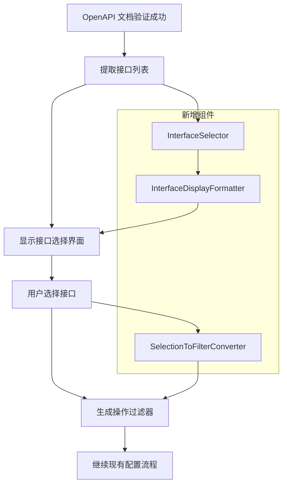

# OpenAPI 接口选择功能技术可行性分析

## 1. 需求概述

在 `mcp-swagger-server` 项目的交互式 CLI 中，当 OpenAPI 文档验证成功后，需要显示一个具体接口列表，供用户选择转换哪些接口为 MCP tool，或者禁止哪些接口转换为 MCP tool。

## 2. 现有架构分析

### 2.1 核心组件

基于对项目代码的分析，现有架构包含以下核心组件：

1. **OpenAPI 解析器** (`mcp-swagger-parser`)
   - `OpenAPIParser` 类：负责解析和验证 OpenAPI 文档
   - `EndpointExtractor` 类：从 OpenAPI 规范中提取接口信息
   - 支持 Swagger 2.0 到 OpenAPI 3.0 的转换

2. **MCP 工具转换器** (`OpenAPIToMCPTransformer`)
   - 将 OpenAPI 操作转换为 MCP tools
   - 支持操作过滤 (`OperationFilter`)
   - 包含完整的请求处理逻辑

3. **交互式 CLI** (`mcp-swagger-server`)
   - `OpenAPIWizard` 类：处理用户交互和配置
   - `SessionManager` 类：管理会话配置
   - 支持多步骤配置向导

### 2.2 现有过滤机制

项目已经实现了强大的操作过滤功能：

```typescript
interface OperationFilter {
  methods?: {
    include?: string[];
    exclude?: string[];
  };
  paths?: {
    include?: string[];
    exclude?: string[];
  };
  operationIds?: {
    include?: string[];
    exclude?: string[];
  };
  statusCodes?: {
    include?: number[];
    exclude?: number[];
  };
  parameters?: {
    required?: string[];
    forbidden?: string[];
  };
  customFilter?: (operation: OperationObject, method: string, path: string) => boolean;
}
```

### 2.3 接口提取能力

`EndpointExtractor` 类已经具备从 OpenAPI 规范中提取接口信息的能力：

- 支持接口分组和统计
- 提供端点详细信息
- 支持过滤和筛选

## 3. 技术可行性评估

### 3.1 可行性等级：**高度可行** ⭐⭐⭐⭐⭐

基于现有架构分析，该功能具有高度可行性，原因如下：

1. **现有基础设施完备**：项目已具备完整的 OpenAPI 解析、接口提取和转换能力
2. **交互式框架成熟**：`OpenAPIWizard` 提供了完善的用户交互框架
3. **过滤机制健全**：现有的 `OperationFilter` 机制可以直接复用
4. **架构设计合理**：模块化设计便于扩展新功能

### 3.2 技术优势

1. **零破坏性改动**：新功能可以作为现有配置向导的一个步骤插入
2. **复用现有组件**：大量现有代码可以直接复用
3. **一致的用户体验**：与现有 CLI 交互模式保持一致
4. **灵活的过滤选项**：支持多种过滤和选择方式

## 4. 具体实现方案

### 4.1 实现架构



### 4.2 核心实现步骤

#### 步骤 1：创建接口选择器组件

```typescript
// src/interactive-cli/components/interface-selector.ts
export class InterfaceSelector {
  constructor(
    private spec: OpenAPISpec,
    private extractor: EndpointExtractor
  ) {}

  async selectInterfaces(): Promise<OperationFilter> {
    // 1. 提取所有接口
    const endpoints = this.extractor.extractEndpoints();
    
    // 2. 格式化显示
    const choices = this.formatEndpointsForSelection(endpoints);
    
    // 3. 用户选择
    const selected = await this.promptUserSelection(choices);
    
    // 4. 转换为过滤器
    return this.convertToOperationFilter(selected);
  }
}
```

#### 步骤 2：集成到 OpenAPI 配置向导

在 `OpenAPIWizard.getOpenAPIConfig()` 方法中，验证成功后添加接口选择步骤：

```typescript
// 验证 OpenAPI 文档
const validation = await this.validateOpenAPIDocument(openApiUrl);
if (!validation.valid) {
  // 现有错误处理
  return null;
}

console.log('✅ OpenAPI 文档验证成功!');
// 现有成功信息显示

// 新增：接口选择步骤
const shouldSelectInterfaces = await this.inquirer.prompt([{
  type: 'confirm',
  name: 'select',
  message: '是否要选择特定的接口进行转换？',
  default: false
}]);

let operationFilter: OperationFilter | undefined;
if (shouldSelectInterfaces.select) {
  const selector = new InterfaceSelector(parsedSpec, new EndpointExtractor(parsedSpec));
  operationFilter = await selector.selectInterfaces();
}

return { openApiUrl, operationFilter };
```

#### 步骤 3：接口显示格式化

```typescript
interface InterfaceDisplayItem {
  name: string;           // 显示名称
  value: string;          // 选择值
  description: string;    // 描述信息
  method: string;         // HTTP 方法
  path: string;          // 路径
  operationId?: string;   // 操作 ID
  tags?: string[];       // 标签
  deprecated?: boolean;   // 是否废弃
}

private formatEndpointsForSelection(endpoints: ApiEndpoint[]): InterfaceDisplayItem[] {
  return endpoints.map(endpoint => ({
    name: `${endpoint.method.toUpperCase()} ${endpoint.path}${endpoint.deprecated ? ' (已废弃)' : ''}`,
    value: `${endpoint.method}:${endpoint.path}`,
    description: endpoint.summary || endpoint.description || '无描述',
    method: endpoint.method,
    path: endpoint.path,
    operationId: endpoint.operationId,
    tags: endpoint.tags,
    deprecated: endpoint.deprecated
  }));
}
```

#### 步骤 4：用户交互界面

支持多种选择模式：

1. **复选框模式**：直接选择要包含的接口
2. **排除模式**：选择要排除的接口
3. **按标签选择**：按 API 标签分组选择
4. **按路径模式选择**：使用通配符模式选择

```typescript
private async promptUserSelection(choices: InterfaceDisplayItem[]): Promise<string[]> {
  const selectionMode = await this.inquirer.prompt([{
    type: 'list',
    name: 'mode',
    message: '选择接口选择模式:',
    choices: [
      { name: '选择要包含的接口', value: 'include' },
      { name: '选择要排除的接口', value: 'exclude' },
      { name: '按标签选择', value: 'tags' },
      { name: '按路径模式选择', value: 'patterns' }
    ]
  }]);

  switch (selectionMode.mode) {
    case 'include':
      return this.selectByInclusion(choices);
    case 'exclude':
      return this.selectByExclusion(choices);
    case 'tags':
      return this.selectByTags(choices);
    case 'patterns':
      return this.selectByPatterns(choices);
    default:
      return [];
  }
}
```

### 4.3 用户体验优化

1. **分页显示**：当接口数量过多时，支持分页浏览
2. **搜索过滤**：支持按关键词搜索接口
3. **预览功能**：显示选择结果的预览
4. **批量操作**：支持全选、反选等批量操作
5. **保存配置**：将选择结果保存到会话配置中

### 4.4 配置持久化

扩展现有的 `SessionConfig` 接口：

```typescript
interface SessionConfig {
  // 现有字段...
  operationFilter?: OperationFilter;  // 已存在
  interfaceSelection?: {
    mode: 'include' | 'exclude' | 'tags' | 'patterns';
    selectedItems: string[];
    timestamp: string;
  };
}
```

## 5. 实现时间估算

| 任务 | 预估时间 | 复杂度 |
|------|----------|--------|
| 接口选择器组件开发 | 2-3 天 | 中等 |
| 集成到配置向导 | 1 天 | 简单 |
| 用户交互界面实现 | 2-3 天 | 中等 |
| 配置持久化扩展 | 1 天 | 简单 |
| 测试和优化 | 2 天 | 简单 |
| **总计** | **8-10 天** | **中等** |

## 6. 风险评估与缓解

### 6.1 潜在风险

1. **性能风险**：大型 API 规范可能包含数百个接口
   - **缓解措施**：实现分页、搜索和虚拟滚动

2. **用户体验风险**：复杂的选择界面可能让用户困惑
   - **缓解措施**：提供多种选择模式和清晰的说明

3. **兼容性风险**：可能影响现有配置流程
   - **缓解措施**：作为可选步骤实现，保持向后兼容

### 6.2 风险等级：**低** ⭐⭐

由于功能设计为可选且非破坏性，整体风险较低。

## 7. 结论

### 7.1 可行性结论

**该功能具有高度技术可行性**，主要依据：

1. ✅ **现有架构支持**：完善的 OpenAPI 解析和转换基础设施
2. ✅ **成熟的交互框架**：现有的配置向导可以无缝扩展
3. ✅ **强大的过滤机制**：现有的 `OperationFilter` 可以直接复用
4. ✅ **模块化设计**：新功能可以作为独立模块开发
5. ✅ **向后兼容**：不会破坏现有功能

### 7.2 推荐实施方案

1. **阶段一**：实现基础的接口选择功能（复选框模式）
2. **阶段二**：添加高级选择模式（标签、模式匹配等）
3. **阶段三**：优化用户体验（搜索、分页、预览等）

### 7.3 预期收益

1. **提升用户体验**：用户可以精确控制要转换的接口
2. **减少资源消耗**：避免转换不需要的接口
3. **增强灵活性**：支持复杂的接口选择需求
4. **保持一致性**：与现有 CLI 交互模式保持一致

该功能的实现将显著提升 `mcp-swagger-server` 的易用性和灵活性，建议优先实施。