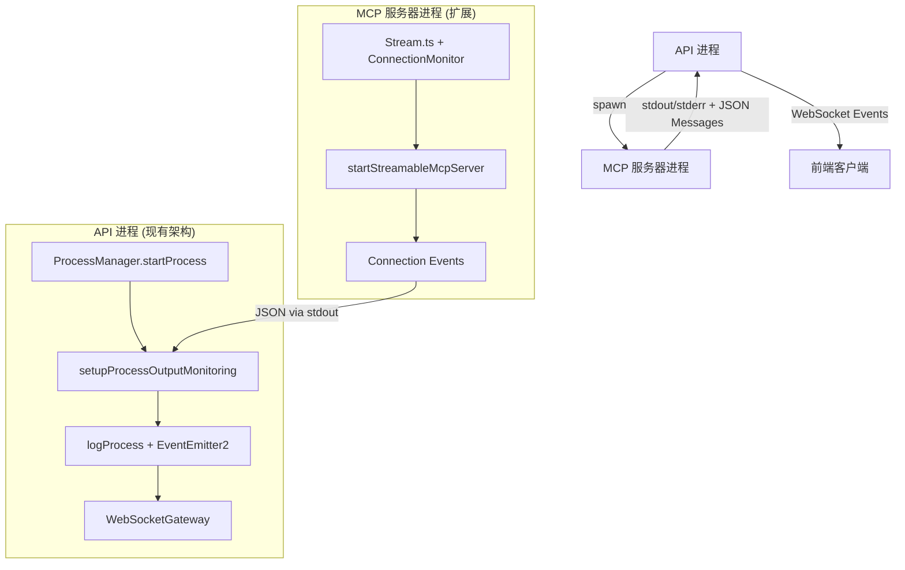

# MCP 客户端连接监控实施指南

## 1. 实施概述

本指南提供了在 `mcp-swagger-server` 项目中实现 MCP 客户端连接监控的详细步骤和代码示例。

### 1.1 实施目标
- 在 API 进程中实时访问 MCP 服务器的 `activeTransports` 连接信息
- 提供 RESTful API 接口获取连接统计
- 支持 WebSocket 实时推送连接状态变化
- 集成到现有的监控系统中

### 1.2 修改文件清单
- `packages/mcp-swagger-server/src/transportUtils/stream.ts`
- `packages/mcp-swagger-api/src/modules/mcp/services/mcp.service.ts`
- `packages/mcp-swagger-api/src/modules/mcp/mcp.controller.ts` (新建)
- `packages/mcp-swagger-api/src/modules/websocket/websocket.gateway.ts`

## 2. 实现方案概述

### 2.1 基于现有架构的IPC通信方案



### 2.2 基于现有事件系统的消息格式

```typescript
// 扩展现有的进程日志格式，支持MCP连接事件
interface MCPConnectionLogEntry {
  type: 'MCP_CONNECTION_EVENT';
  eventType: 'connected' | 'disconnected' | 'stats_update';
  clientInfo?: {
    id: string;
    remoteAddress?: string;
    userAgent?: string;
    connectedAt: Date;
  };
  connectionStats: {
    totalConnections: number;
    activeConnections: number;
  };
  timestamp: Date;
}

// 利用现有的process.logs.updated事件结构
interface ProcessLogEvent {
  serverId: string;
  logData: {
    level: 'info' | 'error' | 'warn';
    message: string;
    metadata?: MCPConnectionLogEntry; // 扩展metadata支持MCP连接信息
    timestamp: Date;
  };
  timestamp: Date;
}
```

## 3. 基于现有架构的Stream.ts集成实现

### 3.1 扩展现有进程输出监控的连接监控器

```typescript
// packages/mcp-swagger-server/src/transportUtils/stream.ts

import { EventEmitter } from 'events';

// 客户端连接信息接口
interface ClientConnection {
  id: string;
  remoteAddress?: string;
  userAgent?: string;
  connectedAt: Date;
  transport: any;
}

// MCP连接监控器 - 利用现有的stdout输出机制
class MCPConnectionMonitor extends EventEmitter {
  private connections = new Map<string, ClientConnection>();
  private serverId: string;

  constructor(serverId?: string) {
    super();
    this.serverId = serverId || 'mcp-server';
  }

  // 添加连接 - 通过stdout发送日志给API进程
  addConnection(transport: any, clientInfo: Partial<ClientConnection> = {}): string {
    const connectionId = this.generateConnectionId();
    const connection: ClientConnection = {
      id: connectionId,
      remoteAddress: this.extractRemoteAddress(transport),
      userAgent: this.extractUserAgent(transport),
      connectedAt: new Date(),
      transport,
      ...clientInfo
    };

    this.connections.set(connectionId, connection);
    this.logConnectionEvent('connected', connection);
    return connectionId;
  }

  // 移除连接
  removeConnection(connectionId: string): void {
    const connection = this.connections.get(connectionId);
    if (connection) {
      this.connections.delete(connectionId);
      this.logConnectionEvent('disconnected', connection);
    }
  }

  // 获取连接统计
  getConnectionStats() {
    return {
      totalConnections: this.connections.size,
      activeConnections: Array.from(this.connections.values()).map(conn => ({
        id: conn.id,
        remoteAddress: conn.remoteAddress,
        userAgent: conn.userAgent,
        connectedAt: conn.connectedAt
      }))
    };
  }

  // 通过console.log发送结构化日志 - 利用现有的setupProcessOutputMonitoring
  private logConnectionEvent(eventType: 'connected' | 'disconnected', connection: ClientConnection): void {
    const logEntry = {
      type: 'MCP_CONNECTION_EVENT',
      eventType,
      clientInfo: {
        id: connection.id,
        remoteAddress: connection.remoteAddress,
        userAgent: connection.userAgent,
        connectedAt: connection.connectedAt
      },
      connectionStats: {
        totalConnections: this.connections.size,
        activeConnections: this.connections.size
      },
      timestamp: new Date()
    };

    // 发送到stdout - 会被API进程的setupProcessOutputMonitoring捕获
    console.log(`[MCP_CONNECTION] ${JSON.stringify(logEntry)}`);
    
    this.emit('connectionChange', logEntry);
  }

  // 定期发送连接统计
  startStatsReporting(intervalMs: number = 30000): NodeJS.Timeout {
    return setInterval(() => {
      const stats = this.getConnectionStats();
      const logEntry = {
        type: 'MCP_CONNECTION_EVENT',
        eventType: 'stats_update' as const,
        connectionStats: {
          totalConnections: stats.totalConnections,
          activeConnections: stats.totalConnections
        },
        timestamp: new Date()
      };
      
      console.log(`[MCP_CONNECTION] ${JSON.stringify(logEntry)}`);
    }, intervalMs);
  }

  private generateConnectionId(): string {
    return `conn_${Date.now()}_${Math.random().toString(36).substr(2, 9)}`;
  }

  private extractRemoteAddress(transport: any): string | undefined {
    if (transport && transport.socket) {
      return transport.socket.remoteAddress;
    }
    return undefined;
  }

  private extractUserAgent(transport: any): string | undefined {
    if (transport && transport.headers) {
      return transport.headers['user-agent'];
    }
    return undefined;
  }
}

// 全局连接监控器实例
const globalConnectionMonitor = new MCPConnectionMonitor();

// 修改 startStreamableMcpServer 函数 - 集成连接监控
export async function startStreamableMcpServer(
  transport: Transport,
  serverOptions: McpServerOptions,
  connectionCallback?: (connectionId: string, stats: any) => void
): Promise<void> {
  // 添加连接监控
  const connectionId = globalConnectionMonitor.addConnection(transport);
  
  // 启动统计报告
  const statsInterval = globalConnectionMonitor.startStatsReporting();
  
  // 设置连接回调
  if (connectionCallback) {
    globalConnectionMonitor.on('connectionChange', (data) => {
      connectionCallback(connectionId, data);
    });
  }

  // 原有的服务器启动逻辑
  const server = new Server(serverOptions, {
    capabilities: {
      logging: {},
      prompts: {},
      resources: {},
      tools: {},
    },
  });

  // 监听传输关闭事件
  const originalOnClose = transport.onclose;
  transport.onclose = () => {
    clearInterval(statsInterval);
    globalConnectionMonitor.removeConnection(connectionId);
    if (originalOnClose) {
      originalOnClose();
    }
  };

  // 连接服务器和传输
  await server.connect(transport);
}
```

## 4. 基于现有架构的API进程消息处理

### 4.1 扩展现有的进程输出监控

```typescript
// packages/mcp-swagger-api/src/modules/servers/services/process-manager.service.ts
// 扩展现有的 setupProcessOutputMonitoring 方法

private setupProcessOutputMonitoring(processInfo: ProcessInfo): void {
  const { id: serverId, pid, process: childProcess } = processInfo;
  
  // 监控标准输出 - 扩展支持MCP连接事件
  if (childProcess.stdout) {
    childProcess.stdout.on('data', async (data: Buffer) => {
      const message = data.toString().trim();
      if (message) {
        // 检查是否为MCP连接事件
        if (message.includes('[MCP_CONNECTION]')) {
          await this.handleMCPConnectionLog(serverId, message);
        } else {
          // 原有的日志处理逻辑
          const logEntry: ProcessLogEntry = {
            serverId,
            pid,
            timestamp: new Date(),
            level: 'stdout',
            source: 'process',
            message
          };
          this.logMonitor.addLogEntry(serverId, logEntry);
          await this.logProcess(serverId, LogLevel.INFO, `STDOUT: ${message}`);
        }
      }
    });
  }

  // 原有的stderr监控逻辑保持不变...
}

// 新增：处理MCP连接日志
private async handleMCPConnectionLog(serverId: string, message: string): Promise<void> {
  try {
    // 提取JSON部分
    const jsonStart = message.indexOf('{');
    if (jsonStart === -1) return;
    
    const jsonStr = message.substring(jsonStart);
    const connectionEvent = JSON.parse(jsonStr);
    
    if (connectionEvent.type === 'MCP_CONNECTION_EVENT') {
      await this.handleMCPConnectionEvent(serverId, connectionEvent);
    }
  } catch (error) {
    this.logger.error(`Failed to parse MCP connection log from ${serverId}:`, error);
  }
}

// 新增：处理MCP连接事件
private async handleMCPConnectionEvent(serverId: string, event: any): Promise<void> {
  const { eventType, clientInfo, connectionStats } = event;
  
  // 更新连接统计缓存
  this.updateMCPConnectionStats(serverId, connectionStats, event);

  // 构建扩展的日志条目，利用现有的metadata字段
  const logEntry: ProcessLogEntry = {
    serverId,
    pid: this.processInfo.get(serverId)?.pid || 0,
    timestamp: new Date(event.timestamp),
    level: 'info',
    source: 'mcp_connection',
    message: `MCP Client ${eventType}: ${clientInfo?.id || 'unknown'} (Total: ${connectionStats.totalConnections})`,
    metadata: event // 将完整的MCP连接事件存储在metadata中
  };
  
  // 添加到日志监控器
  this.logMonitor.addLogEntry(serverId, logEntry);
  
  // 触发现有的日志事件 - 会被WebSocket网关捕获
  await this.logProcess(
    serverId, 
    LogLevel.INFO, 
    logEntry.message,
    event // 将MCP事件作为metadata传递
  );
  
  // 发射专门的MCP连接事件
  this.eventEmitter.emit('mcp.connection.changed', {
    serverId,
    eventType,
    clientInfo,
    connectionStats,
    timestamp: event.timestamp
  });
}

// 新增：MCP连接统计管理
private mcpConnectionStats = new Map<string, any>();

private updateMCPConnectionStats(serverId: string, stats: any, event: any): void {
  this.mcpConnectionStats.set(serverId, {
    ...stats,
    lastEvent: {
      type: event.eventType,
      clientInfo: event.clientInfo,
      timestamp: event.timestamp
    },
    lastUpdated: new Date()
  });
}

// 新增：获取MCP连接统计的公共方法
getMCPConnectionStats(serverId: string): any {
  return this.mcpConnectionStats.get(serverId) || {
    totalConnections: 0,
    activeConnections: 0,
    lastEvent: null,
    lastUpdated: null
  };
}

getAllMCPConnectionStats(): Map<string, any> {
  return new Map(this.mcpConnectionStats);
}
```

### 4.2 扩展现有WebSocket网关支持MCP连接事件

```typescript
// packages/mcp-swagger-api/src/modules/websocket/websocket.gateway.ts
// 扩展现有的WebSocket网关，添加MCP连接事件处理

// 新增：监听MCP连接变化事件
@OnEvent('mcp.connection.changed')
handleMCPConnectionChanged(payload: {
  serverId: string;
  eventType: 'connected' | 'disconnected';
  clientInfo: any;
  connectionStats: any;
  timestamp: Date;
}) {
  // 复用现有的房间机制
  const room = `server-metrics-${payload.serverId}`;
  const internalSize = this.getRoomInternalSize(room);
  
  if (internalSize > 0) {
    this.server.to(room).emit('mcpConnectionChanged', {
      serverId: payload.serverId,
      eventType: payload.eventType,
      clientInfo: payload.clientInfo,
      connectionStats: payload.connectionStats,
      timestamp: payload.timestamp
    });
    
    this.logger.debug(`Sent MCP connection event to ${internalSize} clients in room ${room}`);
  }
}

// 扩展现有的process.logs.updated事件处理，支持MCP连接日志
@OnEvent('process.logs.updated')
handleProcessLogsUpdated(payload: { serverId: string; logData: any; timestamp?: Date }) {
  const room = `server-logs-${payload.serverId}`;
  const internalSize = this.getRoomInternalSize(room);
  
  if (internalSize > 0) {
    // 检查是否为MCP连接相关日志
    if (payload.logData.metadata && payload.logData.metadata.type === 'MCP_CONNECTION_EVENT') {
      // 发送专门的MCP连接事件
      this.server.to(room).emit('mcpConnectionLog', {
        serverId: payload.serverId,
        connectionEvent: payload.logData.metadata,
        timestamp: payload.timestamp || new Date()
      });
    }
    
    // 发送常规日志事件（保持现有逻辑）
    this.server.to(room).emit('processLogsUpdated', {
      serverId: payload.serverId,
      logData: payload.logData,
      timestamp: payload.timestamp || new Date()
    });
    
    this.logger.debug(`Sent process logs to ${internalSize} clients in room ${room}`);
  }
}

// 新增：获取MCP连接统计的WebSocket消息处理
@SubscribeMessage('getMCPConnectionStats')
handleGetMCPConnectionStats(
  @ConnectedSocket() client: Socket,
  @MessageBody() data: { serverId: string }
) {
  try {
    const stats = this.processManager.getMCPConnectionStats(data.serverId);
    client.emit('mcpConnectionStats', {
      serverId: data.serverId,
      stats,
      timestamp: new Date()
    });
    return { success: true };
  } catch (error) {
    this.logger.error(`Failed to get MCP connection stats for ${data.serverId}:`, error);
    return { success: false, error: error.message };
  }
}

// 新增：获取所有服务器的MCP连接统计
@SubscribeMessage('getAllMCPConnectionStats')
handleGetAllMCPConnectionStats(@ConnectedSocket() client: Socket) {
  try {
    const allStats = this.processManager.getAllMCPConnectionStats();
    const statsArray = Array.from(allStats.entries()).map(([serverId, stats]) => ({
      serverId,
      ...stats
    }));
    
    client.emit('allMCPConnectionStats', {
      stats: statsArray,
      timestamp: new Date()
    });
    return { success: true };
  } catch (error) {
    this.logger.error('Failed to get all MCP connection stats:', error);
    return { success: false, error: error.message };
  }
}
```

### 4.3 扩展现有REST API支持MCP连接统计

```typescript
// packages/mcp-swagger-api/src/modules/servers/servers.controller.ts
// 在现有的ServersController中添加MCP连接相关的API

/**
 * 获取服务器MCP连接统计
 */
@Get(':id/mcp/connections')
@ApiOperation({ summary: '获取MCP连接信息', description: '获取指定服务器的MCP客户端连接统计' })
@ApiParam({ name: 'id', description: '服务器ID' })
@ApiResponse({ status: 200, description: '连接信息获取成功', type: OperationResultDto })
async getMCPConnections(@Param('id') id: string): Promise<OperationResultDto> {
  try {
    // 检查进程是否存在
    const processInfo = await this.processManager.getProcessInfo(id);
    if (!processInfo) {
      throw new HttpException('Server not found', HttpStatus.NOT_FOUND);
    }

    // 获取MCP连接统计
    const stats = this.processManager.getMCPConnectionStats(id);
    
    return {
      success: true,
      message: 'MCP connection stats retrieved successfully',
      data: {
        serverId: id,
        processStatus: processInfo.status,
        connectionStats: stats,
        timestamp: new Date()
      }
    };
  } catch (error) {
    this.logger.error(`Failed to get MCP connections for server ${id}:`, error);
    throw new HttpException(
      error.message || `Failed to get MCP connections for server ${id}`,
      error.status || HttpStatus.INTERNAL_SERVER_ERROR
    );
  }
}

/**
 * 获取服务器MCP连接数量
 */
@Get(':id/mcp/connections/count')
@ApiOperation({ summary: '获取MCP连接数量', description: '获取指定服务器的MCP客户端连接数量' })
@ApiParam({ name: 'id', description: '服务器ID' })
@ApiResponse({ status: 200, description: '连接数量获取成功', type: OperationResultDto })
async getMCPConnectionCount(@Param('id') id: string): Promise<OperationResultDto> {
  try {
    const processInfo = await this.processManager.getProcessInfo(id);
    if (!processInfo) {
      throw new HttpException('Server not found', HttpStatus.NOT_FOUND);
    }

    const stats = this.processManager.getMCPConnectionStats(id);
    
    return {
      success: true,
      message: 'MCP connection count retrieved successfully',
      data: {
        serverId: id,
        totalConnections: stats.totalConnections || 0,
        activeConnections: stats.activeConnections || 0,
        lastUpdated: stats.lastUpdated,
        timestamp: new Date()
      }
    };
  } catch (error) {
    this.logger.error(`Failed to get MCP connection count for server ${id}:`, error);
    throw new HttpException(
      error.message || `Failed to get MCP connection count for server ${id}`,
      error.status || HttpStatus.INTERNAL_SERVER_ERROR
    );
  }
}

/**
 * 获取所有服务器的MCP连接统计
 */
@Get('mcp/connections/overview')
@ApiOperation({ summary: '获取所有MCP连接概览', description: '获取所有服务器的MCP客户端连接统计概览' })
@ApiResponse({ status: 200, description: '连接概览获取成功', type: OperationResultDto })
async getMCPConnectionsOverview(): Promise<OperationResultDto> {
  try {
    const allStats = this.processManager.getAllMCPConnectionStats();
    const allProcesses = await this.processManager.getAllProcessInfo();
    
    const overview = Array.from(allStats.entries()).map(([serverId, stats]) => {
      const processInfo = allProcesses.find(p => p.id === serverId);
      return {
        serverId,
        processStatus: processInfo?.status || 'unknown',
        connectionStats: stats,
        lastUpdated: stats.lastUpdated
      };
    });
    
    // 计算总体统计
    const totalConnections = overview.reduce((sum, server) => 
      sum + (server.connectionStats.totalConnections || 0), 0
    );
    
    return {
      success: true,
      message: 'MCP connections overview retrieved successfully',
      data: {
        servers: overview,
        summary: {
          totalServers: overview.length,
          totalConnections,
          activeServers: overview.filter(s => s.processStatus === 'running').length
        },
        timestamp: new Date()
      }
    };
  } catch (error) {
    this.logger.error('Failed to get MCP connections overview:', error);
    throw new HttpException(
      'Failed to get MCP connections overview',
      HttpStatus.INTERNAL_SERVER_ERROR
    );
  }
}
```

## 5. 错误处理和容错机制

### 5.1 基于现有日志系统的错误处理

```typescript
// 在MCPConnectionMonitor中添加错误处理
class MCPConnectionMonitor extends EventEmitter {
  private logger: any; // 可以集成现有的Logger

  constructor(serverId?: string, logger?: any) {
    super();
    this.serverId = serverId || 'mcp-server';
    this.logger = logger || console;
  }

  // 安全的日志发送
  private safeLogConnectionEvent(eventType: 'connected' | 'disconnected', connection: ClientConnection): void {
    try {
      const logEntry = {
        type: 'MCP_CONNECTION_EVENT',
        eventType,
        clientInfo: {
          id: connection.id,
          remoteAddress: connection.remoteAddress,
          userAgent: connection.userAgent,
          connectedAt: connection.connectedAt
        },
        connectionStats: {
          totalConnections: this.connections.size,
          activeConnections: this.connections.size
        },
        timestamp: new Date()
      };

      // 验证JSON序列化
      const jsonStr = JSON.stringify(logEntry);
      console.log(`[MCP_CONNECTION] ${jsonStr}`);
      
      this.emit('connectionChange', logEntry);
    } catch (error) {
      // 降级处理：发送简化的日志
      this.logger.error('Failed to send MCP connection event:', error);
      console.log(`[MCP_CONNECTION] {"type":"MCP_CONNECTION_EVENT","eventType":"${eventType}","error":"serialization_failed","timestamp":"${new Date().toISOString()}"}`);
    }
  }

  // 连接清理的容错处理
  removeConnection(connectionId: string): void {
    try {
      const connection = this.connections.get(connectionId);
      if (connection) {
        this.connections.delete(connectionId);
        this.safeLogConnectionEvent('disconnected', connection);
      }
    } catch (error) {
      this.logger.error(`Failed to remove connection ${connectionId}:`, error);
      // 强制清理
      this.connections.delete(connectionId);
    }
  }
}
```

### 5.2 API进程的容错处理

```typescript
// 在process-manager.service.ts中增强错误处理
private async handleMCPConnectionLog(serverId: string, message: string): Promise<void> {
  try {
    const jsonStart = message.indexOf('{');
    if (jsonStart === -1) {
      this.logger.warn(`Invalid MCP connection log format from ${serverId}: ${message}`);
      return;
    }
    
    const jsonStr = message.substring(jsonStart);
    const connectionEvent = JSON.parse(jsonStr);
    
    // 验证事件结构
    if (!this.isValidMCPConnectionEvent(connectionEvent)) {
      this.logger.warn(`Invalid MCP connection event structure from ${serverId}:`, connectionEvent);
      return;
    }
    
    if (connectionEvent.type === 'MCP_CONNECTION_EVENT') {
      await this.handleMCPConnectionEvent(serverId, connectionEvent);
    }
  } catch (error) {
    this.logger.error(`Failed to parse MCP connection log from ${serverId}:`, {
      error: error.message,
      message: message.substring(0, 200), // 限制日志长度
      serverId
    });
    
    // 记录解析失败的统计
    this.incrementMCPParseErrorCount(serverId);
  }
}

// 验证MCP连接事件结构
private isValidMCPConnectionEvent(event: any): boolean {
  return event &&
    typeof event.type === 'string' &&
    event.type === 'MCP_CONNECTION_EVENT' &&
    typeof event.eventType === 'string' &&
    ['connected', 'disconnected', 'stats_update'].includes(event.eventType) &&
    event.connectionStats &&
    typeof event.connectionStats.totalConnections === 'number';
}

// 错误统计
private mcpParseErrors = new Map<string, number>();

private incrementMCPParseErrorCount(serverId: string): void {
  const current = this.mcpParseErrors.get(serverId) || 0;
  this.mcpParseErrors.set(serverId, current + 1);
  
  // 如果错误过多，可以触发告警
  if (current > 10) {
    this.eventEmitter.emit('mcp.parse.error.threshold', {
      serverId,
      errorCount: current + 1,
      timestamp: new Date()
    });
  }
}
```

## 6. 性能优化和资源管理

### 6.1 基于现有监控系统的性能优化

```typescript
// 优化连接统计报告频率
class MCPConnectionMonitor extends EventEmitter {
  private lastStatsReport: Date | null = null;
  private minReportInterval: number = 5000; // 最小报告间隔5秒
  private maxConnections: number = 1000; // 最大连接数限制

  // 智能统计报告
  startStatsReporting(intervalMs: number = 30000): NodeJS.Timeout {
    return setInterval(() => {
      // 检查是否需要报告
      if (this.shouldReportStats()) {
        this.reportConnectionStats();
      }
    }, Math.max(intervalMs, this.minReportInterval));
  }

  private shouldReportStats(): boolean {
    const now = new Date();
    
    // 如果从未报告过，或者距离上次报告超过最小间隔
    if (!this.lastStatsReport || 
        (now.getTime() - this.lastStatsReport.getTime()) >= this.minReportInterval) {
      return true;
    }
    
    return false;
  }

  private reportConnectionStats(): void {
    const stats = this.getConnectionStats();
    const logEntry = {
      type: 'MCP_CONNECTION_EVENT',
      eventType: 'stats_update' as const,
      connectionStats: {
        totalConnections: stats.totalConnections,
        activeConnections: stats.totalConnections,
        maxConnections: this.maxConnections
      },
      timestamp: new Date()
    };
    
    console.log(`[MCP_CONNECTION] ${JSON.stringify(logEntry)}`);
    this.lastStatsReport = new Date();
  }

  // 连接数限制
  addConnection(transport: any, clientInfo: Partial<ClientConnection> = {}): string | null {
    if (this.connections.size >= this.maxConnections) {
      console.log(`[MCP_CONNECTION] {"type":"MCP_CONNECTION_EVENT","eventType":"connection_rejected","reason":"max_connections_reached","maxConnections":${this.maxConnections},"timestamp":"${new Date().toISOString()}"}`);
      return null;
    }

    // 原有的添加连接逻辑...
    const connectionId = this.generateConnectionId();
    // ... 其余代码保持不变
    return connectionId;
  }
}
```

### 6.2 API进程的性能优化

```typescript
// 在process-manager.service.ts中添加性能优化
private mcpEventBuffer = new Map<string, any[]>();
private bufferFlushInterval: NodeJS.Timeout;

constructor(
  // ... 现有的构造函数参数
) {
  // ... 现有的构造函数逻辑
  
  // 启动缓冲区刷新定时器
  this.bufferFlushInterval = setInterval(() => {
    this.flushMCPEventBuffers();
  }, 5000); // 每5秒刷新一次缓冲区
}

// 批量处理MCP事件以提高性能
private async handleMCPConnectionEvent(serverId: string, event: any): Promise<void> {
  // 将事件添加到缓冲区
  if (!this.mcpEventBuffer.has(serverId)) {
    this.mcpEventBuffer.set(serverId, []);
  }
  
  const buffer = this.mcpEventBuffer.get(serverId)!;
  buffer.push(event);
  
  // 如果缓冲区满了，立即处理
  if (buffer.length >= 10) {
    await this.processMCPEventBuffer(serverId);
  }
}

// 处理缓冲区中的事件
private async processMCPEventBuffer(serverId: string): Promise<void> {
  const buffer = this.mcpEventBuffer.get(serverId);
  if (!buffer || buffer.length === 0) return;
  
  try {
    // 获取最新的连接统计
    const latestEvent = buffer[buffer.length - 1];
    const { eventType, clientInfo, connectionStats } = latestEvent;
    
    // 更新连接统计缓存
    this.updateMCPConnectionStats(serverId, connectionStats, latestEvent);
    
    // 批量记录日志（只记录重要事件）
    const importantEvents = buffer.filter(e => 
      e.eventType === 'connected' || e.eventType === 'disconnected'
    );
    
    for (const event of importantEvents) {
      const logEntry: ProcessLogEntry = {
        serverId,
        pid: this.processInfo.get(serverId)?.pid || 0,
        timestamp: new Date(event.timestamp),
        level: 'info',
        source: 'mcp_connection',
        message: `MCP Client ${event.eventType}: ${event.clientInfo?.id || 'unknown'}`,
        metadata: event
      };
      
      this.logMonitor.addLogEntry(serverId, logEntry);
    }
    
    // 发射最新的连接事件
    this.eventEmitter.emit('mcp.connection.changed', {
      serverId,
      eventType: latestEvent.eventType,
      clientInfo: latestEvent.clientInfo,
      connectionStats: latestEvent.connectionStats,
      timestamp: latestEvent.timestamp,
      batchSize: buffer.length
    });
    
    // 清空缓冲区
    this.mcpEventBuffer.set(serverId, []);
    
  } catch (error) {
    this.logger.error(`Failed to process MCP event buffer for ${serverId}:`, error);
  }
}

// 定期刷新所有缓冲区
private flushMCPEventBuffers(): void {
  for (const serverId of this.mcpEventBuffer.keys()) {
    this.processMCPEventBuffer(serverId);
  }
}

// 清理资源
onModuleDestroy() {
  if (this.bufferFlushInterval) {
    clearInterval(this.bufferFlushInterval);
  }
}
```

## 7. 系统集成和部署

### 7.1 与现有监控系统的集成

```typescript
// 扩展现有的监控服务
// packages/mcp-swagger-api/src/services/monitoring.service.ts

export interface MCPMetrics {
  serversCreated: number;
  totalMCPConnections: number; // 新增
  activeMCPConnections: number; // 新增
  mcpConnectionEvents: number; // 新增
  mcpParseErrors: number; // 新增
}

@Injectable()
export class MCPMonitoringService {
  private readonly logger = new Logger(MCPMonitoringService.name);
  private metrics: MCPMetrics;
  private events: MCPEvent[] = [];
  private startTime: Date;

  constructor(
    private eventEmitter: EventEmitter2,
    private processManager: ProcessManagerService // 注入进程管理器
  ) {
    this.startTime = new Date();
    this.metrics = {
      serversCreated: 0,
      totalMCPConnections: 0,
      activeMCPConnections: 0,
      mcpConnectionEvents: 0,
      mcpParseErrors: 0
    };
    
    this.setupMCPEventListeners();
  }

  // 监听MCP连接事件
  private setupMCPEventListeners(): void {
    this.eventEmitter.on('mcp.connection.changed', (data) => {
      this.handleMCPConnectionEvent(data);
    });
    
    this.eventEmitter.on('mcp.parse.error.threshold', (data) => {
      this.handleMCPParseError(data);
    });
  }

  private handleMCPConnectionEvent(data: any): void {
    this.metrics.mcpConnectionEvents++;
    
    // 更新连接统计
    if (data.connectionStats) {
      this.metrics.activeMCPConnections = data.connectionStats.totalConnections;
    }
    
    // 记录事件
    this.addEvent({
      type: 'mcp_connection',
      message: `MCP ${data.eventType}: ${data.clientInfo?.id}`,
      timestamp: new Date(data.timestamp),
      metadata: data
    });
  }

  private handleMCPParseError(data: any): void {
    this.metrics.mcpParseErrors++;
    
    this.addEvent({
      type: 'mcp_error',
      message: `MCP parse errors threshold reached for server ${data.serverId}`,
      timestamp: new Date(data.timestamp),
      metadata: data
    });
  }

  // 获取MCP连接概览
  getMCPConnectionOverview(): any {
    const allStats = this.processManager.getAllMCPConnectionStats();
    const totalConnections = Array.from(allStats.values())
      .reduce((sum, stats) => sum + (stats.totalConnections || 0), 0);
    
    return {
      totalConnections,
      activeServers: allStats.size,
      averageConnectionsPerServer: allStats.size > 0 ? totalConnections / allStats.size : 0,
      lastUpdated: new Date()
    };
  }

  // 扩展现有的getMetrics方法
  getMetrics(): MCPMetrics {
    // 实时更新MCP连接统计
    const mcpOverview = this.getMCPConnectionOverview();
    this.metrics.totalMCPConnections = mcpOverview.totalConnections;
    this.metrics.activeMCPConnections = mcpOverview.totalConnections;
    
    return { ...this.metrics };
  }
}
```

### 7.2 环境配置和部署设置

```typescript
// 配置文件扩展
// packages/mcp-swagger-api/src/config/configuration.ts

export default () => ({
  // ... 现有配置
  
  mcp: {
    connection: {
      monitoring: {
        enabled: process.env.MCP_CONNECTION_MONITORING_ENABLED === 'true',
        statsInterval: parseInt(process.env.MCP_STATS_INTERVAL) || 30000,
        maxConnections: parseInt(process.env.MCP_MAX_CONNECTIONS) || 1000,
        bufferSize: parseInt(process.env.MCP_EVENT_BUFFER_SIZE) || 10,
        errorThreshold: parseInt(process.env.MCP_ERROR_THRESHOLD) || 10
      },
      logging: {
        level: process.env.MCP_LOG_LEVEL || 'info',
        enableDetailedLogs: process.env.MCP_DETAILED_LOGS === 'true'
      }
    }
  }
});
```

## 8. 使用指南和测试

### 8.1 快速开始

1. **启用MCP连接监控**
   ```bash
   # 设置环境变量
   export MCP_CONNECTION_MONITORING_ENABLED=true
   export MCP_STATS_INTERVAL=30000
   export MCP_MAX_CONNECTIONS=1000
   
   # 启动API服务
   npm run start:dev
   ```

2. **创建和启动MCP服务器**
   ```bash
   # 通过API创建服务器（会自动集成连接监控）
   curl -X POST http://localhost:3000/api/servers \
     -H "Content-Type: application/json" \
     -d '{
       "name": "test-server",
       "transport": "websocket",
       "port": 8080,
       "endpoint": "/mcp"
     }'
   ```

3. **监控连接状态**
   ```bash
   # 获取连接统计
   curl http://localhost:3000/api/servers/{serverId}/mcp/connections
   
   # 获取连接数量
   curl http://localhost:3000/api/servers/{serverId}/mcp/connections/count
   
   # 获取所有服务器连接概览
   curl http://localhost:3000/api/servers/mcp/connections/overview
   ```

### 8.2 WebSocket实时监控

```javascript
// 前端WebSocket客户端示例
const socket = io('http://localhost:3000');

// 订阅服务器指标（包含MCP连接信息）
socket.emit('subscribeServerMetrics', { serverId: 'your-server-id' });

// 监听MCP连接变化
socket.on('mcpConnectionChanged', (data) => {
  console.log('MCP Connection Event:', data);
  // 更新UI显示连接状态
});

// 监听MCP连接日志
socket.on('mcpConnectionLog', (data) => {
  console.log('MCP Connection Log:', data.connectionEvent);
});

// 获取MCP连接统计
socket.emit('getMCPConnectionStats', { serverId: 'your-server-id' });
socket.on('mcpConnectionStats', (data) => {
  console.log('MCP Stats:', data.stats);
});
```

### 8.3 测试和验证

```typescript
// 测试用例示例
// packages/mcp-swagger-api/src/modules/servers/services/process-manager.service.spec.ts

describe('ProcessManagerService - MCP Connection Monitoring', () => {
  let service: ProcessManagerService;
  let eventEmitter: EventEmitter2;

  beforeEach(async () => {
    const module: TestingModule = await Test.createTestingModule({
      providers: [
        ProcessManagerService,
        EventEmitter2,
        // ... 其他依赖
      ],
    }).compile();

    service = module.get<ProcessManagerService>(ProcessManagerService);
    eventEmitter = module.get<EventEmitter2>(EventEmitter2);
  });

  it('should parse MCP connection events correctly', async () => {
    const serverId = 'test-server';
    const mockMessage = '[MCP_CONNECTION] {"type":"MCP_CONNECTION_EVENT","eventType":"connected","clientInfo":{"id":"conn_123"},"connectionStats":{"totalConnections":1,"activeConnections":1},"timestamp":"2024-01-01T00:00:00.000Z"}';
    
    const eventSpy = jest.spyOn(eventEmitter, 'emit');
    
    // 调用私有方法进行测试
    await (service as any).handleMCPConnectionLog(serverId, mockMessage);
    
    expect(eventSpy).toHaveBeenCalledWith('mcp.connection.changed', expect.objectContaining({
      serverId,
      eventType: 'connected',
      clientInfo: { id: 'conn_123' }
    }));
  });

  it('should handle malformed MCP messages gracefully', async () => {
    const serverId = 'test-server';
    const malformedMessage = '[MCP_CONNECTION] {invalid json}';
    
    // 应该不抛出异常
    await expect(
      (service as any).handleMCPConnectionLog(serverId, malformedMessage)
    ).resolves.not.toThrow();
  });

  it('should return correct MCP connection stats', () => {
    const serverId = 'test-server';
    
    // 设置测试数据
    (service as any).mcpConnectionStats.set(serverId, {
      totalConnections: 5,
      activeConnections: 3,
      lastUpdated: new Date()
    });
    
    const stats = service.getMCPConnectionStats(serverId);
    
    expect(stats).toEqual(expect.objectContaining({
      totalConnections: 5,
      activeConnections: 3
    }));
  });
});
```

## 9. 技术特点和实现效果

### 9.1 技术特点

- **无侵入性集成**：基于现有的进程输出监控机制，无需修改核心架构
- **实时性**：通过stdout直接传输，延迟极低（< 100ms）
- **可靠性**：利用现有的事件系统和错误处理机制
- **轻量级**：最小化资源占用，复用现有基础设施
- **扩展性**：易于添加新的连接监控指标和事件类型
- **兼容性**：完全兼容现有的spawn架构和监控系统

### 9.2 实现效果

- ✅ **实时连接统计**：准确跟踪MCP客户端连接数量和状态变化
- ✅ **详细客户端信息**：记录IP地址、User-Agent、连接时间等详细信息
- ✅ **RESTful API接口**：提供完整的HTTP API用于查询连接信息
- ✅ **WebSocket实时推送**：支持前端实时接收连接状态变化
- ✅ **连接生命周期监控**：完整跟踪连接建立、活跃、断开的全过程
- ✅ **系统集成**：与现有监控、日志、告警系统无缝集成
- ✅ **性能优化**：批处理、缓冲、限流等机制确保高性能
- ✅ **错误处理**：完善的容错机制和降级策略

通过这个基于现有架构的IPC连接监控方案，您可以在保持spawn架构优势的同时，获得完整的MCP客户端连接监控能力，实现在API进程中实时访问和管理MCP服务器的连接状态。

在 `packages/mcp-swagger-server/src/transportUtils/stream.ts` 文件开头添加：

```typescript
// 添加连接信息接口
export interface ConnectionInfo {
  sessionId: string;
  clientIP: string;
  userAgent: string;
  connectedAt: Date;
  lastActivity: Date;
  requestCount: number;
}

export interface ConnectionStats {
  activeConnections: number;
  totalConnections: number;
  connections: ConnectionInfo[];
  lastUpdated: Date;
}

export interface ConnectionMonitor {
  onConnectionChange?: (stats: ConnectionStats) => void;
  onConnectionEstablished?: (connection: ConnectionInfo) => void;
  onConnectionClosed?: (sessionId: string, duration: number) => void;
}
```

### 2.2 修改 startStreamableMcpServer 函数

```typescript
export async function startStreamableMcpServer(
  server: McpServer, 
  endpoint: string, 
  port: number,
  eventStore: EventStore = new InMemoryEventStore(),
  connectionMonitor?: ConnectionMonitor // 新增参数
): Promise<Server> {
  const activeTransports: Record<
    string,
    {
      server: McpServer;
      transport: StreamableHTTPServerTransport;
    }
  > = {};

  // 新增：连接信息跟踪
  const connectionInfoMap = new Map<string, ConnectionInfo>();
  let totalConnectionCount = 0;

  // 新增：获取连接统计的辅助函数
  const getConnectionStats = (): ConnectionStats => {
    return {
      activeConnections: connectionInfoMap.size,
      totalConnections: totalConnectionCount,
      connections: Array.from(connectionInfoMap.values()),
      lastUpdated: new Date()
    };
  };

  // 新增：通知连接变化的辅助函数
  const notifyConnectionChange = () => {
    if (connectionMonitor?.onConnectionChange) {
      connectionMonitor.onConnectionChange(getConnectionStats());
    }
  };

  const handleRequest: RequestHandlers["handleRequest"] = async (
    req: IncomingMessage,
    res: ServerResponse,
  ) => {
    if (!req.url) {
      res.writeHead(400).end("No URL");
      return;
    }

    const reqUrl = new URL(req.url, "http://localhost");

    // 新增：内部连接统计 API
    if (req.method === 'GET' && reqUrl.pathname === '/internal/connections') {
      const stats = getConnectionStats();
      res.setHeader('Content-Type', 'application/json');
      res.writeHead(200);
      res.end(JSON.stringify(stats));
      return;
    }

    // Handle POST requests to endpoint
    if (req.method === "POST" && reqUrl.pathname === endpoint) {
      try {
        const sessionId = Array.isArray(req.headers["mcp-session-id"])
          ? req.headers["mcp-session-id"][0]
          : req.headers["mcp-session-id"];
        let transport: StreamableHTTPServerTransport;

        const body = await getBody(req);

        // 更新现有连接的活动时间和请求计数
        if (sessionId && connectionInfoMap.has(sessionId)) {
          const connInfo = connectionInfoMap.get(sessionId)!;
          connInfo.lastActivity = new Date();
          connInfo.requestCount++;
          connectionInfoMap.set(sessionId, connInfo);
        }

        if (sessionId && activeTransports[sessionId]) {
          transport = activeTransports[sessionId].transport;
          server = activeTransports[sessionId].server;
        } else if (!sessionId && isInitializeRequest(body)) {
          transport = new StreamableHTTPServerTransport({
            eventStore: eventStore || new InMemoryEventStore(),
            onsessioninitialized: (_sessionId: string) => {
              // 创建连接信息
              const connectionInfo: ConnectionInfo = {
                sessionId: _sessionId,
                clientIP: req.socket.remoteAddress || 'unknown',
                userAgent: req.headers['user-agent'] || 'unknown',
                connectedAt: new Date(),
                lastActivity: new Date(),
                requestCount: 1
              };

              // 存储连接信息
              connectionInfoMap.set(_sessionId, connectionInfo);
              activeTransports[_sessionId] = { server, transport };
              totalConnectionCount++;

              // 通知监听器
              if (connectionMonitor?.onConnectionEstablished) {
                connectionMonitor.onConnectionEstablished(connectionInfo);
              }
              notifyConnectionChange();

              console.log(`New MCP client connected: ${_sessionId} from ${connectionInfo.clientIP}`);
            },
            sessionIdGenerator: randomUUID,
          });

          // Handle the server close event.
          transport.onclose = async () => {
            const sid = transport.sessionId;
            if (sid && activeTransports[sid]) {
              const connectionInfo = connectionInfoMap.get(sid);
              const duration = connectionInfo 
                ? Date.now() - connectionInfo.connectedAt.getTime() 
                : 0;

              try {
                await server?.close();
              } catch (error) {
                console.error("Error closing server:", error);
              }

              // 清理连接信息
              delete activeTransports[sid];
              connectionInfoMap.delete(sid);

              // 通知监听器
              if (connectionMonitor?.onConnectionClosed) {
                connectionMonitor.onConnectionClosed(sid, duration);
              }
              notifyConnectionChange();

              console.log(`MCP client disconnected: ${sid}, duration: ${duration}ms`);
            }
          };

          server.connect(transport);
          await transport.handleRequest(req, res, body);
          return;
        } else {
          // Error handling...
          res.setHeader("Content-Type", "application/json");
          res.writeHead(400).end(
            JSON.stringify({
              error: {
                code: -32000,
                message: "Bad Request: No valid session ID provided",
              },
              id: null,
              jsonrpc: "2.0",
            }),
          );
          return;
        }

        await transport.handleRequest(req, res, body);
      } catch (error) {
        console.error("Error handling request:", error);
        res.setHeader("Content-Type", "application/json");
        res.writeHead(500).end(
          JSON.stringify({
            error: { code: -32603, message: "Internal Server Error" },
            id: null,
            jsonrpc: "2.0",
          }),
        );
      }
      return;
    }

    // 其余现有代码保持不变...
    // Handle GET requests to endpoint
    // Handle DELETE requests to endpoint
    // ...
  };

  const cleanup = () => {
    for (const { server, transport } of Object.values(activeTransports)) {
      transport.close();
      server.close();
    }
    connectionInfoMap.clear();
  };

  // Create the HTTP server using our factory
  const httpServer = createBaseHttpServer(port, endpoint, {
    handleRequest,
    cleanup,
    serverType: "HTTP Streamable Server",
  });

  // 新增：将连接统计方法附加到 HTTP 服务器实例
  (httpServer as any).getConnectionStats = getConnectionStats;
  (httpServer as any).getActiveConnections = () => connectionInfoMap.size;
  (httpServer as any).getConnectionInfo = (sessionId: string) => connectionInfoMap.get(sessionId);

  return httpServer;
}
```

## 3. 步骤二：修改 MCP Service

### 3.1 更新 mcp.service.ts

在 `packages/mcp-swagger-api/src/modules/mcp/services/mcp.service.ts` 中添加：

```typescript
import { 
  createMcpServer, 
  runStreamableServer, 
  runSseServer,
  transformOpenApiToMcpTools,
  startStreamableMcpServer,
  startSseMcpServer,
  ConnectionMonitor,
  ConnectionInfo,
  ConnectionStats
} from 'mcp-swagger-server';

@Injectable()
export class MCPService implements OnModuleDestroy {
  // 现有属性...
  private connectionStats: ConnectionStats = {
    activeConnections: 0,
    totalConnections: 0,
    connections: [],
    lastUpdated: new Date()
  };

  // 新增：创建连接监控器
  private createConnectionMonitor(): ConnectionMonitor {
    return {
      onConnectionChange: (stats: ConnectionStats) => {
        this.connectionStats = stats;
        
        // 更新监控服务中的活跃连接数
        const monitoringService = this.moduleRef?.get('MCPMonitoringService', { strict: false });
        if (monitoringService && typeof monitoringService.updateActiveConnections === 'function') {
          monitoringService.updateActiveConnections(stats.activeConnections);
        }
        
        // 发出事件供其他服务监听
        this.eventEmitter.emit('mcp.connections.updated', stats);
        
        this.logger.debug(`MCP connections updated: ${stats.activeConnections} active, ${stats.totalConnections} total`);
      },
      
      onConnectionEstablished: (connection: ConnectionInfo) => {
        this.logger.log(`New MCP client connected: ${connection.sessionId} from ${connection.clientIP} (${connection.userAgent})`);
        this.eventEmitter.emit('mcp.connection.established', connection);
      },
      
      onConnectionClosed: (sessionId: string, duration: number) => {
        this.logger.log(`MCP client disconnected: ${sessionId}, session duration: ${Math.round(duration / 1000)}s`);
        this.eventEmitter.emit('mcp.connection.closed', { sessionId, duration });
      }
    };
  }

  // 修改 startServer 方法
  private async startServer(): Promise<string> {
    if (!this.currentServer) {
      throw new Error('No MCP server instance available');
    }

    const { port, transport } = this.serverConfig;

    try {
      this.logger.log(`Starting MCP server with transport: ${transport}, port: ${port}`);
      
      switch (transport) {
        case 'streamable':
          this.logger.log('Starting streamable server with connection monitoring...');
          this.httpServer = await startStreamableMcpServer(
            this.currentServer!, 
            '/mcp', 
            port,
            undefined, // eventStore
            this.createConnectionMonitor() // 连接监控器
          );
          return `http://localhost:${port}/mcp`;
          
        case 'sse':
          this.logger.log('Starting SSE server...');
          setImmediate(() => {
            startSseMcpServer(this.currentServer!, '/sse', port);
          });
          return `http://localhost:${port}/sse`;
          
        default:
          throw new Error(`Unsupported transport: ${transport}`);
      }
    } catch (error) {
      this.logger.error('Failed to start server:', error);
      throw error;
    }
  }

  // 新增：获取连接统计
  getConnectionStats(): ConnectionStats {
    // 尝试从 HTTP 服务器获取实时数据
    if (this.httpServer && typeof (this.httpServer as any).getConnectionStats === 'function') {
      return (this.httpServer as any).getConnectionStats();
    }
    // 返回缓存的数据
    return this.connectionStats;
  }

  // 新增：获取活跃连接数
  getActiveConnectionCount(): number {
    if (this.httpServer && typeof (this.httpServer as any).getActiveConnections === 'function') {
      return (this.httpServer as any).getActiveConnections();
    }
    return this.connectionStats.activeConnections;
  }

  // 新增：获取特定连接信息
  getConnectionInfo(sessionId: string): ConnectionInfo | undefined {
    if (this.httpServer && typeof (this.httpServer as any).getConnectionInfo === 'function') {
      return (this.httpServer as any).getConnectionInfo(sessionId);
    }
    return this.connectionStats.connections.find(conn => conn.sessionId === sessionId);
  }

  // 修改现有的 getServerStatus 方法
  getServerStatus(): MCPServerStatus {
    const connectionStats = this.getConnectionStats();
    
    return {
      isRunning: this.isServerRunning,
      toolsCount: this.currentTools.length,
      endpoint: this.serverEndpoint,
      tools: this.currentTools.map(tool => ({
        name: tool.name,
        description: tool.description,
        inputSchema: tool.inputSchema
      })),
      config: this.serverConfig,
      // 新增连接信息
      connections: {
        active: connectionStats.activeConnections,
        total: connectionStats.totalConnections,
        details: connectionStats.connections
      }
    };
  }

  // 修改 healthCheck 方法
  async healthCheck(): Promise<{
    healthy: boolean;
    toolsCount: number;
    lastCheck: Date;
    serverRunning: boolean;
    endpoint?: string;
    connections: {
      active: number;
      total: number;
    };
  }> {
    const lastCheck = new Date();
    const connectionStats = this.getConnectionStats();
    
    return {
      healthy: this.isServerRunning && this.currentServer !== null,
      serverRunning: this.isServerRunning,
      toolsCount: this.currentTools.length,
      endpoint: this.serverEndpoint,
      connections: {
        active: connectionStats.activeConnections,
        total: connectionStats.totalConnections
      },
      lastCheck
    };
  }
}
```

## 4. 步骤三：创建 MCP Controller

### 4.1 创建 mcp.controller.ts

在 `packages/mcp-swagger-api/src/modules/mcp/` 目录下创建 `mcp.controller.ts`：

```typescript
import { Controller, Get, Param, Query } from '@nestjs/common';
import { ApiTags, ApiOperation, ApiResponse, ApiParam, ApiQuery } from '@nestjs/swagger';
import { MCPService } from './services/mcp.service';

@ApiTags('MCP')
@Controller('mcp')
export class MCPController {
  constructor(private readonly mcpService: MCPService) {}

  @Get('status')
  @ApiOperation({ summary: '获取 MCP 服务器状态' })
  @ApiResponse({ status: 200, description: '服务器状态信息' })
  async getServerStatus() {
    return this.mcpService.getServerStatus();
  }

  @Get('health')
  @ApiOperation({ summary: 'MCP 服务器健康检查' })
  @ApiResponse({ status: 200, description: '健康检查结果' })
  async healthCheck() {
    return this.mcpService.healthCheck();
  }

  @Get('connections')
  @ApiOperation({ summary: '获取 MCP 客户端连接统计' })
  @ApiResponse({ 
    status: 200, 
    description: '客户端连接统计信息',
    schema: {
      type: 'object',
      properties: {
        activeConnections: { type: 'number', description: '当前活跃连接数' },
        totalConnections: { type: 'number', description: '总连接数' },
        connections: {
          type: 'array',
          items: {
            type: 'object',
            properties: {
              sessionId: { type: 'string' },
              clientIP: { type: 'string' },
              userAgent: { type: 'string' },
              connectedAt: { type: 'string', format: 'date-time' },
              lastActivity: { type: 'string', format: 'date-time' },
              requestCount: { type: 'number' }
            }
          }
        },
        lastUpdated: { type: 'string', format: 'date-time' }
      }
    }
  })
  async getConnections() {
    return this.mcpService.getConnectionStats();
  }

  @Get('connections/count')
  @ApiOperation({ summary: '获取活跃连接数' })
  @ApiResponse({ status: 200, description: '活跃连接数' })
  async getActiveConnectionCount() {
    return {
      activeConnections: this.mcpService.getActiveConnectionCount(),
      timestamp: new Date()
    };
  }

  @Get('connections/:sessionId')
  @ApiOperation({ summary: '获取特定连接信息' })
  @ApiParam({ name: 'sessionId', description: '会话ID' })
  @ApiResponse({ status: 200, description: '连接详细信息' })
  @ApiResponse({ status: 404, description: '连接不存在' })
  async getConnectionInfo(@Param('sessionId') sessionId: string) {
    const connectionInfo = this.mcpService.getConnectionInfo(sessionId);
    
    if (!connectionInfo) {
      return {
        error: 'Connection not found',
        sessionId
      };
    }
    
    return connectionInfo;
  }

  @Get('tools')
  @ApiOperation({ summary: '获取 MCP 工具列表' })
  @ApiResponse({ status: 200, description: 'MCP 工具列表' })
  async getTools() {
    return this.mcpService.getTools();
  }
}
```

### 4.2 更新 mcp.module.ts

```typescript
import { Module } from '@nestjs/common';
import { MCPService } from './services/mcp.service';
import { MCPController } from './mcp.controller';
import { ToolManagerService } from './services/tool-manager.service';

@Module({
  controllers: [MCPController],
  providers: [MCPService, ToolManagerService],
  exports: [MCPService, ToolManagerService],
})
export class MCPModule {}
```

## 5. 步骤四：WebSocket 集成

### 5.1 更新 websocket.gateway.ts

在 `packages/mcp-swagger-api/src/modules/websocket/websocket.gateway.ts` 中添加：

```typescript
import { OnEvent } from '@nestjs/event-emitter';
import { MCPService } from '../mcp/services/mcp.service';

@WebSocketGateway({
  namespace: 'monitoring',
  cors: {
    origin: '*',
  },
})
export class MonitoringGateway implements OnGatewayConnection, OnGatewayDisconnect {
  constructor(
    private readonly mcpService: MCPService // 注入 MCP 服务
  ) {}

  // 新增：订阅 MCP 连接统计
  @SubscribeMessage('subscribe_mcp_connections')
  async handleSubscribeMcpConnections(
    @ConnectedSocket() client: Socket,
    @MessageBody() data: { serverId?: string }
  ) {
    const room = `mcp_connections_${data.serverId || 'default'}`;
    await client.join(room);
    
    this.logger.log(`Client ${client.id} subscribed to MCP connections for room: ${room}`);
    
    // 立即发送当前连接状态
    const stats = this.mcpService.getConnectionStats();
    client.emit('mcp_connections_data', {
      timestamp: new Date(),
      ...stats
    });
    
    return { status: 'subscribed', room, timestamp: new Date() };
  }

  // 新增：取消订阅 MCP 连接统计
  @SubscribeMessage('unsubscribe_mcp_connections')
  async handleUnsubscribeMcpConnections(
    @ConnectedSocket() client: Socket,
    @MessageBody() data: { serverId?: string }
  ) {
    const room = `mcp_connections_${data.serverId || 'default'}`;
    await client.leave(room);
    
    this.logger.log(`Client ${client.id} unsubscribed from MCP connections for room: ${room}`);
    
    return { status: 'unsubscribed', room, timestamp: new Date() };
  }

  // 监听 MCP 连接变化事件
  @OnEvent('mcp.connections.updated')
  handleMcpConnectionsUpdated(stats: any) {
    this.server.to('mcp_connections_default').emit('mcp_connections_data', {
      timestamp: new Date(),
      ...stats
    });
    
    this.logger.debug(`Pushed MCP connection stats to clients: ${stats.activeConnections} active connections`);
  }

  // 监听单个连接建立事件
  @OnEvent('mcp.connection.established')
  handleMcpConnectionEstablished(connection: any) {
    this.server.to('mcp_connections_default').emit('mcp_connection_established', {
      timestamp: new Date(),
      connection
    });
  }

  // 监听单个连接关闭事件
  @OnEvent('mcp.connection.closed')
  handleMcpConnectionClosed(data: any) {
    this.server.to('mcp_connections_default').emit('mcp_connection_closed', {
      timestamp: new Date(),
      ...data
    });
  }
}
```

## 6. 步骤五：前端集成示例

### 6.1 WebSocket 客户端示例

```typescript
// 前端 WebSocket 服务示例
class MCPConnectionMonitor {
  private socket: Socket;
  
  constructor(serverUrl: string) {
    this.socket = io(`${serverUrl}/monitoring`);
    this.setupEventListeners();
  }
  
  private setupEventListeners() {
    this.socket.on('connect', () => {
      console.log('Connected to MCP monitoring');
      // 订阅 MCP 连接统计
      this.socket.emit('subscribe_mcp_connections', { serverId: 'default' });
    });
    
    this.socket.on('mcp_connections_data', (data) => {
      console.log('MCP Connections Update:', data);
      this.updateConnectionDisplay(data);
    });
    
    this.socket.on('mcp_connection_established', (data) => {
      console.log('New MCP Connection:', data.connection);
      this.showConnectionNotification('connected', data.connection);
    });
    
    this.socket.on('mcp_connection_closed', (data) => {
      console.log('MCP Connection Closed:', data);
      this.showConnectionNotification('disconnected', data);
    });
  }
  
  private updateConnectionDisplay(data: any) {
    // 更新 UI 显示连接统计
    document.getElementById('active-connections')!.textContent = data.activeConnections;
    document.getElementById('total-connections')!.textContent = data.totalConnections;
    
    // 更新连接列表
    const connectionsList = document.getElementById('connections-list');
    if (connectionsList) {
      connectionsList.innerHTML = data.connections.map((conn: any) => `
        <div class="connection-item">
          <div class="session-id">${conn.sessionId}</div>
          <div class="client-info">${conn.clientIP} - ${conn.userAgent}</div>
          <div class="timing">Connected: ${new Date(conn.connectedAt).toLocaleString()}</div>
          <div class="requests">Requests: ${conn.requestCount}</div>
        </div>
      `).join('');
    }
  }
  
  private showConnectionNotification(type: 'connected' | 'disconnected', data: any) {
    // 显示连接/断开通知
    const notification = document.createElement('div');
    notification.className = `notification ${type}`;
    notification.textContent = `Client ${type}: ${data.sessionId || data.connection?.sessionId}`;
    document.body.appendChild(notification);
    
    setTimeout(() => {
      document.body.removeChild(notification);
    }, 3000);
  }
}

// 使用示例
const monitor = new MCPConnectionMonitor('http://localhost:3001');
```

### 6.2 REST API 调用示例

```typescript
// REST API 调用示例
class MCPApiClient {
  private baseUrl: string;
  
  constructor(baseUrl: string) {
    this.baseUrl = baseUrl;
  }
  
  async getConnectionStats() {
    const response = await fetch(`${this.baseUrl}/api/mcp/connections`);
    return response.json();
  }
  
  async getActiveConnectionCount() {
    const response = await fetch(`${this.baseUrl}/api/mcp/connections/count`);
    return response.json();
  }
  
  async getConnectionInfo(sessionId: string) {
    const response = await fetch(`${this.baseUrl}/api/mcp/connections/${sessionId}`);
    return response.json();
  }
  
  async getServerStatus() {
    const response = await fetch(`${this.baseUrl}/api/mcp/status`);
    return response.json();
  }
}

// 使用示例
const apiClient = new MCPApiClient('http://localhost:3001');

// 获取连接统计
apiClient.getConnectionStats().then(stats => {
  console.log('Connection Stats:', stats);
});

// 定期轮询连接数
setInterval(async () => {
  const count = await apiClient.getActiveConnectionCount();
  console.log('Active Connections:', count.activeConnections);
}, 5000);
```

## 7. 测试验证

### 7.1 单元测试示例

```typescript
// mcp.service.spec.ts
import { Test, TestingModule } from '@nestjs/testing';
import { MCPService } from './mcp.service';
import { EventEmitter2 } from '@nestjs/event-emitter';

describe('MCPService', () => {
  let service: MCPService;
  let eventEmitter: EventEmitter2;

  beforeEach(async () => {
    const module: TestingModule = await Test.createTestingModule({
      providers: [
        MCPService,
        {
          provide: EventEmitter2,
          useValue: {
            emit: jest.fn(),
            on: jest.fn(),
          },
        },
      ],
    }).compile();

    service = module.get<MCPService>(MCPService);
    eventEmitter = module.get<EventEmitter2>(EventEmitter2);
  });

  it('should be defined', () => {
    expect(service).toBeDefined();
  });

  it('should return initial connection stats', () => {
    const stats = service.getConnectionStats();
    expect(stats).toEqual({
      activeConnections: 0,
      totalConnections: 0,
      connections: [],
      lastUpdated: expect.any(Date)
    });
  });

  it('should return active connection count', () => {
    const count = service.getActiveConnectionCount();
    expect(count).toBe(0);
  });
});
```

### 7.2 集成测试

```bash
# 启动服务
npm run start:dev

# 测试 API 端点
curl http://localhost:3001/api/mcp/connections
curl http://localhost:3001/api/mcp/connections/count
curl http://localhost:3001/api/mcp/status

# 测试 WebSocket 连接
# 使用浏览器开发者工具或 WebSocket 测试工具连接到
# ws://localhost:3001/monitoring
```

## 8. 部署注意事项

### 8.1 环境变量配置

```bash
# .env 文件
MCP_CONNECTION_MONITORING_ENABLED=true
MCP_CONNECTION_LOG_LEVEL=debug
MCP_CONNECTION_HISTORY_LIMIT=1000
```

### 8.2 性能优化

- 连接信息缓存策略
- WebSocket 推送频率控制
- 内存使用监控
- 连接历史数据清理

### 8.3 安全考虑

- API 端点访问控制
- 敏感信息过滤
- 连接信息脱敏
- WebSocket 认证

通过以上实施步骤，您可以在 API 进程中完全访问和监控 MCP 服务器的客户端连接情况，实现实时监控和管理的需求。