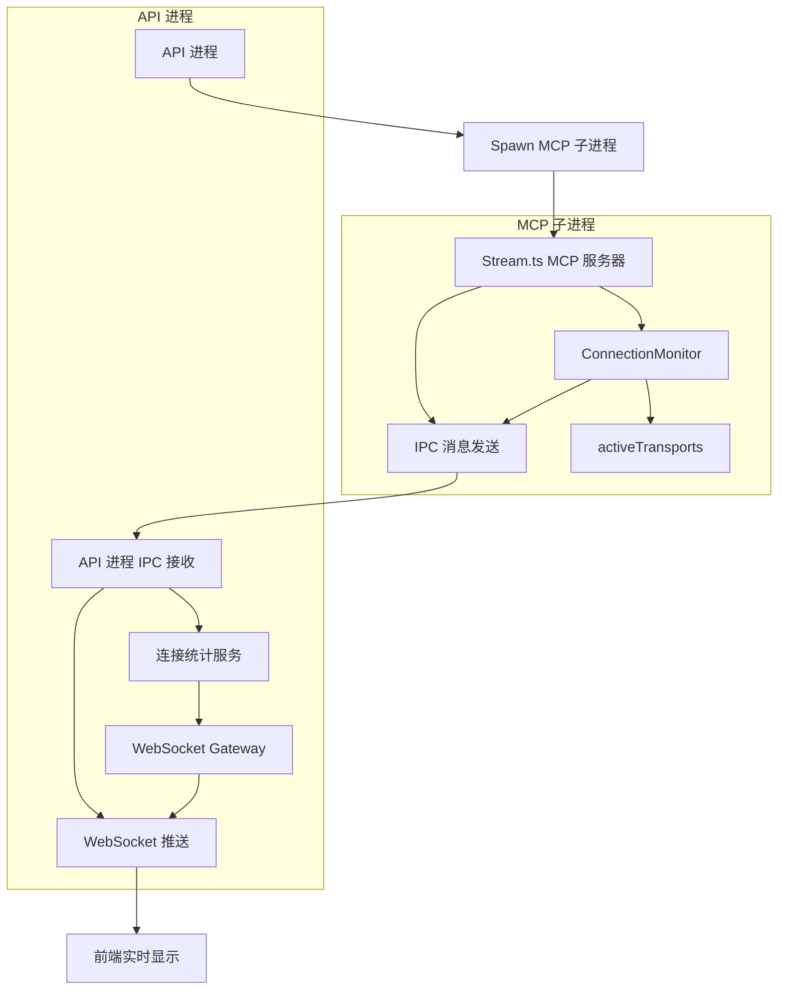

# MCP IPC 连接监控技术实现指南

## 1. IPC 通信方案概述

### 1.1 方案背景

在 MCP Swagger Server 项目中，API 进程需要通过 `spawn` 方式启动 MCP 服务器子进程，并实时监控 MCP 客户端的连接状态。IPC（Inter-Process Communication）进程间通信是实现这一需求的核心技术方案。

### 1.2 架构设计



### 1.3 核心特性

- **实时性**: 通过 IPC 消息实现毫秒级连接状态同步
- **可靠性**: 内置错误处理和重连机制
- **轻量级**: 最小化进程间通信开销
- **扩展性**: 支持多种连接信息类型传递

## 2. IPC 实现方式

### 2.1 Stdio 通信方式

使用标准输入输出流进行进程间通信，这是最简单且可靠的方式。

#### 2.1.1 消息格式定义

```typescript
// 消息类型定义
interface IPCMessage {
  type: 'CONNECTION_EVENT' | 'CONNECTION_STATS' | 'ERROR' | 'HEARTBEAT';
  timestamp: number;
  data: any;
}

// 连接事件消息
interface ConnectionEventMessage extends IPCMessage {
  type: 'CONNECTION_EVENT';
  data: {
    event: 'connected' | 'disconnected';
    sessionId: string;
    clientInfo: {
      userAgent?: string;
      ip?: string;
      connectedAt: number;
    };
  };
}

// 连接统计消息
interface ConnectionStatsMessage extends IPCMessage {
  type: 'CONNECTION_STATS';
  data: {
    activeConnections: number;
    totalConnections: number;
    connections: Array<{
      sessionId: string;
      userAgent?: string;
      ip?: string;
      connectedAt: number;
      duration: number;
    }>;
  };
}
```

### 2.2 事件机制

#### 2.2.1 子进程事件发送

```typescript
// packages/mcp-swagger-server/src/transportUtils/ipc-connection-monitor.ts
export class IPCConnectionMonitor {
  private sendIPCMessage(message: IPCMessage): void {
    try {
      const messageStr = JSON.stringify(message) + '\n';
      process.stdout.write(messageStr);
    } catch (error) {
      console.error('Failed to send IPC message:', error);
    }
  }

  public notifyConnectionEvent(event: 'connected' | 'disconnected', sessionId: string, clientInfo: any): void {
    const message: ConnectionEventMessage = {
      type: 'CONNECTION_EVENT',
      timestamp: Date.now(),
      data: {
        event,
        sessionId,
        clientInfo
      }
    };
    this.sendIPCMessage(message);
  }

  public sendConnectionStats(stats: any): void {
    const message: ConnectionStatsMessage = {
      type: 'CONNECTION_STATS',
      timestamp: Date.now(),
      data: stats
    };
    this.sendIPCMessage(message);
  }

  public sendHeartbeat(): void {
    const message: IPCMessage = {
      type: 'HEARTBEAT',
      timestamp: Date.now(),
      data: { status: 'alive' }
    };
    this.sendIPCMessage(message);
  }
}
```

#### 2.2.2 父进程事件接收

```typescript
// packages/mcp-swagger-api/src/services/ipc-message-handler.service.ts
import { Injectable } from '@nestjs/common';
import { EventEmitter2 } from '@nestjs/event-emitter';

@Injectable()
export class IPCMessageHandlerService {
  constructor(private eventEmitter: EventEmitter2) {}

  public setupIPCListener(childProcess: any): void {
    let buffer = '';
    
    childProcess.stdout.on('data', (data: Buffer) => {
      buffer += data.toString();
      
      // 处理多行消息
      const lines = buffer.split('\n');
      buffer = lines.pop() || ''; // 保留不完整的行
      
      for (const line of lines) {
        if (line.trim()) {
          this.processIPCMessage(line.trim());
        }
      }
    });

    childProcess.stderr.on('data', (data: Buffer) => {
      console.error('MCP Process Error:', data.toString());
    });

    childProcess.on('exit', (code: number) => {
      console.log(`MCP Process exited with code ${code}`);
      this.eventEmitter.emit('mcp.process.exit', { code });
    });
  }

  private processIPCMessage(messageStr: string): void {
    try {
      const message: IPCMessage = JSON.parse(messageStr);
      
      switch (message.type) {
        case 'CONNECTION_EVENT':
          this.handleConnectionEvent(message as ConnectionEventMessage);
          break;
        case 'CONNECTION_STATS':
          this.handleConnectionStats(message as ConnectionStatsMessage);
          break;
        case 'HEARTBEAT':
          this.handleHeartbeat(message);
          break;
        case 'ERROR':
          this.handleError(message);
          break;
        default:
          console.warn('Unknown IPC message type:', message.type);
      }
    } catch (error) {
      console.error('Failed to parse IPC message:', messageStr, error);
    }
  }

  private handleConnectionEvent(message: ConnectionEventMessage): void {
    this.eventEmitter.emit('mcp.connection.event', message.data);
  }

  private handleConnectionStats(message: ConnectionStatsMessage): void {
    this.eventEmitter.emit('mcp.connection.stats', message.data);
  }

  private handleHeartbeat(message: IPCMessage): void {
    this.eventEmitter.emit('mcp.heartbeat', message.data);
  }

  private handleError(message: IPCMessage): void {
    this.eventEmitter.emit('mcp.error', message.data);
  }
}
```

## 3. Stream.ts 集成 IPC 连接监控

### 3.1 修改 Stream.ts 实现

```typescript
// packages/mcp-swagger-server/src/transportUtils/stream.ts
import { IPCConnectionMonitor } from './ipc-connection-monitor.js';

// 全局连接监控器
const ipcMonitor = new IPCConnectionMonitor();

// 连接信息接口
interface ClientConnectionInfo {
  sessionId: string;
  transport: StreamableHTTPServerTransport;
  userAgent?: string;
  ip?: string;
  connectedAt: number;
}

// 全局连接管理
const activeTransports: Record<string, ClientConnectionInfo> = {};

// 获取连接统计
function getConnectionStats() {
  const now = Date.now();
  const connections = Object.values(activeTransports).map(conn => ({
    sessionId: conn.sessionId,
    userAgent: conn.userAgent,
    ip: conn.ip,
    connectedAt: conn.connectedAt,
    duration: now - conn.connectedAt
  }));

  return {
    activeConnections: connections.length,
    totalConnections: connections.length, // 可以扩展为累计连接数
    connections
  };
}

// 修改 startStreamableMcpServer 函数
export function startStreamableMcpServer(
  server: Server,
  options: StreamableServerOptions = {}
): void {
  const { path = '/sse', ...transportOptions } = options;

  // 启动心跳机制
  const heartbeatInterval = setInterval(() => {
    ipcMonitor.sendHeartbeat();
  }, 30000); // 30秒心跳

  // 定期发送连接统计
  const statsInterval = setInterval(() => {
    const stats = getConnectionStats();
    ipcMonitor.sendConnectionStats(stats);
  }, 5000); // 5秒统计

  server.on('request', (req, res) => {
    if (req.url?.startsWith(path)) {
      handleRequest(req, res, transportOptions);
    }
  });

  // 清理定时器
  process.on('SIGTERM', () => {
    clearInterval(heartbeatInterval);
    clearInterval(statsInterval);
  });
}

function handleRequest(
  req: IncomingMessage,
  res: ServerResponse,
  options: StreamableTransportOptions
): void {
  const sessionId = generateSessionId();
  
  // 提取客户端信息
  const clientInfo = {
    userAgent: req.headers['user-agent'],
    ip: req.socket.remoteAddress || req.headers['x-forwarded-for'] as string,
    connectedAt: Date.now()
  };

  const transport = new StreamableHTTPServerTransport(req, res, options);
  
  // 存储连接信息
  activeTransports[sessionId] = {
    sessionId,
    transport,
    ...clientInfo
  };

  // 通知连接建立
  ipcMonitor.notifyConnectionEvent('connected', sessionId, clientInfo);

  transport.onsessioninitialized = () => {
    console.log(`MCP session initialized: ${sessionId}`);
  };

  transport.onclose = () => {
    console.log(`MCP session closed: ${sessionId}`);
    
    // 通知连接断开
    ipcMonitor.notifyConnectionEvent('disconnected', sessionId, clientInfo);
    
    // 清理连接信息
    delete activeTransports[sessionId];
  };

  transport.onerror = (error) => {
    console.error(`MCP session error: ${sessionId}`, error);
    
    // 发送错误信息
    ipcMonitor.sendIPCMessage({
      type: 'ERROR',
      timestamp: Date.now(),
      data: {
        sessionId,
        error: error.message,
        stack: error.stack
      }
    });
  };
}

function generateSessionId(): string {
  return `mcp_${Date.now()}_${Math.random().toString(36).substr(2, 9)}`;
}
```

## 4. API 进程中的 IPC 消息处理

### 4.1 连接统计服务

```typescript
// packages/mcp-swagger-api/src/services/mcp-connection-stats.service.ts
import { Injectable } from '@nestjs/common';
import { OnEvent } from '@nestjs/event-emitter';
import { MonitoringGateway } from '../gateways/monitoring.gateway';

@Injectable()
export class McpConnectionStatsService {
  private connectionStats = {
    activeConnections: 0,
    totalConnections: 0,
    connections: [] as any[]
  };

  private lastHeartbeat = Date.now();

  constructor(private monitoringGateway: MonitoringGateway) {}

  @OnEvent('mcp.connection.event')
  handleConnectionEvent(data: any): void {
    console.log('MCP Connection Event:', data);
    
    // 实时推送连接事件
    this.monitoringGateway.pushConnectionEvent(data);
  }

  @OnEvent('mcp.connection.stats')
  handleConnectionStats(data: any): void {
    this.connectionStats = data;
    
    // 推送连接统计到前端
    this.monitoringGateway.pushConnectionStats(data);
  }

  @OnEvent('mcp.heartbeat')
  handleHeartbeat(data: any): void {
    this.lastHeartbeat = Date.now();
    console.log('MCP Process Heartbeat:', data);
  }

  @OnEvent('mcp.error')
  handleError(data: any): void {
    console.error('MCP Process Error:', data);
    
    // 推送错误信息到前端
    this.monitoringGateway.pushError(data);
  }

  @OnEvent('mcp.process.exit')
  handleProcessExit(data: any): void {
    console.log('MCP Process Exited:', data);
    
    // 重置连接统计
    this.connectionStats = {
      activeConnections: 0,
      totalConnections: 0,
      connections: []
    };
    
    // 通知前端进程退出
    this.monitoringGateway.pushProcessExit(data);
  }

  // 获取当前连接统计
  getConnectionStats() {
    return {
      ...this.connectionStats,
      processStatus: this.getProcessStatus()
    };
  }

  private getProcessStatus(): string {
    const timeSinceHeartbeat = Date.now() - this.lastHeartbeat;
    
    if (timeSinceHeartbeat > 60000) { // 1分钟无心跳
      return 'disconnected';
    } else if (timeSinceHeartbeat > 35000) { // 35秒无心跳
      return 'warning';
    } else {
      return 'healthy';
    }
  }
}
```

### 4.2 WebSocket Gateway 扩展

```typescript
// packages/mcp-swagger-api/src/gateways/monitoring.gateway.ts
import { WebSocketGateway, WebSocketServer } from '@nestjs/websockets';
import { Server } from 'socket.io';

@WebSocketGateway({
  cors: {
    origin: '*',
  },
})
export class MonitoringGateway {
  @WebSocketServer()
  server: Server;

  // 推送连接事件
  pushConnectionEvent(data: any): void {
    this.server.emit('mcp:connection:event', {
      timestamp: Date.now(),
      ...data
    });
  }

  // 推送连接统计
  pushConnectionStats(data: any): void {
    this.server.emit('mcp:connection:stats', {
      timestamp: Date.now(),
      ...data
    });
  }

  // 推送错误信息
  pushError(data: any): void {
    this.server.emit('mcp:error', {
      timestamp: Date.now(),
      ...data
    });
  }

  // 推送进程退出事件
  pushProcessExit(data: any): void {
    this.server.emit('mcp:process:exit', {
      timestamp: Date.now(),
      ...data
    });
  }
}
```

### 4.3 REST API 接口

```typescript
// packages/mcp-swagger-api/src/controllers/mcp-connections.controller.ts
import { Controller, Get } from '@nestjs/common';
import { McpConnectionStatsService } from '../services/mcp-connection-stats.service';

@Controller('api/mcp/connections')
export class McpConnectionsController {
  constructor(private connectionStatsService: McpConnectionStatsService) {}

  @Get()
  getConnections() {
    return this.connectionStatsService.getConnectionStats();
  }

  @Get('count')
  getConnectionCount() {
    const stats = this.connectionStatsService.getConnectionStats();
    return {
      activeConnections: stats.activeConnections,
      totalConnections: stats.totalConnections
    };
  }

  @Get('status')
  getConnectionStatus() {
    const stats = this.connectionStatsService.getConnectionStats();
    return {
      processStatus: stats.processStatus,
      activeConnections: stats.activeConnections,
      lastUpdate: Date.now()
    };
  }
}
```

## 5. 错误处理和容错机制

### 5.1 IPC 通信错误处理

```typescript
// packages/mcp-swagger-server/src/transportUtils/ipc-connection-monitor.ts
export class IPCConnectionMonitor {
  private messageQueue: IPCMessage[] = [];
  private isProcessing = false;
  private maxRetries = 3;
  private retryDelay = 1000;

  private async sendIPCMessageWithRetry(message: IPCMessage, retries = 0): Promise<void> {
    try {
      const messageStr = JSON.stringify(message) + '\n';
      
      // 检查进程状态
      if (!process.stdout.writable) {
        throw new Error('stdout is not writable');
      }
      
      process.stdout.write(messageStr);
    } catch (error) {
      console.error(`Failed to send IPC message (attempt ${retries + 1}):`, error);
      
      if (retries < this.maxRetries) {
        await this.delay(this.retryDelay * (retries + 1));
        return this.sendIPCMessageWithRetry(message, retries + 1);
      } else {
        // 达到最大重试次数，将消息加入队列
        this.messageQueue.push(message);
        console.error('Message queued due to persistent IPC failure');
      }
    }
  }

  private delay(ms: number): Promise<void> {
    return new Promise(resolve => setTimeout(resolve, ms));
  }

  // 处理队列中的消息
  private async processMessageQueue(): void {
    if (this.isProcessing || this.messageQueue.length === 0) {
      return;
    }

    this.isProcessing = true;
    
    while (this.messageQueue.length > 0) {
      const message = this.messageQueue.shift();
      if (message) {
        await this.sendIPCMessageWithRetry(message);
      }
    }
    
    this.isProcessing = false;
  }

  // 定期处理队列
  constructor() {
    setInterval(() => {
      this.processMessageQueue();
    }, 5000);
  }
}
```

### 5.2 进程监控和自动重启

```typescript
// packages/mcp-swagger-api/src/services/mcp-process-manager.service.ts
import { Injectable } from '@nestjs/common';
import { spawn, ChildProcess } from 'child_process';
import { IPCMessageHandlerService } from './ipc-message-handler.service';

@Injectable()
export class McpProcessManagerService {
  private mcpProcess: ChildProcess | null = null;
  private restartCount = 0;
  private maxRestarts = 5;
  private restartDelay = 5000;
  private isShuttingDown = false;

  constructor(private ipcHandler: IPCMessageHandlerService) {}

  async startMcpProcess(config: any): Promise<void> {
    if (this.mcpProcess) {
      await this.stopMcpProcess();
    }

    try {
      this.mcpProcess = spawn('node', [
        'packages/mcp-swagger-server/dist/index.js',
        '--config', JSON.stringify(config)
      ], {
        stdio: ['pipe', 'pipe', 'pipe'],
        cwd: process.cwd()
      });

      // 设置 IPC 监听
      this.ipcHandler.setupIPCListener(this.mcpProcess);

      // 监听进程退出
      this.mcpProcess.on('exit', (code, signal) => {
        console.log(`MCP process exited with code ${code}, signal ${signal}`);
        
        if (!this.isShuttingDown && this.restartCount < this.maxRestarts) {
          this.scheduleRestart();
        }
      });

      // 监听进程错误
      this.mcpProcess.on('error', (error) => {
        console.error('MCP process error:', error);
        
        if (!this.isShuttingDown && this.restartCount < this.maxRestarts) {
          this.scheduleRestart();
        }
      });

      console.log(`MCP process started with PID: ${this.mcpProcess.pid}`);
      this.restartCount = 0; // 重置重启计数
      
    } catch (error) {
      console.error('Failed to start MCP process:', error);
      throw error;
    }
  }

  private scheduleRestart(): void {
    this.restartCount++;
    console.log(`Scheduling MCP process restart (${this.restartCount}/${this.maxRestarts})`);
    
    setTimeout(() => {
      if (!this.isShuttingDown) {
        this.startMcpProcess({}).catch(error => {
          console.error('Failed to restart MCP process:', error);
        });
      }
    }, this.restartDelay * this.restartCount);
  }

  async stopMcpProcess(): Promise<void> {
    this.isShuttingDown = true;
    
    if (this.mcpProcess) {
      return new Promise((resolve) => {
        const timeout = setTimeout(() => {
          if (this.mcpProcess) {
            this.mcpProcess.kill('SIGKILL');
          }
          resolve();
        }, 10000); // 10秒强制终止

        this.mcpProcess.on('exit', () => {
          clearTimeout(timeout);
          this.mcpProcess = null;
          resolve();
        });

        this.mcpProcess.kill('SIGTERM');
      });
    }
  }

  getProcessStatus(): any {
    return {
      isRunning: this.mcpProcess !== null && !this.mcpProcess.killed,
      pid: this.mcpProcess?.pid,
      restartCount: this.restartCount,
      maxRestarts: this.maxRestarts
    };
  }
}
```

## 6. 性能考虑和最佳实践

### 6.1 消息批处理

```typescript
// 批处理消息以减少 IPC 开销
export class IPCConnectionMonitor {
  private messageBatch: IPCMessage[] = [];
  private batchTimeout: NodeJS.Timeout | null = null;
  private maxBatchSize = 10;
  private batchDelay = 100; // 100ms

  private sendIPCMessage(message: IPCMessage): void {
    this.messageBatch.push(message);
    
    if (this.messageBatch.length >= this.maxBatchSize) {
      this.flushBatch();
    } else if (!this.batchTimeout) {
      this.batchTimeout = setTimeout(() => {
        this.flushBatch();
      }, this.batchDelay);
    }
  }

  private flushBatch(): void {
    if (this.messageBatch.length === 0) return;
    
    try {
      const batchMessage = {
        type: 'BATCH',
        timestamp: Date.now(),
        data: {
          messages: this.messageBatch
        }
      };
      
      const messageStr = JSON.stringify(batchMessage) + '\n';
      process.stdout.write(messageStr);
      
      this.messageBatch = [];
      
      if (this.batchTimeout) {
        clearTimeout(this.batchTimeout);
        this.batchTimeout = null;
      }
    } catch (error) {
      console.error('Failed to flush message batch:', error);
    }
  }
}
```

### 6.2 内存管理

```typescript
// 连接信息清理和内存管理
export class ConnectionManager {
  private connections = new Map<string, ClientConnectionInfo>();
  private maxConnections = 1000;
  private cleanupInterval = 60000; // 1分钟

  constructor() {
    // 定期清理过期连接
    setInterval(() => {
      this.cleanupExpiredConnections();
    }, this.cleanupInterval);
  }

  addConnection(sessionId: string, info: ClientConnectionInfo): void {
    // 检查连接数限制
    if (this.connections.size >= this.maxConnections) {
      this.cleanupOldestConnections(100); // 清理最老的100个连接
    }
    
    this.connections.set(sessionId, info);
  }

  removeConnection(sessionId: string): void {
    this.connections.delete(sessionId);
  }

  private cleanupExpiredConnections(): void {
    const now = Date.now();
    const maxAge = 24 * 60 * 60 * 1000; // 24小时
    
    for (const [sessionId, info] of this.connections.entries()) {
      if (now - info.connectedAt > maxAge) {
        this.connections.delete(sessionId);
      }
    }
  }

  private cleanupOldestConnections(count: number): void {
    const sortedConnections = Array.from(this.connections.entries())
      .sort(([, a], [, b]) => a.connectedAt - b.connectedAt);
    
    for (let i = 0; i < Math.min(count, sortedConnections.length); i++) {
      this.connections.delete(sortedConnections[i][0]);
    }
  }
}
```

### 6.3 性能监控

```typescript
// 性能指标收集
export class IPCPerformanceMonitor {
  private metrics = {
    messagesSent: 0,
    messagesReceived: 0,
    averageLatency: 0,
    errorCount: 0,
    lastResetTime: Date.now()
  };

  recordMessageSent(): void {
    this.metrics.messagesSent++;
  }

  recordMessageReceived(latency: number): void {
    this.metrics.messagesReceived++;
    
    // 计算平均延迟
    this.metrics.averageLatency = 
      (this.metrics.averageLatency * (this.metrics.messagesReceived - 1) + latency) / 
      this.metrics.messagesReceived;
  }

  recordError(): void {
    this.metrics.errorCount++;
  }

  getMetrics(): any {
    const now = Date.now();
    const duration = now - this.metrics.lastResetTime;
    
    return {
      ...this.metrics,
      duration,
      messagesPerSecond: this.metrics.messagesSent / (duration / 1000),
      errorRate: this.metrics.errorCount / this.metrics.messagesSent
    };
  }

  resetMetrics(): void {
    this.metrics = {
      messagesSent: 0,
      messagesReceived: 0,
      averageLatency: 0,
      errorCount: 0,
      lastResetTime: Date.now()
    };
  }
}
```

## 7. 与现有 WebSocket 监控系统集成

### 7.1 统一监控接口

```typescript
// packages/mcp-swagger-api/src/services/unified-monitoring.service.ts
import { Injectable } from '@nestjs/common';
import { McpConnectionStatsService } from './mcp-connection-stats.service';
import { ProcessResourceMonitorService } from './process-resource-monitor.service';

@Injectable()
export class UnifiedMonitoringService {
  constructor(
    private mcpConnectionStats: McpConnectionStatsService,
    private processMonitor: ProcessResourceMonitorService
  ) {}

  // 获取综合监控数据
  getComprehensiveStats(): any {
    const mcpStats = this.mcpConnectionStats.getConnectionStats();
    const processStats = this.processMonitor.getProcessInfo();
    
    return {
      timestamp: Date.now(),
      mcp: {
        connections: mcpStats,
        process: processStats
      },
      system: {
        // 系统级监控数据
        memory: process.memoryUsage(),
        uptime: process.uptime()
      }
    };
  }

  // 获取实时监控数据流
  getRealtimeDataStream(): any {
    return {
      mcpConnections: this.mcpConnectionStats.getConnectionStats(),
      processMetrics: this.processMonitor.getCurrentMetrics(),
      timestamp: Date.now()
    };
  }
}
```

### 7.2 WebSocket 事件整合

```typescript
// packages/mcp-swagger-api/src/gateways/monitoring.gateway.ts (扩展)
export class MonitoringGateway {
  @WebSocketServer()
  server: Server;

  // 统一的监控数据推送
  pushUnifiedMonitoringData(data: any): void {
    this.server.emit('monitoring:unified', {
      timestamp: Date.now(),
      ...data
    });
  }

  // MCP 特定事件
  pushMcpConnectionEvent(data: any): void {
    this.server.emit('monitoring:mcp:connection', data);
  }

  // 进程监控事件
  pushProcessMetrics(data: any): void {
    this.server.emit('monitoring:process', data);
  }

  // 系统监控事件
  pushSystemMetrics(data: any): void {
    this.server.emit('monitoring:system', data);
  }
}
```

## 8. 完整代码示例和使用指南

### 8.1 启动 MCP 服务器（带 IPC 监控）

```typescript
// packages/mcp-swagger-server/src/index.ts
import { startStreamableMcpServer } from './transportUtils/stream.js';
import { createServer } from 'http';

// 创建 HTTP 服务器
const server = createServer();

// 启动 MCP 服务器（已集成 IPC 监控）
startStreamableMcpServer(server, {
  path: '/sse',
  // 其他配置选项
});

// 监听端口
const port = process.env.PORT || 3001;
server.listen(port, () => {
  console.log(`MCP Server with IPC monitoring started on port ${port}`);
});

// 优雅关闭
process.on('SIGTERM', () => {
  console.log('Received SIGTERM, shutting down gracefully');
  server.close(() => {
    process.exit(0);
  });
});
```

### 8.2 API 进程启动 MCP 子进程

```typescript
// packages/mcp-swagger-api/src/main.ts
import { NestFactory } from '@nestjs/core';
import { AppModule } from './app.module';
import { McpProcessManagerService } from './services/mcp-process-manager.service';

async function bootstrap() {
  const app = await NestFactory.create(AppModule);
  
  // 启用 CORS
  app.enableCors();
  
  // 获取 MCP 进程管理服务
  const mcpManager = app.get(McpProcessManagerService);
  
  // 启动 MCP 子进程
  await mcpManager.startMcpProcess({
    port: 3001,
    // 其他 MCP 配置
  });
  
  // 启动 API 服务器
  await app.listen(3000);
  console.log('API Server started on port 3000');
  
  // 优雅关闭
  process.on('SIGTERM', async () => {
    console.log('Shutting down API server...');
    await mcpManager.stopMcpProcess();
    await app.close();
  });
}

bootstrap();
```

### 8.3 前端集成示例

```typescript
// packages/mcp-swagger-ui/src/services/mcp-monitoring.service.ts
import { io, Socket } from 'socket.io-client';

export class McpMonitoringService {
  private socket: Socket;
  private connectionStats = {
    activeConnections: 0,
    totalConnections: 0,
    connections: []
  };

  constructor() {
    this.socket = io('http://localhost:3000');
    this.setupEventListeners();
  }

  private setupEventListeners(): void {
    // 监听 MCP 连接事件
    this.socket.on('mcp:connection:event', (data) => {
      console.log('MCP Connection Event:', data);
      this.handleConnectionEvent(data);
    });

    // 监听连接统计
    this.socket.on('mcp:connection:stats', (data) => {
      this.connectionStats = data;
      this.notifyStatsUpdate();
    });

    // 监听错误事件
    this.socket.on('mcp:error', (data) => {
      console.error('MCP Error:', data);
      this.handleError(data);
    });

    // 监听进程退出
    this.socket.on('mcp:process:exit', (data) => {
      console.warn('MCP Process Exited:', data);
      this.handleProcessExit(data);
    });
  }

  private handleConnectionEvent(data: any): void {
    // 更新 UI 显示连接事件
    const event = new CustomEvent('mcpConnectionEvent', { detail: data });
    window.dispatchEvent(event);
  }

  private notifyStatsUpdate(): void {
    // 通知组件更新统计数据
    const event = new CustomEvent('mcpStatsUpdate', { 
      detail: this.connectionStats 
    });
    window.dispatchEvent(event);
  }

  private handleError(data: any): void {
    // 显示错误通知
    const event = new CustomEvent('mcpError', { detail: data });
    window.dispatchEvent(event);
  }

  private handleProcessExit(data: any): void {
    // 显示进程退出警告
    const event = new CustomEvent('mcpProcessExit', { detail: data });
    window.dispatchEvent(event);
  }

  // 获取当前连接统计
  getConnectionStats() {
    return this.connectionStats;
  }

  // 手动请求连接统计
  async fetchConnectionStats(): Promise<any> {
    try {
      const response = await fetch('http://localhost:3000/api/mcp/connections');
      return await response.json();
    } catch (error) {
      console.error('Failed to fetch connection stats:', error);
      throw error;
    }
  }
}
```

### 8.4 使用指南

#### 8.4.1 部署步骤

1. **安装依赖**
   ```bash
   cd packages/mcp-swagger-server
   npm install
   
   cd ../mcp-swagger-api
   npm install
   ```

2. **构建项目**
   ```bash
   # 构建 MCP 服务器
   cd packages/mcp-swagger-server
   npm run build
   
   # 构建 API 服务器
   cd ../mcp-swagger-api
   npm run build
   ```

3. **启动服务**
   ```bash
   # 启动 API 服务器（会自动启动 MCP 子进程）
   cd packages/mcp-swagger-api
   npm run start:prod
   ```

#### 8.4.2 监控数据访问

1. **REST API 访问**
   ```bash
   # 获取连接统计
   curl http://localhost:3000/api/mcp/connections
   
   # 获取连接数量
   curl http://localhost:3000/api/mcp/connections/count
   
   # 获取连接状态
   curl http://localhost:3000/api/mcp/connections/status
   ```

2. **WebSocket 实时监控**
   ```javascript
   const socket = io('http://localhost:3000');
   
   socket.on('mcp:connection:stats', (data) => {
     console.log('实时连接统计:', data);
   });
   
   socket.on('mcp:connection:event', (data) => {
     console.log('连接事件:', data);
   });
   ```

#### 8.4.3 故障排查

1. **检查 IPC 通信**
   ```bash
   # 查看 MCP 进程日志
   tail -f logs/mcp-process.log
   
   # 检查进程状态
   curl http://localhost:3000/api/mcp/connections/status
   ```

2. **调试 WebSocket 连接**
   ```javascript
   // 在浏览器控制台中测试
   const socket = io('http://localhost:3000');
   socket.on('connect', () => console.log('Connected'));
   socket.on('disconnect', () => console.log('Disconnected'));
   ```

## 9. 总结

本技术文档详细介绍了在 MCP Swagger Server 项目中使用 IPC 进程间通信实现 MCP 客户端连接监控的完整解决方案。该方案具有以下特点：

### 9.1 技术优势

- **实时性**: 通过 IPC 消息实现毫秒级的连接状态同步
- **可靠性**: 内置错误处理、重试机制和进程监控
- **轻量级**: 使用 stdio 通信，最小化系统开销
- **扩展性**: 支持多种消息类型和自定义事件
- **集成性**: 与现有 WebSocket 监控系统无缝集成

### 9.2 实现效果

- 实时监控 MCP 客户端连接数和详细信息
- 通过 REST API 提供连接统计数据
- WebSocket 实时推送连接状态变化
- 自动进程管理和故障恢复
- 统一的监控数据展示界面

### 9.3 适用场景

该 IPC 方案特别适合以下场景：
- 需要进程隔离的 MCP 服务器部署
- 对实时性要求较高的连接监控
- 需要详细客户端信息的应用场景
- 要求高可靠性和容错能力的生产环境

通过本文档提供的完整实现方案，开发者可以快速在现有项目中集成 IPC 连接监控功能，实现对 MCP 客户端连接的全面监控和管理。