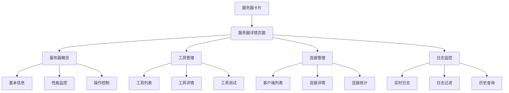

# MCP服务器详情页面设计文档

## 1. 产品概述

当用户点击MCP服务器卡片时，展示该服务器的详细信息页面，提供全面的服务器状态监控、工具管理、客户端连接管理和日志查看功能。

## 2. 核心功能

### 2.1 用户角色

| 角色  | 访问方式 | 核心权限              |
| --- | ---- | ----------------- |
| 管理员 | 默认访问 | 查看所有信息、管理服务器、查看日志 |
| 开发者 | 默认访问 | 查看服务器信息、工具列表、连接状态 |

### 2.2 功能模块

本MCP服务器详情页面包含以下主要模块：

1. **服务器概览页面**：服务器基本信息展示、状态监控、操作控制
2. **工具管理页面**：MCP工具列表、工具详情、工具测试
3. **连接管理页面**：客户端连接列表、连接状态、连接历史
4. **日志监控页面**：实时日志流、历史日志查询、日志过滤

### 2.3 页面详情

| 页面名称    | 模块名称   | 功能描述                                   |
| ------- | ------ | -------------------------------------- |
| 服务器概览页面 | 基本信息卡片 | 显示服务器名称、ID、状态、端口、传输类型、启动时间、运行时长        |
| 服务器概览页面 | 性能监控卡片 | 显示CPU使用率、内存使用率、请求数量、响应时间等实时指标          |
| 服务器概览页面 | 操作控制面板 | 提供启动、停止、重启、删除等服务器操作按钮                  |
| 工具管理页面  | 工具列表   | 展示该服务器提供的所有MCP工具，包括工具名称、描述、参数、使用次数     |
| 工具管理页面  | 工具详情抽屉 | 点击工具后展示详细信息，包括完整描述、参数列表、示例用法           |
| 工具管理页面  | 工具测试面板 | 提供工具参数输入和测试执行功能，显示执行结果                 |
| 连接管理页面  | 客户端列表  | 显示连接到此服务器的所有客户端，包括客户端ID、连接时间、状态、最后活动时间 |
| 连接管理页面  | 连接详情   | 展示单个客户端的详细连接信息和通信历史                    |
| 连接管理页面  | 连接统计图表 | 显示连接数量趋势、活跃度分析等可视化数据                   |
| 日志监控页面  | 实时日志流  | 实时显示服务器日志，支持自动滚动和暂停功能                  |
| 日志监控页面  | 日志过滤器  | 提供日志级别、时间范围、关键词等过滤条件                   |
| 日志监控页面  | 历史日志查询 | 支持按时间范围查询历史日志，分页显示结果                   |

## 3. 核心流程

用户点击MCP服务器卡片后，系统自动跳转到服务器详情页面，默认显示服务器概览信息。用户可以通过顶部标签页切换到不同的功能模块，每个模块提供相应的数据展示和操作功能。

## 4. 用户界面设计

### 4.1 设计风格

* 主色调：蓝色系（#1890ff）和灰色系（#f0f2f5）

* 按钮样式：圆角按钮，主要操作使用蓝色，次要操作使用灰色

* 字体：系统默认字体，标题使用16px，正文使用14px，辅助信息使用12px

* 布局风格：卡片式布局，顶部导航标签页，左右分栏展示

* 图标风格：使用Ant Design图标库，简洁现代风格

### 4.2 页面设计概览

| 页面名称 | 模块名称 | UI元素 |
| ---- | ---- | ---- |
| 服务器概 |      |      |

