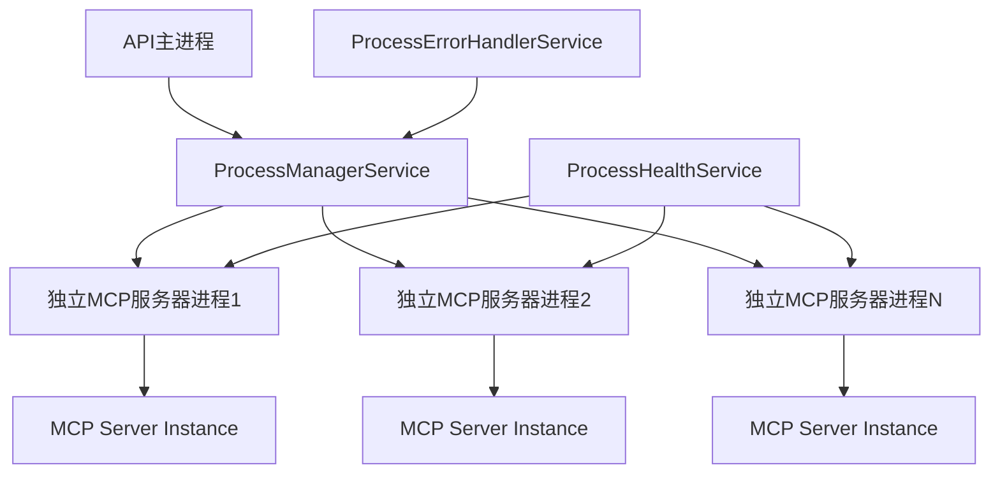

# MCP服务器进程隔离技术实施文档

## 1. 项目概述

本文档详细描述了如何在MCP Swagger API项目中实现真正的进程隔离，使MCP服务器在独立进程中运行，而不是在主API进程中运行。

## 2. 当前架构分析

### 2.1 现有进程管理基础设施

当前系统已具备完整的进程管理框架：

* **ProcessManagerService**: 负责进程的启动、停止、重启管理

* **ProcessHealthService**: 提供进程健康检查功能

* **ProcessErrorHandlerService**: 处理进程错误和重启策略

* **相关数据库实体**: ProcessInfoEntity、ProcessLogEntity、HealthCheckResultEntity

### 2.2 当前问题分析

虽然进程管理基础设施完备，但存在关键问题：

1. **缺少独立服务器脚本**: `ProcessConfig.scriptPath` 指向不存在的 `server.js`
2. **空参数配置**: `ProcessConfig.args` 为空数组，无法传递配置
3. **主进程运行**: MCP服务器仍在主进程中通过 `MCPService` 直接运行
4. **进程隔离未实现**: 子进程无法启动独立的MCP服务器实例

## 3. 进程隔离实现方案

### 3.1 整体架构设计



### 3.2 核心实现策略

1. **创建独立服务器启动脚本**
2. **修改进程配置传递机制**
3. **集成mcp-swagger-server CLI能力**
4. **增强进程间通信**
5. **完善进程监控和管理**

## 4. 具体实现步骤

### 4.1 创建独立MCP服务器启动脚本

#### 4.1.1 创建 `scripts/mcp-server-runner.js`

```javascript
#!/usr/bin/env node

const { createMcpServer, startStreamableMcpServer, startSseMcpServer, startStdioMcpServer } = require('mcp-swagger-server');
const fs = require('fs');
const path = require('path');

/**
 * 独立MCP服务器启动器
 * 用于在独立进程中启动MCP服务器实例
 */
class MCPServerRunner {
  constructor() {
    this.server = null;
    this.httpServer = null;
    this.config = null;
  }

  /**
   * 解析命令行参数
   */
  parseArguments() {
    const args = process.argv.slice(2);
    const config = {};
    
    for (let i = 0; i < args.length; i += 2) {
      const key = args[i].replace('--', '');
      const value = args[i + 1];
      
      switch (key) {
        case 'config-file':
          // 从配置文件加载
          const configData = JSON.parse(fs.readFileSync(value, 'utf8'));
          Object.assign(config, configData);
          break;
        case 'server-id':
          config.serverId = value;
          break;
        case 'server-name':
          config.serverName = value;
          break;
        case 'port':
          config.port = parseInt(value);
          break;
        case 'transport':
          config.transport = value;
          break;
        case 'openapi-data':
          config.openApiData = JSON.parse(value);
          break;
        case 'auth-config':
          config.authConfig = JSON.parse(value);
          break;
        default:
          config[key] = value;
      }
    }
    
    this.config = config;
    return config;
  }

  /**
   * 启动MCP服务器
   */
  async startServer() {
    try {
      console.log(`[${this.config.serverId}] Starting MCP server...`);
      
      // 创建MCP服务器实例
      this.server = await createMcpServer({
        openApiData: this.config.openApiData,
        authConfig: this.config.authConfig,
        customHeaders: this.config.customHeaders || {},
        debugHeaders: this.config.debugHeaders || false,
      });

      // 根据传输类型启动服务器
      switch (this.config.transport) {
        case 'streamable':
          this.httpServer = await startStreamableMcpServer(
            this.server, 
            this.config.endpoint || '/mcp', 
            this.config.port
          );
          console.log(`[${this.config.serverId}] Streamable server started on port ${this.config.port}`);
          break;
          
        case 'sse':
          this.httpServer = await startSseMcpServer(
            this.server, 
            this.config.endpoint || '/mcp', 
            this.config.port
          );
          console.log(`[${this.config.serverId}] SSE server started on port ${this.config.port}`);
          break;
          
        case 'stdio':
          await startStdioMcpServer(this.server);
          console.log(`[${this.config.serverId}] STDIO server started`);
          break;
          
        default:
          throw new Error(`Unsupported transport: ${this.config.transport}`);
      }

      // 设置进程信号处理
      this.setupSignalHandlers();
      
      // 发送启动成功信号
      process.send && process.send({
        type: 'server-started',
        serverId: this.config.serverId,
        port: this.config.port,
        transport: this.config.transport
      });
      
    } catch (error) {
      console.error(`[${this.config.serverId}] Failed to start server:`, error);
      process.send && process.send({
        type: 'server-error',
        serverId: this.config.serverId,
        error: error.message
      });
      process.exit(1);
    }
  }

  /**
   * 设置信号处理器
   */
  setupSignalHandlers() {
    const gracefulShutdown = async (signal) => {
      console.log(`[${this.config.serverId}] Received ${signal}, shutting down gracefully...`);
      
      try {
        if (this.httpServer) {
          await new Promise((resolve) => {
            this.httpServer.close(resolve);
          });
        }
        
        if (this.server && typeof this.server.close === 'function') {
          await this.server.close();
        }
        
        console.log(`[${this.config.serverId}] Server stopped gracefully`);
        process.exit(0);
      } catch (error) {
        console.error(`[${this.config.serverId}] Error during shutdown:`, error);
        process.exit(1);
      }
    };

    process.on('SIGTERM', () => gracefulShutdown('SIGTERM'));
    process.on('SIGINT', () => gracefulShutdown('SIGINT'));
    process.on('SIGHUP', () => gracefulShutdown('SIGHUP'));
  }

  /**
   * 健康检查端点
   */
  setupHealthCheck() {
    // 监听健康检查请求
    process.on('message', (message) => {
      if (message.type === 'health-check') {
        const isHealthy = this.server && (this.httpServer ? !this.httpServer.listening === false : true);
        process.send({
          type: 'health-check-response',
          serverId: this.config.serverId,
          healthy: isHealthy,
          timestamp: new Date().toISOString()
        });
      }
    });
  }
}

// 启动服务器
if (require.main === module) {
  const runner = new MCPServerRunner();
  runner.parseArguments();
  runner.setupHealthCheck();
  runner.startServer().catch(error => {
    console.error('Failed to start MCP server:', error);
    process.exit(1);
  });
}

module.exports = MCPServerRunner;
```

#### 4.1.2 创建配置文件模板 `scripts/server-config.template.json`

```json
{
  "serverId": "{{serverId}}",
  "serverName": "{{serverName}}",
  "port": {{port}},
  "transport": "{{transport}}",
  "openApiData": {{openApiData}},
  "authConfig": {{authConfig}},
  "customHeaders": {{customHeaders}},
  "debugHeaders": {{debugHeaders}},
  "endpoint": "{{endpoint}}"
}
```

### 4.2 修改进程实体类

#### 4.2.1 扩展 ProcessConfig 接口

```typescript
// src/modules/servers/interfaces/process.interface.ts

export interface ProcessConfig {
  serverId: string;
  serverName: string;
  scriptPath: string;
  args: string[];
  configFile?: string; // 新增：配置文件路径
  workingDirectory?: string; // 新增：工作目录
  env?: Record<string, string>;
  cwd?: string;
  timeout?: number;
  processTimeout?: number;
  maxRetries?: number;
  maxRestartAttempts?: number;
  restartDelay?: number;
  restartPolicy?: RestartPolicy;
  healthCheckEnabled?: boolean;
  healthCheckInterval?: number;
  healthCheckTimeout?: number;
  memoryLimit?: number;
  cpuLimit?: number;
  
  // 新增：MCP服务器特定配置
  mcpConfig?: {
    port: number;
    transport: TransportType;
    openApiData: any;
    authConfig?: any;
    customHeaders?: Record<string, string>;
    debugHeaders?: boolean;
    endpoint?: string;
  };
}
```

#### 4.2.2 扩展 ProcessInfoEntity

```typescript
// src/database/entities/process-info.entity.ts

import { Entity, PrimaryGeneratedColumn, Column, CreateDateColumn, UpdateDateColumn } from 'typeorm';
import { ProcessStatus, ProcessConfig } from '../../modules/servers/interfaces/process.interface';

@Entity('process_info')
export class ProcessInfoEntity {
  @PrimaryGeneratedColumn('uuid')
  id: string;

  @Column({ name: 'server_id' })
  serverId: string;

  @Column()
  pid: number;

  @Column({ name: 'start_time' })
  startTime: Date;

  @Column({
    type: 'enum',
    enum: ProcessStatus,
    default: ProcessStatus.STARTING
  })
  status: ProcessStatus;

  @Column({ name: 'restart_count', default: 0 })
  restartCount: number;

  @Column({ name: 'last_error', nullable: true })
  lastError?: string;

  @Column({ type: 'json', name: 'memory_usage', nullable: true })
  memoryUsage?: NodeJS.MemoryUsage;

  @Column({ type: 'json', name: 'cpu_usage', nullable: true })
  cpuUsage?: NodeJS.CpuUsage;

  // 新增字段
  @Column({ name: 'config_file_path', nullable: true })
  configFilePath?: string;

  @Column({ name: 'working_directory', nullable: true })
  workingDirectory?: string;

  @Column({ type: 'json', name: 'process_config', nullable: true })
  processConfig?: ProcessConfig;

  @Column({ name: 'last_health_check', nullable: true })
  lastHealthCheck?: Date;

  @Column({ name: 'health_status', default: true })
  healthStatus: boolean;

  @CreateDateColumn({ name: 'created_at' })
  createdAt: Date;

  @UpdateDateColumn({ name: 'updated_at' })
  updatedAt: Date;
}
```

### 4.3 修改 ProcessManagerService

#### 4.3.1 增强进程启动逻辑

```typescript
// src/modules/servers/services/process-manager.service.ts

import { Injectable, Logger, OnModuleDestroy } from '@nestjs/common';
import { spawn, ChildProcess } from 'child_process';
import * as fs from 'fs/promises';
import * as path from 'path';

@Injectable()
export class ProcessManagerService implements OnModuleDestroy {
  private readonly logger = new Logger(ProcessManagerService.name);
  private readonly processes = new Map<string, ChildProcess>();
  private readonly processInfo = new Map<string, ProcessInfo>();
  private readonly configFiles = new Map<string, string>(); // 配置文件路径映射

  /**
   * 启动进程（增强版）
   */
  async startProcess(config: ProcessConfig): Promise<ProcessInfo> {
    const { serverId } = config;
    
    // 检查进程是否已经在运行
    if (this.processes.has(serverId)) {
      const existingInfo = this.processInfo.get(serverId);
      if (existingInfo && existingInfo.status === ProcessStatus.RUNNING) {
        throw new Error(`Process for server ${serverId} is already running`);
      }
    }

    this.logger.log(`Starting isolated process for server: ${serverId}`);
    await this.logProcess(serverId, LogLevel.INFO, `Starting isolated process for server: ${config.serverName}`);

    try {
      // 更新状态为启动中
      await this.updateProcessStatus(serverId, ProcessStatus.STARTING);

      // 创建配置文件
      const configFilePath = await this.createConfigFile(serverId, config);
      this.configFiles.set(serverId, configFilePath);

      // 构建启动参数
      const scriptPath = path.resolve(__dirname, '../../../../scripts/mcp-server-runner.js');
      const args = [
        scriptPath,
        '--config-file', configFilePath,
        '--server-id', serverId,
        '--server-name', config.serverName
      ];

      // 创建子进程
      const childProcess = spawn('node', args, {
        cwd: config.workingDirectory || process.cwd(),
        env: { 
          ...process.env, 
          ...config.env,
          NODE_ENV: process.env.NODE_ENV || 'production'
        },
        stdio: ['pipe', 'pipe', 'pipe', 'ipc'], // 启用IPC通信
        detached: false,
      });

      if (!childProcess.pid) {
        throw new Error('Failed to start process - no PID assigned');
      }

      // 创建进程信息
      const processInfo: ProcessInfo = {
        serverId,
        pid: childProcess.pid,
        startTime: new Date(),
        status: ProcessStatus.RUNNING,
        restartCount: 0,
        updatedAt: new Date(),
        config,
      };

      // 存储进程引用和信息
      this.processes.set(serverId, childProcess);
      this.processInfo.set(serverId, processInfo);

      // 设置进程事件监听（增强版）
      this.setupEnhancedProcessListeners(serverId, childProcess, config);

      // 保存到数据库
      await this.saveProcessInfo(processInfo, configFilePath);

      // 写入PID文件
      await this.writePidFile(serverId, childProcess.pid);

      // 发送启动事件
      const event: ProcessEvent = {
        serverId,
        eventType: 'started',
        timestamp: new Date(),
        data: { pid: childProcess.pid, configFile: configFilePath }
      };
      this.eventEmitter.emit('process.started', event);

      this.logger.log(`Isolated process started successfully for server ${serverId} with PID ${childProcess.pid}`);
      await this.logProcess(serverId, LogLevel.INFO, `Isolated process started with PID ${childProcess.pid}`);

      return processInfo;
    } catch (error) {
      this.logger.error(`Failed to start isolated process for server ${serverId}:`, error);
      await this.logProcess(serverId, LogLevel.ERROR, `Failed to start isolated process: ${error.message}`);
      await this.updateProcessStatus(serverId, ProcessStatus.ERROR, error.message);
      
      // 清理配置文件
      const configFile = this.configFiles.get(serverId);
      if (configFile) {
        await this.cleanupConfigFile(configFile);
        this.configFiles.delete(serverId);
      }
      
      throw error;
    }
  }

  /**
   * 创建进程配置文件
   */
  private async createConfigFile(serverId: string, config: ProcessConfig): Promise<string> {
    const configDir = path.resolve(process.cwd(), 'temp', 'process-configs');
    await fs.mkdir(configDir, { recursive: true });
    
    const configFilePath = path.join(configDir, `${serverId}.json`);
    const configData = {
      serverId: config.serverId,
      serverName: config.serverName,
      port: config.mcpConfig?.port,
      transport: config.mcpConfig?.transport,
      openApiData: config.mcpConfig?.openApiData,
      authConfig: config.mcpConfig?.authConfig || null,
      customHeaders: config.mcpConfig?.customHeaders || {},
      debugHeaders: config.mcpConfig?.debugHeaders || false,
      endpoint: config.mcpConfig?.endpoint || '/mcp'
    };
    
    await fs.writeFile(configFilePath, JSON.stringify(configData, null, 2));
    this.logger.log(`Created config file for server ${serverId}: ${configFilePath}`);
    
    return configFilePath;
  }

  /**
   * 设置增强的进程事件监听
   */
  private setupEnhancedProcessListeners(serverId: string, childProcess: ChildProcess, config: ProcessConfig): void {
    // 监听IPC消息
    childProcess.on('message', (message: any) => {
      this.handleIPCMessage(serverId, message);
    });

    // 监听进程退出
    childProcess.on('exit', async (code, signal) => {
      this.logger.log(`Isolated process ${serverId} exited with code ${code} and signal ${signal}`);
      await this.logProcess(serverId, LogLevel.INFO, `Isolated process exited with code ${code} and signal ${signal}`);
      
      const event: ProcessEvent = {
        serverId,
        eventType: 'stopped',
        timestamp: new Date(),
        data: { code, signal }
      };
      this.eventEmitter.emit('process.stopped', event);
      
      // 清理资源
      await this.cleanupProcess(serverId);
    });

    // 监听错误
    childProcess.on('error', async (error) => {
      this.logger.error(`Isolated process ${serverId} error:`, error);
      await this.logProcess(serverId, LogLevel.ERROR, `Process error: ${error.message}`);
      
      const errorEvent: ProcessErrorEvent = {
        serverId,
        errorType: ProcessErrorType.PROCESS_ERROR,
        error,
        timestamp: new Date(),
        context: { pid: childProcess.pid }
      };
      this.eventEmitter.emit('process.error', errorEvent);
    });

    // 监听标准输出
    childProcess.stdout?.on('data', (data) => {
      const output = data.toString().trim();
      if (output) {
        this.logger.log(`[${serverId}] STDOUT: ${output}`);
      }
    });

    // 监听标准错误
    childProcess.stderr?.on('data', (data) => {
      const output = data.toString().trim();
      if (output) {
        this.logger.error(`[${serverId}] STDERR: ${output}`);
      }
    });
  }

  /**
   * 处理IPC消息
   */
  private handleIPCMessage(serverId: string, message: any): void {
    switch (message.type) {
      case 'server-started':
        this.logger.log(`Server ${serverId} started successfully on port ${message.port}`);
        this.eventEmitter.emit('server.process.started', {
          serverId,
          port: message.port,
          transport: message.transport
        });
        break;
        
      case 'server-error':
        this.logger.error(`Server ${serverId} startup error: ${message.error}`);
        this.eventEmitter.emit('server.process.error', {
          serverId,
          error: message.error
        });
        break;
        
      case 'health-check-response':
        this.eventEmitter.emit('process.health_check', {
          serverId,
          healthy: message.healthy,
          timestamp: message.timestamp
        });
        break;
        
      default:
        this.logger.debug(`Unknown IPC message from ${serverId}:`, message);
    }
  }

  /**
   * 发送健康检查请求
   */
  async sendHealthCheck(serverId: string): Promise<boolean> {
    const childProcess = this.processes.get(serverId);
    if (!childProcess) {
      return false;
    }

    return new Promise((resolve) => {
      const timeout = setTimeout(() => {
        resolve(false);
      }, 5000); // 5秒超时

      const messageHandler = (message: any) => {
        if (message.type === 'health-check-response' && message.serverId === serverId) {
          clearTimeout(timeout);
          childProcess.off('message', messageHandler);
          resolve(message.healthy);
        }
      };

      childProcess.on('message', messageHandler);
      childProcess.send({ type: 'health-check', serverId });
    });
  }

  /**
   * 清理进程资源（增强版）
   */
  private async cleanupProcess(serverId: string): Promise<void> {
    // 移除进程引用
    this.processes.delete(serverId);
    
    // 更新进程状态
    await this.updateProcessStatus(serverId, ProcessStatus.STOPPED);
    
    // 删除PID文件
    await this.deletePidFile(serverId);
    
    // 清理配置文件
    const configFile = this.configFiles.get(serverId);
    if (configFile) {
      await this.cleanupConfigFile(configFile);
      this.configFiles.delete(serverId);
    }
  }

  /**
   * 清理配置文件
   */
  private async cleanupConfigFile(configFilePath: string): Promise<void> {
    try {
      await fs.unlink(configFilePath);
      this.logger.log(`Cleaned up config file: ${configFilePath}`);
    } catch (error) {
      this.logger.warn(`Failed to cleanup config file ${configFilePath}:`, error);
    }
  }

  /**
   * 保存进程信息（增强版）
   */
  private async saveProcessInfo(processInfo: ProcessInfo, configFilePath?: string): Promise<void> {
    const entity = new ProcessInfoEntity();
    entity.serverId = processInfo.serverId;
    entity.pid = processInfo.pid;
    entity.startTime = processInfo.startTime;
    entity.status = processInfo.status;
    entity.restartCount = processInfo.restartCount;
    entity.lastError = processInfo.lastError;
    entity.memoryUsage = processInfo.memoryUsage;
    entity.cpuUsage = processInfo.cpuUsage;
    entity.configFilePath = configFilePath;
    entity.workingDirectory = processInfo.config?.workingDirectory;
    entity.processConfig = processInfo.config;
    entity.updatedAt = processInfo.updatedAt;

    await this.processInfoRepository.save(entity);
  }
}
```

### 4.4 修改 ServerLifecycleService

```typescript
// src/modules/servers/services/server-lifecycle.service.ts

/**
 * 启动MCP服务器（进程隔离版本）
 */
async startServer(serverEntity: MCPServerEntity): Promise<ServerStartResult> {
  this.logger.log(`Starting isolated server '${serverEntity.name}' on port ${serverEntity.port}`);

  try {
    // 验证OpenAPI数据
    await this.validateOpenApiData(serverEntity.openApiData);

    // 解析OpenAPI为MCP工具
    const tools = await this.parserService.parseSpecification(serverEntity.openApiData);
    
    // 准备进程配置（增强版）
    const processConfig: ProcessConfig = {
      ...DEFAULT_PROCESS_CONFIG,
      serverId: serverEntity.id,
      serverName: serverEntity.name,
      scriptPath: path.resolve(__dirname, '../../../../scripts/mcp-server-runner.js'),
      args: [], // 参数通过配置文件传递
      workingDirectory: process.cwd(),
      restartPolicy: serverEntity.config?.restartPolicy || {
        maxRetries: DEFAULT_PROCESS_CONFIG.defaultMaxRetries,
        retryDelay: DEFAULT_PROCESS_CONFIG.defaultRestartDelay,
        backoffMultiplier: DEFAULT_PROCESS_CONFIG.defaultBackoffMultiplier,
        maxRetryDelay: DEFAULT_PROCESS_CONFIG.defaultMaxRetryDelay
      },
      maxRestartAttempts: serverEntity.config?.maxRestartAttempts || DEFAULT_PROCESS_CONFIG.maxRestartAttempts,
      healthCheckEnabled: serverEntity.config?.healthCheckEnabled !== false,
      healthCheckInterval: serverEntity.config?.healthCheckInterval || DEFAULT_PROCESS_CONFIG.healthCheckInterval,
      processTimeout: serverEntity.config?.processTimeout || DEFAULT_PROCESS_CONFIG.processTimeout,
      memoryLimit: serverEntity.config?.memoryLimit || DEFAULT_PROCESS_CONFIG.memoryLimit,
      cpuLimit: serverEntity.config?.cpuLimit || DEFAULT_PROCESS_CONFIG.cpuLimit,
      
      // MCP服务器特定配置
      mcpConfig: {
        port: serverEntity.port,
        transport: serverEntity.transport,
        openApiData: tools, // 传递解析后的工具
        authConfig: serverEntity.authConfig,
        customHeaders: serverEntity.config?.customHeaders || {},
        debugHeaders: serverEntity.config?.debugHeaders || false,
        endpoint: serverEntity.config?.endpoint || '/mcp'
      }
    };

    // 启动隔离进程
    const processInfo = await this.processManager.startProcess(processConfig);

    // 等待服务器启动完成
    const serverStarted = await this.waitForServerStart(serverEntity.id, 30000); // 30秒超时
    
    if (!serverStarted) {
      throw new Error('Server failed to start within timeout period');
    }

    // 构建端点URL
    let endpoint: string;
    switch (serverEntity.transport) {
      case TransportType.STREAMABLE:
      case TransportType.SSE:
        endpoint = `http://localhost:${serverEntity.port}/mcp`;
        break;
      case TransportType.STDIO:
        endpoint = `stdio://${serverEntity.name}`;
        break;
      case TransportType.WEBSOCKET:
        endpoint = `ws://localhost:${serverEntity.port}`;
        break;
      default:
        throw new Error(`Unsupported transport type: ${serverEntity.transport}`);
    }

    // 启动健康检查
    if (processConfig.healthCheckEnabled) {
      await this.processHealth.startHealthCheck(serverEntity.id);
    }

    // 发送启动事件
    this.eventEmitter.emit('server.lifecycle.started', {
      serverId: serverEntity.id,
      serverName: serverEntity.name,
      transport: serverEntity.transport,
      endpoint,
      pid: processInfo.pid,
      isolated: true // 标记为隔离进程
    });

    this.logger.log(`Isolated server '${serverEntity.name}' started successfully at ${endpoint} (PID: ${processInfo.pid})`);

    return {
      success: true,
      endpoint,
      processInfo,
      status: 'running',
      data: {
        endpoint,
        isolated: true
      }
    };
  } catch (error) {
    this.logger.error(`Failed to start isolated server '${serverEntity.name}':`, error);
    
    this.eventEmitter.emit('server.lifecycle.start_failed', {
      serverId: serverEntity.id,
      serverName: serverEntity.name,
      error: error.message,
    });
    
    throw error;
  }
}

/**
 * 等待服务器启动完成
 */
private async waitForServerStart(serverId: string, timeout: number): Promise<boolean> {
  return new Promise((resolve) => {
    const startTime = Date.now();
    
    const checkInterval = setInterval(() => {
      if (Date.now() - startTime > timeout) {
        clearInterval(checkInterval);
        resolve(false);
        return;
      }
      
      // 检查进程状态
      const processInfo = this.processManager.getProcessInfo(serverId);
      if (processInfo && processInfo.status === ProcessStatus.RUNNING) {
        clearInterval(checkInterval);
        resolve(true);
      }
    }, 1000);
    
    // 监听启动成功事件
    const successHandler = (event: any) => {
      if (event.serverId === serverId) {
        clearInterval(checkInterval);
        this.eventEmitter.off('server.process.started', successHandler);
        resolve(true);
      }
    };
    
    this.eventEmitter.on('server.process.started', successHandler);
  });
}
```

## 5. 数据库迁移

### 5.1 创建迁移文件

```typescript
// src/database/migrations/xxxx-enhance-process-info.ts

import { MigrationInterface, QueryRunner, TableColumn } from 'typeorm';

export class EnhanceProcessInfo1234567890123 implements MigrationInterface {
  name = 'EnhanceProcessInfo1234567890123';

  public async up(queryRunner: QueryRunner): Promise<void> {
    // 添加新字段
    await queryRunner.addColumns('process_info', [
      new TableColumn({
        name: 'config_file_path',
        type: 'varchar',
        length: '500',
        isNullable: true,
      }),
      new TableColumn({
        name: 'working_directory',
        type: 'varchar',
        length: '500',
        isNullable: true,
      }),
      new TableColumn({
        name: 'process_config',
        type: 'json',
        isNullable: true,
      }),
      new TableColumn({
        name: 'last_health_check',
        type: 'timestamp',
        isNullable: true,
      }),
      new TableColumn({
        name: 'health_status',
        type: 'boolean',
        default: true,
      }),
    ]);
  }

  public async down(queryRunner: QueryRunner): Promise<void> {
    await queryRunner.dropColumns('process_info', [
      'config_file_path',
      'working_directory', 
      'process_config',
      'last_health_check',
      'health_status'
    ]);
  }
}
```

## 6. 进程间通信增强

### 6.1 创建 IPC 消息类型定义

```typescript
// src/modules/servers/interfaces/ipc.interface.ts

export interface IPCMessage {
  type: string;
  serverId: string;
  timestamp?: string;
  data?: any;
}

export interface ServerStartedMessage extends IPCMessage {
  type: 'server-started';
  port: number;
  transport: string;
}

export interface ServerErrorMessage extends IPCMessage {
  type: 'server-error';
  error: string;
}

export interface HealthCheckMessage extends IPCMessage {
  type: 'health-check';
}

export interface HealthCheckResponseMessage extends IPCMessage {
  type: 'health-check-response';
  healthy: boolean;
}

export interface ProcessMetricsMessage extends IPCMessage {
  type: 'process-metrics';
  metrics: {
    memoryUsage: NodeJS.MemoryUsage;
    cpuUsage: NodeJS.CpuUsage;
    uptime: number;
  };
}
```

## 7. 测试和验证

### 7.1 单元测试

```typescript
// test/process-isolation.spec.ts

import { Test, TestingModule } from '@nestjs/testing';
import { ProcessManagerService } from '../src/modules/servers/services/process-manager.service';
import { ProcessConfig, ProcessStatus } from '../src/modules/servers/interfaces/process.interface';

describe('ProcessManagerService - Process Isolation', () => {
  let service: ProcessManagerService;
  let module: TestingModule;

  beforeEach(async () => {
    module = await Test.createTestingModule({
      providers: [ProcessManagerService],
    }).compile();

    service = module.get<ProcessManagerService>(ProcessManagerService);
  });

  afterEach(async () => {
    await module.close();
  });

  it('should start isolated MCP server process', async () => {
    const config: ProcessConfig = {
      serverId: 'test-server-1',
      serverName: 'Test Server',
      scriptPath: 'scripts/mcp-server-runner.js',
      args: [],
      mcpConfig: {
        port: 3001,
        transport: 'streamable',
        openApiData: { /* test data */ },
      }
    };

    const processInfo = await service.startProcess(config);
    
    expect(processInfo).toBeDefined();
    expect(processInfo.serverId).toBe('test-server-1');
    expect(processInfo.status).toBe(ProcessStatus.RUNNING);
    expect(processInfo.pid).toBeGreaterThan(0);

    // 清理
    await service.stopProcess('test-server-1');
  });

  it('should handle process health checks', async () => {
    // 测试健康检查功能
  });

  it('should handle process restart', async () => {
    // 测试进程重启功能
  });
});
```

### 7.2 集成测试

```typescript
// test/integration/server-isolation.e2e-spec.ts

import { Test, TestingModule } from '@nestjs/testing';
import { INestApplication } from '@nestjs/common';
import { AppModule } from '../src/app.module';
import { ServerManagerService } from '../src/modules/servers/services/server-manager.service';

describe('Server Isolation (e2e)', () => {
  let app: INestApplication;
  let serverManager: ServerManagerService;

  beforeEach(async () => {
    const moduleFixture: TestingModule = await Test.createTestingModule({
      imports: [AppModule],
    }).compile();

    app = moduleFixture.createNestApplication();
    await app.init();
    
    serverManager = app.get<ServerManagerService>(ServerManagerService);
  });

  afterEach(async () => {
    await app.close();
  });

  it('should create and start isolated MCP server', async () => {
    const createDto = {
      name: 'test-isolated-server',
      description: 'Test isolated server',
      openApiData: { /* test OpenAPI spec */ },
      transport: 'streamable',
      port: 3002
    };

    const server = await serverManager.createServer(createDto);
    expect(server).toBeDefined();
    
    const startResult = await serverManager.startServer(server.id);
    expect(startResult.success).toBe(true);
    expect(startResult.data?.isolated).toBe(true);

    // 验证进程确实在独立运行
    const processInfo = await serverManager.getProcessInfo(server.id);
    expect(processInfo).toBeDefined();
    expect(processInfo.pid).toBeGreaterThan(0);

    // 清理
    await serverManager.stopServer(server.id);
    await serverManager.deleteServer(server.id);
  });
});
```

## 8. 部署和配置

### 8.1 环境变量配置

```bash
# .env

# 进程管理配置
PROCESS_TIMEOUT=30000
PROCESS_MAX_RETRIES=3
PROCESS_RESTART_DELAY=2000
HEALTH_CHECK_INTERVAL=30000

# 进程隔离配置
PROCESS_CONFIG_DIR=./temp/process-configs
PROCESS_WORKING_DIR=./
PROCESS_LOG_LEVEL=info

# MCP服务器配置
MCP_SERVER_SCRIPT_PATH=./scripts/mcp-server-runner.js
MCP_SERVER_TIMEOUT=30000
```

### 8.2 Docker 配置更新

```dockerfile
# Dockerfile

FROM node:20-alpine

WORKDIR /app

# 复制脚本文件
COPY scripts/ ./scripts/
RUN chmod +x ./scripts/mcp-server-runner.js

# 创建临时目录
RUN mkdir -p ./temp/process-configs
RUN mkdir -p ./pids
RUN mkdir -p ./logs

# 其他配置...
```

## 9. 监控和日志

### 9.1 进程监控增强

```typescript
// src/modules/monitoring/services/process-monitoring.service.ts

@Injectable()
export class ProcessMonitoringService {
  private readonly logger = new Logger(ProcessMonitoringService.name);

  constructor(
    private readonly processManager: ProcessManagerService,
    private readonly metricsService: MetricsService
  ) {}

  /**
   * 收集所有隔离进程的指标
   */
  async collectProcessMetrics(): Promise<ProcessMetrics[]> {
    const allProcesses = this.processManager.getAllProcessInfo();
    const metrics: ProcessMetrics[] = [];

    for (const processInfo of allProcesses) {
      try {
        const processMetrics = await this.collectSingleProcessMetrics(processInfo.serverId);
        if (processMetrics) {
          metrics.push(processMetrics);
        }
      } catch (error) {
        this.logger.error(`Failed to collect metrics for process ${processInfo.serverId}:`, error);
      }
    }

    return metrics;
  }

  /**
   * 收集单个进程指标
   */
  private async collectSingleProcessMetrics(serverId: string): Promise<ProcessMetrics | null> {
    const processInfo = this.processManager.getProcessInfo(serverId);
    if (!processInfo || processInfo.status !== ProcessStatus.RUNNING) {
      return null;
    }

    // 通过IPC获取进程指标
    return new Promise((resolve) => {
      const timeout = setTimeout(() => resolve(null), 5000);
      
      const messageHandler = (message: any) => {
        if (message.type === 'process-metrics' && message.serverId === serverId) {
          clearTimeout(timeout);
          resolve({
            serverId,
            uptime: Date.now() - processInfo.startTime.getTime(),
            memoryUsage: message.metrics.memoryUsage,
            cpuUsage: message.metrics.cpuUsage,
            requestCount: message.metrics.requestCount || 0,
            errorCount: message.metrics.errorCount || 0,
            lastHealthCheck: new Date(),
            averageResponseTime: message.metrics.averageResponseTime || 0
          });
        }
      };

      // 发送指标收集请求
      this.processManager.sendIPCMessage(serverId, {
        type: 'collect-metrics',
        serverId
      });
    });
  }
}
```

## 10. 总结

本技术实施文档提供了完整的MCP服务器进程隔离解决方案，包括：

1. **独立服务器启动脚本**: 创建可在独立进程中运行的MCP服务器
2. **进程管理增强**: 扩展ProcessManagerService支持真正的进程隔离
3. **数据库实体扩展**: 增加必要字段支持进程隔离功能
4. **进程间通信**: 实现主进程与子进程的可靠通信
5. **健康检查和监控**: 完善的进程健康监控机制
6. **错误处理和重启**: 健壮的错误处理和自动重启策略

通过这个方案，每个MCP服务器将在独立的Node.js进程中运行，实现真正的进程隔离，提高系统的稳定性和可扩展性。

### 实施优先级

1. **高优先级**: 创建独立服务器脚本、修改ProcessManagerService
2. **中优先级**: 数据库实体扩展、进程间通信
3. **低优先级**: 监控增强、测试完善

### 预期收益

* **隔离性**: 每个MCP服务器独立运行，互不影响

* **稳定性**: 单个服务器崩溃不会影响其他服务器

* **可扩展性**: 支持更多并发服务器实例

* **监控性**: 更精确的进程级监控和管理

* **维护性**: 更容易调试和维护单个服务器实例

