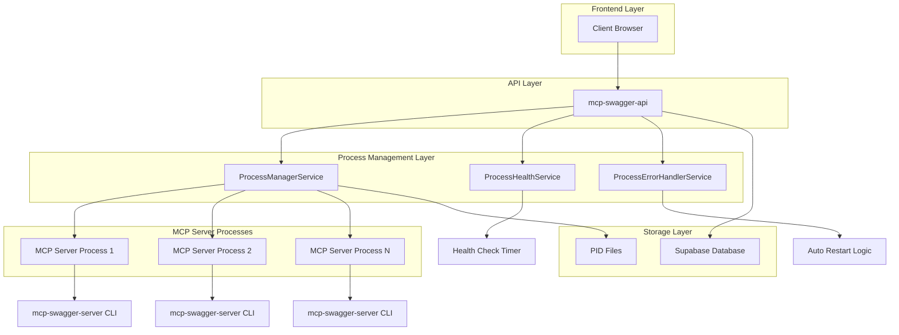
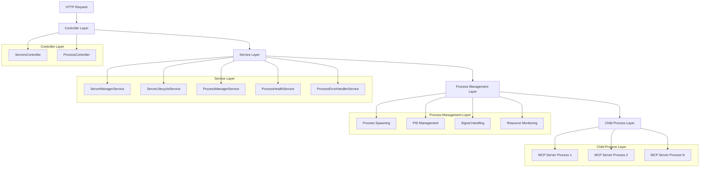
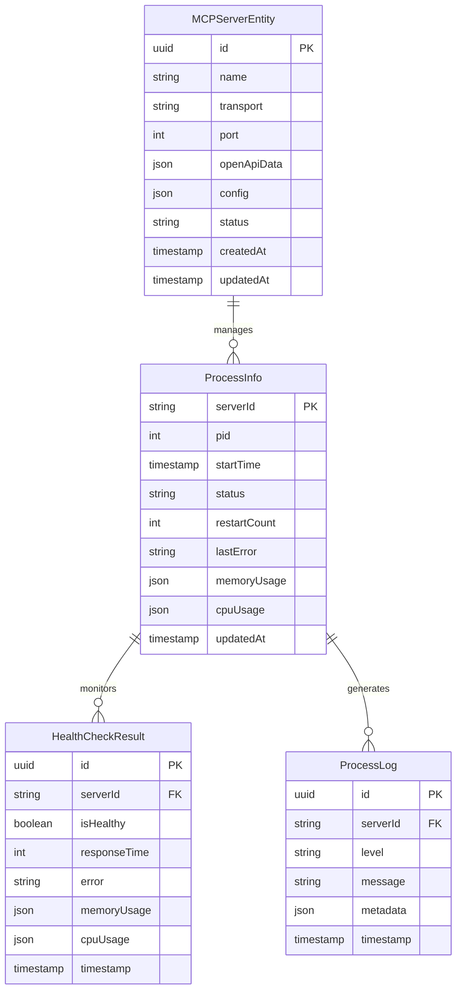

# MCP Server 进程管理技术架构文档

## 1. 架构设计



## 2. 技术描述

- Frontend: React@18 + tailwindcss@3 + vite
- Backend: NestJS@10 + TypeScript@5
- Database: Supabase (PostgreSQL)
- Process Management: Node.js child_process + Custom Process Manager
- Health Monitoring: Cron Jobs + Event Emitters
- IPC: Standard I/O + Process Signals

## 3. 路由定义

| Route | Purpose |
|-------|----------|
| /v1/servers | 服务器管理页面，显示所有MCP服务器状态 |
| /v1/servers/:id | 单个服务器详情页面，显示服务器配置和状态 |
| /v1/processes | 进程管理页面，显示所有进程状态和监控信息 |
| /v1/processes/:serverId | 单个进程详情页面，显示进程健康状态和日志 |
| /v1/processes/:serverId/health | 进程健康检查页面，显示历史记录和实时状态 |

## 4. API 定义

### 4.1 进程管理 API

**获取所有进程状态**
```
GET /api/v1/processes
```

Response:
| Param Name | Param Type | Description |
|------------|------------|-------------|
| processes | ProcessInfo[] | 进程信息列表 |

Example:
```json
{
  "processes": [
    {
      "serverId": "server-1",
      "pid": 12345,
      "startTime": "2024-01-15T10:30:00Z",
      "status": "running",
      "restartCount": 0,
      "memoryUsage": {
        "rss": 52428800,
        "heapTotal": 29360128,
        "heapUsed": 20971520
      }
    }
  ]
}
```

**启动进程**
```
POST /api/v1/processes
```

Request:
| Param Name | Param Type | isRequired | Description |
|------------|------------|------------|-------------|
| serverId | string | true | 服务器ID |
| config | ProcessConfig | true | 进程配置 |

Response:
| Param Name | Param Type | Description |
|------------|------------|-------------|
| processInfo | ProcessInfo | 启动的进程信息 |

**停止进程**
```
DELETE /api/v1/processes/:serverId
```

Request:
| Param Name | Param Type | isRequired | Description |
|------------|------------|------------|-------------|
| serverId | string | true | 服务器ID |
| force | boolean | false | 是否强制停止 |

Response:
| Param Name | Param Type | Description |
|------------|------------|-------------|
| message | string | 操作结果消息 |

**重启进程**
```
POST /api/v1/processes/:serverId/restart
```

Request:
| Param Name | Param Type | isRequired | Description |
|------------|------------|------------|-------------|
| serverId | string | true | 服务器ID |

Response:
| Param Name | Param Type | Description |
|------------|------------|-------------|
| processInfo | ProcessInfo | 重启后的进程信息 |

### 4.2 健康检查 API

**获取健康检查历史**
```
GET /api/v1/processes/:serverId/health/history
```

Response:
| Param Name | Param Type | Description |
|------------|------------|-------------|
| history | HealthCheckResult[] | 健康检查历史记录 |

Example:
```json
{
  "history": [
    {
      "serverId": "server-1",
      "isHealthy": true,
      "responseTime": 150,
      "timestamp": "2024-01-15T10:35:00Z",
      "memoryUsage": {
        "rss": 52428800,
        "heapTotal": 29360128,
        "heapUsed": 20971520
      }
    }
  ]
}
```

**手动健康检查**
```
POST /api/v1/processes/:serverId/health/check
```

Response:
| Param Name | Param Type | Description |
|------------|------------|-------------|
| result | HealthCheckResult | 健康检查结果 |

### 4.3 服务器管理 API（更新）

**启动服务器（更新为进程模式）**
```
POST /api/v1/servers/:id/start
```

Response:
| Param Name | Param Type | Description |
|------------|------------|-------------|
| endpoint | string | 服务器端点URL |
| processInfo | ProcessInfo | 进程信息 |
| status | string | 启动状态 |

Example:
```json
{
  "endpoint": "http://localhost:3001/mcp",
  "processInfo": {
    "pid": 12345,
    "startTime": "2024-01-15T10:30:00Z",
    "status": "running"
  },
  "status": "started"
}
```

## 5. 服务器架构图



## 6. 数据模型

### 6.1 数据模型定义



### 6.2 数据定义语言

**进程信息表 (process_info)**
```sql
-- 创建进程信息表
CREATE TABLE process_info (
    server_id VARCHAR(255) PRIMARY KEY,
    pid INTEGER NOT NULL,
    start_time TIMESTAMP WITH TIME ZONE NOT NULL,
    status VARCHAR(20) NOT NULL CHECK (status IN ('starting', 'running', 'stopping', 'stopped', 'error')),
    restart_count INTEGER DEFAULT 0,
    last_error TEXT,
    memory_usage JSONB,
    cpu_usage JSONB,
    updated_at TIMESTAMP WITH TIME ZONE DEFAULT NOW()
);

-- 创建索引
CREATE INDEX idx_process_info_status ON process_info(status);
CREATE INDEX idx_process_info_updated_at ON process_info(updated_at DESC);

-- 设置权限
GRANT SELECT ON process_info TO anon;
GRANT ALL PRIVILEGES ON process_info TO authenticated;
```

**健康检查结果表 (health_check_results)**
```sql
-- 创建健康检查结果表
CREATE TABLE health_check_results (
    id UUID PRIMARY KEY DEFAULT gen_random_uuid(),
    server_id VARCHAR(255) NOT NULL,
    is_healthy BOOLEAN NOT NULL,
    response_time INTEGER NOT NULL,
    error_message TEXT,
    memory_usage JSONB,
    cpu_usage JSONB,
    timestamp TIMESTAMP WITH TIME ZONE DEFAULT NOW()
);

-- 创建索引
CREATE INDEX idx_health_check_server_id ON health_check_results(server_id);
CREATE INDEX idx_health_check_timestamp ON health_check_results(timestamp DESC);
CREATE INDEX idx_health_check_healthy ON health_check_results(is_healthy);

-- 设置权限
GRANT SELECT ON health_check_results TO anon;
GRANT ALL PRIVILEGES ON health_check_results TO authenticated;

-- 自动清理旧记录（保留最近7天）
CREATE OR REPLACE FUNCTION cleanup_old_health_checks()
RETURNS void AS $$
BEGIN
    DELETE FROM health_check_results 
    WHERE timestamp < NOW() - INTERVAL '7 days';
END;
$$ LANGUAGE plpgsql;

-- 创建定时任务（需要pg_cron扩展）
-- SELECT cron.schedule('cleanup-health-checks', '0 2 * * *', 'SELECT cleanup_old_health_checks();');
```

**进程日志表 (process_logs)**
```sql
-- 创建进程日志表
CREATE TABLE process_logs (
    id UUID PRIMARY KEY DEFAULT gen_random_uuid(),
    server_id VARCHAR(255) NOT NULL,
    level VARCHAR(10) NOT NULL CHECK (level IN ('debug', 'info', 'warn', 'error')),
    message TEXT NOT NULL,
    metadata JSONB,
    timestamp TIMESTAMP WITH TIME ZONE DEFAULT NOW()
);

-- 创建索引
CREATE INDEX idx_process_logs_server_id ON process_logs(server_id);
CREATE INDEX idx_process_logs_timestamp ON process_logs(timestamp DESC);
CREATE INDEX idx_process_logs_level ON process_logs(level);

-- 设置权限
GRANT SELECT ON process_logs TO anon;
GRANT ALL PRIVILEGES ON process_logs TO authenticated;

-- 自动清理旧日志（保留最近30天）
CREATE OR REPLACE FUNCTION cleanup_old_process_logs()
RETURNS void AS $$
BEGIN
    DELETE FROM process_logs 
    WHERE timestamp < NOW() - INTERVAL '30 days';
END;
$$ LANGUAGE plpgsql;
```

**更新现有服务器表**
```sql
-- 为现有的 mcp_servers 表添加进程相关字段
ALTER TABLE mcp_servers 
ADD COLUMN IF NOT EXISTS process_pid INTEGER,
ADD COLUMN IF NOT EXISTS process_status VARCHAR(20) DEFAULT 'stopped',
ADD COLUMN IF NOT EXISTS last_restart_time TIMESTAMP WITH TIME ZONE,
ADD COLUMN IF NOT EXISTS restart_count INTEGER DEFAULT 0;

-- 创建索引
CREATE INDEX IF NOT EXISTS idx_mcp_servers_process_status ON mcp_servers(process_status);
CREATE INDEX IF NOT EXISTS idx_mcp_servers_process_pid ON mcp_servers(process_pid);
```

**初始化数据**
```sql
-- 插入默认的重启策略配置
INSERT INTO process_logs (server_id, level, message, metadata)
VALUES 
('system', 'info', 'Process management system initialized', 
 '{"component": "ProcessManager", "version": "1.0.0"}');

-- 清理可能存在的僵尸进程记录
UPDATE mcp_servers 
SET process_status = 'stopped', process_pid = NULL 
WHERE process_status IN ('starting', 'running') 
AND updated_at < NOW() - INTERVAL '1 hour';
```

## 7. TypeScript 类型定义

```typescript
// 进程配置接口
export interface ProcessConfig {
  serverId: string;
  serverName: string;
  scriptPath: string;
  args: string[];
  env?: Record<string, string>;
  cwd?: string;
  timeout?: number;
  maxRetries?: number;
  restartDelay?: number;
}

// 进程信息接口
export interface ProcessInfo {
  serverId: string;
  pid: number;
  startTime: Date;
  status: ProcessStatus;
  restartCount: number;
  lastError?: string;
  memoryUsage?: NodeJS.MemoryUsage;
  cpuUsage?: NodeJS.CpuUsage;
  updatedAt: Date;
}

// 进程状态枚举
export enum ProcessStatus {
  STARTING = 'starting',
  RUNNING = 'running',
  STOPPING = 'stopping',
  STOPPED = 'stopped',
  ERROR = 'error'
}

// 健康检查结果接口
export interface HealthCheckResult {
  id: string;
  serverId: string;
  isHealthy: boolean;
  responseTime: number;
  error?: string;
  memoryUsage?: NodeJS.MemoryUsage;
  cpuUsage?: NodeJS.CpuUsage;
  timestamp: Date;
}

// 重启策略接口
export interface RestartPolicy {
  maxRetries: number;
  retryDelay: number;
  backoffMultiplier: number;
  maxRetryDelay: number;
}

// 进程日志接口
export interface ProcessLog {
  id: string;
  serverId: string;
  level: LogLevel;
  message: string;
  metadata?: Record<string, any>;
  timestamp: Date;
}

// 日志级别枚举
export enum LogLevel {
  DEBUG = 'debug',
  INFO = 'info',
  WARN = 'warn',
  ERROR = 'error'
}

// 服务器启动结果接口（更新）
export interface ServerStartResult {
  endpoint: string;
  processInfo: ProcessInfo;
  status: string;
}

// 进程事件接口
export interface ProcessEvent {
  serverId: string;
  eventType: 'started' | 'stopped' | 'error' | 'health_check';
  timestamp: Date;
  data?: any;
}
```

## 8. 配置管理

```typescript
// 进程管理配置
export interface ProcessManagerConfig {
  // 进程超时设置
  processTimeout: number; // 默认 30000ms
  
  // 重启策略
  defaultMaxRetries: number; // 默认 3
  defaultRestartDelay: number; // 默认 2000ms
  defaultBackoffMultiplier: number; // 默认 1.5
  defaultMaxRetryDelay: number; // 默认 30000ms
  
  // 健康检查设置
  healthCheckInterval: number; // 默认 30000ms
  healthCheckTimeout: number; // 默认 5000ms
  
  // 资源限制
  memoryLimitMB: number; // 默认 512MB
  cpuLimitPercent: number; // 默认 80%
  
  // 文件路径
  pidDirectory: string; // 默认 './pids'
  logDirectory: string; // 默认 './logs'
  
  // 日志设置
  logLevel: LogLevel; // 默认 'info'
  logToFile: boolean; // 默认 true
  logRotation: boolean; // 默认 true
  maxLogFiles: number; // 默认 10
  maxLogSize: string; // 默认 '10MB'
}

// 默认配置
export const DEFAULT_PROCESS_CONFIG: ProcessManagerConfig = {
  processTimeout: 30000,
  defaultMaxRetries: 3,
  defaultRestartDelay: 2000,
  defaultBackoffMultiplier: 1.5,
  defaultMaxRetryDelay: 30000,
  healthCheckInterval: 30000,
  healthCheckTimeout: 5000,
  memoryLimitMB: 512,
  cpuLimitPercent: 80,
  pidDirectory: './pids',
  logDirectory: './logs',
  logLevel: LogLevel.INFO,
  logToFile: true,
  logRotation: true,
  maxLogFiles: 10,
  maxLogSize: '10MB'
};
```

## 9. 错误处理和监控

```typescript
// 错误类型定义
export enum ProcessErrorType {
  STARTUP_FAILED = 'startup_failed',
  PROCESS_CRASHED = 'process_crashed',
  HEALTH_CHECK_FAILED = 'health_check_failed',
  RESOURCE_LIMIT_EXCEEDED = 'resource_limit_exceeded',
  COMMUNICATION_ERROR = 'communication_error'
}

// 错误事件接口
export interface ProcessErrorEvent {
  serverId: string;
  errorType: ProcessErrorType;
  error: Error;
  timestamp: Date;
  context?: Record<string, any>;
}

// 监控指标接口
export interface ProcessMetrics {
  serverId: string;
  uptime: number;
  memoryUsage: NodeJS.MemoryUsage;
  cpuUsage: NodeJS.CpuUsage;
  requestCount: number;
  errorCount: number;
  lastHealthCheck: Date;
  averageResponseTime: number;
}
```

这个技术架构文档提供了完整的实现细节，包括数据库设计、API接口、类型定义和配置管理，为开发团队提供了清晰的技术实现指南。