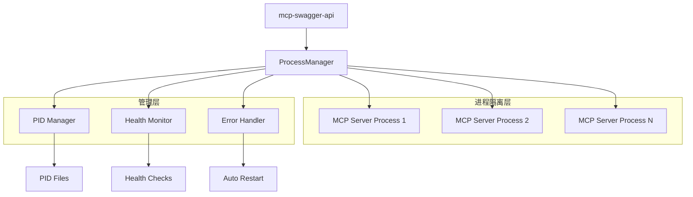

# MCP Server 进程管理和隔离方案

## 1. 问题分析

### 1.1 当前架构问题
- **进程耦合**：mcp-swagger-api 直接在内存中创建 mcp server 实例，缺乏进程隔离
- **停止困难**：无法安全地停止已启动的 mcp server 进程
- **错误传播**：mcp server 崩溃可能导致整个 mcp-swagger-api 服务崩溃
- **资源管理**：缺乏对 mcp server 进程的监控和资源限制

### 1.2 目标需求
- 实现 mcp server 作为独立子进程运行
- 提供安全的进程启动、停止和重启机制
- 实现进程监控和健康检查
- 提供错误隔离和自动恢复功能
- 支持进程资源限制和管理

## 2. 解决方案设计

### 2.1 架构概览



### 2.2 核心组件设计

#### 2.2.1 ProcessManager（进程管理器）
- **职责**：统一管理所有 MCP Server 子进程
- **功能**：
  - 进程启动、停止、重启
  - 进程状态跟踪
  - 资源监控
  - 错误处理和恢复

#### 2.2.2 PID Manager（进程ID管理）
- **职责**：管理进程ID和生命周期
- **功能**：
  - PID 文件管理
  - 进程存活检查
  - 僵尸进程清理

#### 2.2.3 Health Monitor（健康监控）
- **职责**：监控 MCP Server 进程健康状态
- **功能**：
  - 定期健康检查
  - 性能指标收集
  - 异常检测和报警

#### 2.2.4 Error Handler（错误处理器）
- **职责**：处理进程错误和异常情况
- **功能**：
  - 错误隔离
  - 自动重启策略
  - 错误日志记录

## 3. 实现方案

### 3.1 进程管理服务重构

#### 3.1.1 新增 ProcessManagerService

```typescript
// src/modules/servers/services/process-manager.service.ts
import { Injectable, Logger } from '@nestjs/common';
import { spawn, ChildProcess } from 'child_process';
import { EventEmitter2 } from '@nestjs/event-emitter';
import { writeFileSync, readFileSync, existsSync, unlinkSync } from 'fs';
import { join } from 'path';

export interface ProcessConfig {
  serverId: string;
  serverName: string;
  scriptPath: string;
  args: string[];
  env?: Record<string, string>;
  cwd?: string;
  timeout?: number;
  maxRetries?: number;
  restartDelay?: number;
}

export interface ProcessInfo {
  pid: number;
  startTime: Date;
  status: 'starting' | 'running' | 'stopping' | 'stopped' | 'error';
  restartCount: number;
  lastError?: string;
  memoryUsage?: NodeJS.MemoryUsage;
  cpuUsage?: NodeJS.CpuUsage;
}

@Injectable()
export class ProcessManagerService {
  private readonly logger = new Logger(ProcessManagerService.name);
  private processes = new Map<string, ChildProcess>();
  private processInfo = new Map<string, ProcessInfo>();
  private pidDir = join(process.cwd(), 'pids');
  
  constructor(private eventEmitter: EventEmitter2) {
    this.ensurePidDirectory();
    this.setupExitHandlers();
  }

  /**
   * 启动 MCP Server 进程
   */
  async startProcess(config: ProcessConfig): Promise<ProcessInfo> {
    const { serverId, scriptPath, args, env, cwd } = config;
    
    // 检查进程是否已存在
    if (this.processes.has(serverId)) {
      throw new Error(`Process ${serverId} is already running`);
    }

    this.logger.log(`Starting MCP Server process: ${serverId}`);
    
    try {
      // 启动子进程
      const childProcess = spawn('node', [scriptPath, ...args], {
        stdio: ['pipe', 'pipe', 'pipe'],
        env: { ...process.env, ...env, MCP_MANAGED: 'true' },
        cwd: cwd || process.cwd(),
        detached: false
      });

      if (!childProcess.pid) {
        throw new Error('Failed to get process PID');
      }

      // 保存进程信息
      const processInfo: ProcessInfo = {
        pid: childProcess.pid,
        startTime: new Date(),
        status: 'starting',
        restartCount: 0
      };

      this.processes.set(serverId, childProcess);
      this.processInfo.set(serverId, processInfo);
      
      // 保存 PID 文件
      this.savePidFile(serverId, childProcess.pid);
      
      // 设置进程事件监听
      this.setupProcessHandlers(serverId, childProcess);
      
      // 等待进程启动完成
      await this.waitForProcessReady(serverId, config.timeout || 30000);
      
      processInfo.status = 'running';
      this.eventEmitter.emit('process.started', { serverId, pid: childProcess.pid });
      
      return processInfo;
      
    } catch (error) {
      this.logger.error(`Failed to start process ${serverId}:`, error);
      this.cleanup(serverId);
      throw error;
    }
  }

  /**
   * 停止 MCP Server 进程
   */
  async stopProcess(serverId: string, force = false): Promise<void> {
    const childProcess = this.processes.get(serverId);
    const processInfo = this.processInfo.get(serverId);
    
    if (!childProcess || !processInfo) {
      this.logger.warn(`Process ${serverId} not found`);
      return;
    }

    this.logger.log(`Stopping MCP Server process: ${serverId} (PID: ${processInfo.pid})`);
    processInfo.status = 'stopping';

    return new Promise((resolve) => {
      const timeout = setTimeout(() => {
        if (childProcess && !childProcess.killed) {
          this.logger.warn(`Force killing process ${serverId}`);
          childProcess.kill('SIGKILL');
        }
      }, force ? 1000 : 5000);

      childProcess.once('exit', () => {
        clearTimeout(timeout);
        this.cleanup(serverId);
        this.eventEmitter.emit('process.stopped', { serverId });
        resolve();
      });

      // 发送终止信号
      childProcess.kill('SIGTERM');
    });
  }

  /**
   * 重启 MCP Server 进程
   */
  async restartProcess(serverId: string, config: ProcessConfig): Promise<ProcessInfo> {
    const processInfo = this.processInfo.get(serverId);
    
    if (processInfo) {
      processInfo.restartCount++;
      await this.stopProcess(serverId);
      
      // 等待一段时间后重启
      await new Promise(resolve => setTimeout(resolve, config.restartDelay || 2000));
    }
    
    return this.startProcess(config);
  }

  /**
   * 获取进程信息
   */
  getProcessInfo(serverId: string): ProcessInfo | undefined {
    return this.processInfo.get(serverId);
  }

  /**
   * 获取所有进程信息
   */
  getAllProcessInfo(): Map<string, ProcessInfo> {
    return new Map(this.processInfo);
  }

  /**
   * 检查进程是否运行
   */
  isProcessRunning(serverId: string): boolean {
    const processInfo = this.processInfo.get(serverId);
    return processInfo?.status === 'running';
  }

  // 私有方法实现...
  private setupProcessHandlers(serverId: string, childProcess: ChildProcess): void {
    // 进程退出处理
    childProcess.on('exit', (code, signal) => {
      this.logger.warn(`Process ${serverId} exited with code ${code}, signal ${signal}`);
      const processInfo = this.processInfo.get(serverId);
      if (processInfo) {
        processInfo.status = 'stopped';
      }
      this.eventEmitter.emit('process.exited', { serverId, code, signal });
    });

    // 错误处理
    childProcess.on('error', (error) => {
      this.logger.error(`Process ${serverId} error:`, error);
      const processInfo = this.processInfo.get(serverId);
      if (processInfo) {
        processInfo.status = 'error';
        processInfo.lastError = error.message;
      }
      this.eventEmitter.emit('process.error', { serverId, error });
    });

    // 输出处理
    if (childProcess.stdout) {
      childProcess.stdout.on('data', (data) => {
        this.logger.debug(`${serverId} STDOUT: ${data.toString().trim()}`);
      });
    }

    if (childProcess.stderr) {
      childProcess.stderr.on('data', (data) => {
        this.logger.debug(`${serverId} STDERR: ${data.toString().trim()}`);
      });
    }
  }

  private async waitForProcessReady(serverId: string, timeout: number): Promise<void> {
    // 实现进程就绪检查逻辑
    return new Promise((resolve, reject) => {
      const timer = setTimeout(() => {
        reject(new Error(`Process ${serverId} startup timeout`));
      }, timeout);

      // 这里可以通过健康检查或其他方式确认进程就绪
      // 简化实现：等待2秒
      setTimeout(() => {
        clearTimeout(timer);
        resolve();
      }, 2000);
    });
  }

  private cleanup(serverId: string): void {
    this.processes.delete(serverId);
    const processInfo = this.processInfo.get(serverId);
    if (processInfo) {
      processInfo.status = 'stopped';
    }
    this.removePidFile(serverId);
  }

  private savePidFile(serverId: string, pid: number): void {
    const pidFile = join(this.pidDir, `${serverId}.pid`);
    try {
      writeFileSync(pidFile, pid.toString());
    } catch (error) {
      this.logger.error(`Failed to save PID file for ${serverId}:`, error);
    }
  }

  private removePidFile(serverId: string): void {
    const pidFile = join(this.pidDir, `${serverId}.pid`);
    try {
      if (existsSync(pidFile)) {
        unlinkSync(pidFile);
      }
    } catch (error) {
      this.logger.error(`Failed to remove PID file for ${serverId}:`, error);
    }
  }

  private ensurePidDirectory(): void {
    if (!existsSync(this.pidDir)) {
      require('fs').mkdirSync(this.pidDir, { recursive: true });
    }
  }

  private setupExitHandlers(): void {
    process.on('SIGINT', () => this.shutdownAllProcesses());
    process.on('SIGTERM', () => this.shutdownAllProcesses());
    process.on('exit', () => this.shutdownAllProcesses());
  }

  private async shutdownAllProcesses(): Promise<void> {
    this.logger.log('Shutting down all MCP Server processes...');
    const promises = Array.from(this.processes.keys()).map(serverId => 
      this.stopProcess(serverId, true)
    );
    await Promise.all(promises);
  }
}
```

#### 3.1.2 健康监控服务

```typescript
// src/modules/servers/services/process-health.service.ts
import { Injectable, Logger } from '@nestjs/common';
import { Cron, CronExpression } from '@nestjs/schedule';
import { EventEmitter2 } from '@nestjs/event-emitter';
import { ProcessManagerService } from './process-manager.service';

export interface HealthCheckResult {
  serverId: string;
  isHealthy: boolean;
  responseTime: number;
  error?: string;
  memoryUsage?: NodeJS.MemoryUsage;
  cpuUsage?: NodeJS.CpuUsage;
  timestamp: Date;
}

@Injectable()
export class ProcessHealthService {
  private readonly logger = new Logger(ProcessHealthService.name);
  private healthHistory = new Map<string, HealthCheckResult[]>();
  
  constructor(
    private processManager: ProcessManagerService,
    private eventEmitter: EventEmitter2
  ) {}

  /**
   * 定期健康检查
   */
  @Cron(CronExpression.EVERY_30_SECONDS)
  async performHealthChecks(): Promise<void> {
    const processInfoMap = this.processManager.getAllProcessInfo();
    
    for (const [serverId, processInfo] of processInfoMap) {
      if (processInfo.status === 'running') {
        await this.checkProcessHealth(serverId);
      }
    }
  }

  /**
   * 检查单个进程健康状态
   */
  async checkProcessHealth(serverId: string): Promise<HealthCheckResult> {
    const startTime = Date.now();
    const processInfo = this.processManager.getProcessInfo(serverId);
    
    if (!processInfo) {
      throw new Error(`Process ${serverId} not found`);
    }

    try {
      // 检查进程是否存在
      process.kill(processInfo.pid, 0);
      
      // 获取进程资源使用情况
      const memoryUsage = process.memoryUsage();
      const cpuUsage = process.cpuUsage();
      
      const result: HealthCheckResult = {
        serverId,
        isHealthy: true,
        responseTime: Date.now() - startTime,
        memoryUsage,
        cpuUsage,
        timestamp: new Date()
      };
      
      this.saveHealthResult(serverId, result);
      this.eventEmitter.emit('process.health.checked', result);
      
      return result;
      
    } catch (error) {
      const result: HealthCheckResult = {
        serverId,
        isHealthy: false,
        responseTime: Date.now() - startTime,
        error: error.message,
        timestamp: new Date()
      };
      
      this.saveHealthResult(serverId, result);
      this.eventEmitter.emit('process.health.failed', result);
      
      return result;
    }
  }

  /**
   * 获取健康检查历史
   */
  getHealthHistory(serverId: string, limit = 50): HealthCheckResult[] {
    const history = this.healthHistory.get(serverId) || [];
    return history.slice(-limit);
  }

  private saveHealthResult(serverId: string, result: HealthCheckResult): void {
    let history = this.healthHistory.get(serverId) || [];
    history.push(result);
    
    // 保持最近100条记录
    if (history.length > 100) {
      history = history.slice(-100);
    }
    
    this.healthHistory.set(serverId, history);
  }
}
```

#### 3.1.3 修改 ServerLifecycleService

```typescript
// 修改现有的 server-lifecycle.service.ts
// 将直接创建 MCP Server 实例改为启动独立进程

@Injectable()
export class ServerLifecycleService {
  constructor(
    private processManager: ProcessManagerService,
    // ... 其他依赖
  ) {}

  /**
   * 启动MCP服务器（修改为进程模式）
   */
  async startServer(serverEntity: MCPServerEntity): Promise<ServerStartResult> {
    this.logger.log(`Starting server '${serverEntity.name}' as separate process`);

    try {
      // 验证OpenAPI数据
      await this.validateOpenApiData(serverEntity.openApiData);

      // 准备进程配置
      const processConfig: ProcessConfig = {
        serverId: serverEntity.id,
        serverName: serverEntity.name,
        scriptPath: this.getServerScriptPath(),
        args: this.buildServerArgs(serverEntity),
        env: {
          MCP_SERVER_ID: serverEntity.id,
          MCP_SERVER_NAME: serverEntity.name,
          MCP_SERVER_PORT: serverEntity.port.toString(),
          MCP_TRANSPORT_TYPE: serverEntity.transport,
          MCP_OPENAPI_DATA: JSON.stringify(serverEntity.openApiData)
        },
        timeout: 30000,
        maxRetries: 3,
        restartDelay: 2000
      };

      // 启动进程
      const processInfo = await this.processManager.startProcess(processConfig);
      
      // 构建端点URL
      const endpoint = this.buildEndpointUrl(serverEntity);
      
      return {
        mcpServer: null, // 不再返回内存中的实例
        httpServer: null,
        endpoint,
        processInfo // 返回进程信息
      };
      
    } catch (error) {
      this.logger.error(`Failed to start server '${serverEntity.name}':`, error);
      throw error;
    }
  }

  /**
   * 停止MCP服务器（修改为进程模式）
   */
  async stopServer(instance: ServerInstance): Promise<void> {
    this.logger.log(`Stopping server '${instance.entity.name}'`);

    try {
      await this.processManager.stopProcess(instance.id);
    } catch (error) {
      this.logger.error(`Failed to stop server '${instance.entity.name}':`, error);
      throw error;
    }
  }

  private getServerScriptPath(): string {
    // 返回 mcp-swagger-server 的启动脚本路径
    return require.resolve('mcp-swagger-server/dist/cli.js');
  }

  private buildServerArgs(serverEntity: MCPServerEntity): string[] {
    const args = [
      '--transport', serverEntity.transport,
      '--port', serverEntity.port.toString(),
      '--managed' // 标记为受管理模式
    ];

    if (serverEntity.config?.endpoint) {
      args.push('--endpoint', serverEntity.config.endpoint);
    }

    return args;
  }

  private buildEndpointUrl(serverEntity: MCPServerEntity): string {
    const protocol = serverEntity.transport === 'websocket' ? 'ws' : 'http';
    const endpoint = serverEntity.config?.endpoint || '/mcp';
    return `${protocol}://localhost:${serverEntity.port}${endpoint}`;
  }
}
```

### 3.2 错误处理和自动恢复

#### 3.2.1 进程错误处理器

```typescript
// src/modules/servers/services/process-error-handler.service.ts
import { Injectable, Logger } from '@nestjs/common';
import { OnEvent } from '@nestjs/event-emitter';
import { ProcessManagerService, ProcessConfig } from './process-manager.service';

export interface RestartPolicy {
  maxRetries: number;
  retryDelay: number;
  backoffMultiplier: number;
  maxRetryDelay: number;
}

@Injectable()
export class ProcessErrorHandlerService {
  private readonly logger = new Logger(ProcessErrorHandlerService.name);
  private restartPolicies = new Map<string, RestartPolicy>();
  private processConfigs = new Map<string, ProcessConfig>();
  
  constructor(private processManager: ProcessManagerService) {}

  /**
   * 设置重启策略
   */
  setRestartPolicy(serverId: string, policy: RestartPolicy): void {
    this.restartPolicies.set(serverId, policy);
  }

  /**
   * 保存进程配置（用于重启）
   */
  saveProcessConfig(serverId: string, config: ProcessConfig): void {
    this.processConfigs.set(serverId, config);
  }

  /**
   * 监听进程退出事件
   */
  @OnEvent('process.exited')
  async handleProcessExit(payload: { serverId: string; code: number; signal: string }): Promise<void> {
    const { serverId, code, signal } = payload;
    
    this.logger.warn(`Process ${serverId} exited unexpectedly (code: ${code}, signal: ${signal})`);
    
    // 检查是否需要自动重启
    if (this.shouldRestart(serverId, code)) {
      await this.attemptRestart(serverId);
    }
  }

  /**
   * 监听进程错误事件
   */
  @OnEvent('process.error')
  async handleProcessError(payload: { serverId: string; error: Error }): Promise<void> {
    const { serverId, error } = payload;
    
    this.logger.error(`Process ${serverId} encountered error:`, error);
    
    // 尝试重启进程
    await this.attemptRestart(serverId);
  }

  /**
   * 监听健康检查失败事件
   */
  @OnEvent('process.health.failed')
  async handleHealthCheckFailed(payload: { serverId: string; error: string }): Promise<void> {
    const { serverId, error } = payload;
    
    this.logger.warn(`Health check failed for process ${serverId}: ${error}`);
    
    // 连续失败多次后重启
    if (this.shouldRestartOnHealthFailure(serverId)) {
      await this.attemptRestart(serverId);
    }
  }

  private shouldRestart(serverId: string, exitCode: number): boolean {
    // 正常退出不重启
    if (exitCode === 0) {
      return false;
    }
    
    const processInfo = this.processManager.getProcessInfo(serverId);
    const policy = this.restartPolicies.get(serverId);
    
    if (!processInfo || !policy) {
      return false;
    }
    
    return processInfo.restartCount < policy.maxRetries;
  }

  private shouldRestartOnHealthFailure(serverId: string): boolean {
    // 实现健康检查失败重启逻辑
    // 例如：连续3次失败后重启
    return true;
  }

  private async attemptRestart(serverId: string): Promise<void> {
    const config = this.processConfigs.get(serverId);
    const policy = this.restartPolicies.get(serverId);
    
    if (!config || !policy) {
      this.logger.error(`Cannot restart ${serverId}: missing config or policy`);
      return;
    }

    try {
      const processInfo = this.processManager.getProcessInfo(serverId);
      const retryCount = processInfo?.restartCount || 0;
      
      if (retryCount >= policy.maxRetries) {
        this.logger.error(`Max retries reached for ${serverId}, giving up`);
        return;
      }

      // 计算重启延迟
      const delay = Math.min(
        policy.retryDelay * Math.pow(policy.backoffMultiplier, retryCount),
        policy.maxRetryDelay
      );

      this.logger.log(`Restarting ${serverId} in ${delay}ms (attempt ${retryCount + 1}/${policy.maxRetries})`);
      
      setTimeout(async () => {
        try {
          await this.processManager.restartProcess(serverId, config);
          this.logger.log(`Successfully restarted ${serverId}`);
        } catch (error) {
          this.logger.error(`Failed to restart ${serverId}:`, error);
        }
      }, delay);
      
    } catch (error) {
      this.logger.error(`Error during restart attempt for ${serverId}:`, error);
    }
  }
}
```

### 3.3 API 接口更新

#### 3.3.1 新增进程管理接口

```typescript
// src/modules/servers/controllers/process.controller.ts
import { Controller, Get, Post, Delete, Param, Body } from '@nestjs/common';
import { ApiTags, ApiOperation } from '@nestjs/swagger';
import { ProcessManagerService } from '../services/process-manager.service';
import { ProcessHealthService } from '../services/process-health.service';

@ApiTags('进程管理')
@Controller('v1/processes')
export class ProcessController {
  constructor(
    private processManager: ProcessManagerService,
    private processHealth: ProcessHealthService
  ) {}

  /**
   * 获取所有进程状态
   */
  @Get()
  @ApiOperation({ summary: '获取所有进程状态' })
  getAllProcesses() {
    const processInfoMap = this.processManager.getAllProcessInfo();
    return Array.from(processInfoMap.entries()).map(([serverId, info]) => ({
      serverId,
      ...info
    }));
  }

  /**
   * 获取特定进程状态
   */
  @Get(':serverId')
  @ApiOperation({ summary: '获取进程状态' })
  getProcessStatus(@Param('serverId') serverId: string) {
    const processInfo = this.processManager.getProcessInfo(serverId);
    if (!processInfo) {
      throw new Error(`Process ${serverId} not found`);
    }
    return processInfo;
  }

  /**
   * 强制停止进程
   */
  @Delete(':serverId')
  @ApiOperation({ summary: '强制停止进程' })
  async forceStopProcess(@Param('serverId') serverId: string) {
    await this.processManager.stopProcess(serverId, true);
    return { message: `Process ${serverId} force stopped` };
  }

  /**
   * 获取进程健康检查历史
   */
  @Get(':serverId/health/history')
  @ApiOperation({ summary: '获取健康检查历史' })
  getHealthHistory(@Param('serverId') serverId: string) {
    return this.processHealth.getHealthHistory(serverId);
  }

  /**
   * 手动执行健康检查
   */
  @Post(':serverId/health/check')
  @ApiOperation({ summary: '手动健康检查' })
  async performHealthCheck(@Param('serverId') serverId: string) {
    return await this.processHealth.checkProcessHealth(serverId);
  }
}
```

## 4. 部署和配置

### 4.1 环境变量配置

```bash
# .env
# 进程管理配置
MCP_PROCESS_TIMEOUT=30000
MCP_MAX_RETRIES=3
MCP_RESTART_DELAY=2000
MCP_HEALTH_CHECK_INTERVAL=30000

# 资源限制
MCP_MEMORY_LIMIT=512
MCP_CPU_LIMIT=80

# 日志配置
MCP_LOG_LEVEL=info
MCP_LOG_TO_FILE=true
MCP_LOG_FILE_PATH=./logs/mcp-processes.log
```

### 4.2 Docker 配置更新

```dockerfile
# Dockerfile 更新
FROM node:18-alpine

# 安装进程管理工具
RUN apk add --no-cache procps

# 创建必要目录
RUN mkdir -p /app/pids /app/logs

# 复制应用代码
COPY . /app
WORKDIR /app

# 安装依赖
RUN npm install

# 设置权限
RUN chmod +x /app/scripts/*.sh

# 暴露端口
EXPOSE 3000

# 启动命令
CMD ["npm", "run", "start:prod"]
```

## 5. 监控和运维

### 5.1 监控指标

- **进程状态**：运行、停止、错误状态统计
- **资源使用**：CPU、内存使用率监控
- **健康检查**：成功率、响应时间统计
- **重启统计**：重启次数、重启原因分析
- **错误日志**：进程错误、崩溃日志收集

### 5.2 告警规则

- 进程连续重启超过阈值
- 内存使用率超过限制
- 健康检查连续失败
- 进程启动失败
- 僵尸进程检测

### 5.3 运维工具

```bash
# 进程管理脚本
#!/bin/bash
# scripts/mcp-process-manager.sh

case "$1" in
  status)
    curl -s http://localhost:3000/v1/processes | jq .
    ;;
  stop)
    curl -X DELETE http://localhost:3000/v1/processes/$2
    ;;
  health)
    curl -s http://localhost:3000/v1/processes/$2/health/history | jq .
    ;;
  *)
    echo "Usage: $0 {status|stop|health} [server-id]"
    exit 1
    ;;
esac
```

## 6. 总结

### 6.1 方案优势

1. **进程隔离**：MCP Server 作为独立进程运行，崩溃不影响主服务
2. **安全管理**：提供完整的进程生命周期管理（启动、停止、重启）
3. **自动恢复**：智能错误处理和自动重启机制
4. **资源监控**：实时监控进程资源使用和健康状态
5. **运维友好**：提供丰富的监控接口和管理工具

### 6.2 实施步骤

1. **第一阶段**：实现 ProcessManagerService 和基础进程管理
2. **第二阶段**：添加健康监控和错误处理机制
3. **第三阶段**：完善监控接口和运维工具
4. **第四阶段**：性能优化和稳定性测试

### 6.3 风险控制

- **向后兼容**：保持现有 API 接口不变，内部实现渐进式迁移
- **渐进部署**：支持新旧模式并存，逐步切换
- **回滚机制**：出现问题时可快速回滚到原有实现
- **充分测试**：完整的单元测试和集成测试覆盖

通过这个方案，可以彻底解决 MCP Server 进程管理和隔离问题，提供稳定可靠的服务架构。