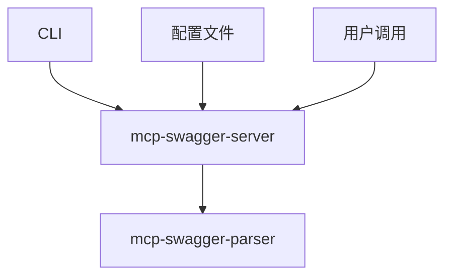
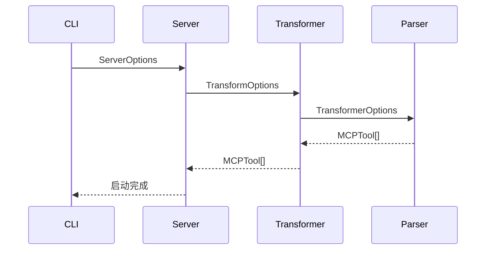

# MCP Swagger 包兼容性分析与解决方案

## 1. 问题概述

基于对 `mcp-swagger-parser` 和 `mcp-swagger-server` 两个包的代码分析，发现了接口过滤配置实现方案中存在的兼容性问题。主要问题是两个包之间的类型接口不匹配，可能导致修改 `mcp-swagger-parser` 包后，`mcp-swagger-server` 包无法正确适配。

## 2. 当前架构分析

### 2.1 包依赖关系


### 2.2 类型接口对比

#### mcp-swagger-server 的 TransformOptions
```typescript
// packages/mcp-swagger-server/src/types/core.ts
interface TransformOptions {
  baseUrl?: string;
  includeDeprecated?: boolean;
  requestTimeout?: number;
  pathPrefix?: string;
  tagFilter?: {
    include?: string[];
    exclude?: string[];
  };
  operationIdPrefix?: string;
  enableAuth?: boolean;
  authConfig?: AuthConfig;
}
```

#### mcp-swagger-parser 的 TransformerOptions
```typescript
// packages/mcp-swagger-parser/src/transformer/types.ts
interface TransformerOptions {
  baseUrl?: string;
  includeDeprecated?: boolean;
  includeTags?: string[];
  excludeTags?: string[];
  requestTimeout?: number;
  defaultHeaders?: Record<string, string>;
  customHandlers?: Record<string, CustomHandler>;
  pathPrefix?: string;
  stripBasePath?: boolean;
  authConfig?: AuthConfig;
  customHeaders?: CustomHeaders;
  debugHeaders?: boolean;
  protectedHeaders?: string[];
  includeFieldAnnotations?: boolean;
  annotationOptions?: AnnotationOptions;
}
```

### 2.3 关键差异分析

| 字段 | mcp-swagger-server | mcp-swagger-parser | 兼容性问题 |
|------|-------------------|-------------------|----------|
| tagFilter | ✅ (对象格式) | ❌ | 需要转换为 includeTags/excludeTags |
| includeTags | ❌ | ✅ | 缺失字段 |
| excludeTags | ❌ | ✅ | 缺失字段 |
| customHeaders | ❌ | ✅ | 缺失字段 |
| debugHeaders | ❌ | ✅ | 缺失字段 |
| operationIdPrefix | ✅ | ❌ | 仅在 server 层处理 |
| enableAuth | ✅ | ❌ | 仅在 server 层处理 |

## 3. 数据流分析

### 3.1 当前调用链


### 3.2 类型转换逻辑（当前）
```typescript
// packages/mcp-swagger-server/src/lib/Transformer.ts
const transformerOptions: TransformerOptions = {
  baseUrl: options.baseUrl,
  includeDeprecated: options.includeDeprecated,
  requestTimeout: options.requestTimeout,
  pathPrefix: options.pathPrefix,
  // 注意：tagFilter 需要转换为 includeTags/excludeTags
  includeTags: options.tagFilter?.include,
  excludeTags: options.tagFilter?.exclude,
};
```

## 4. 兼容性问题详细分析

### 4.1 核心问题

1. **类型不匹配**：两个包的配置接口字段不完全对应
2. **字段缺失**：`mcp-swagger-server` 缺少 `mcp-swagger-parser` 需要的部分字段
3. **转换不完整**：当前的类型转换逻辑没有处理所有字段
4. **新增配置传递**：计划新增的 `operationFilter` 配置无法正确传递

### 4.2 影响范围

- **CLI 参数传递**：新增的过滤参数无法从 CLI 传递到 parser
- **配置文件支持**：配置文件中的新字段无法生效
- **向后兼容性**：现有配置可能失效
- **扩展性**：未来新增字段需要同时修改两个包

## 5. 解决方案设计

### 5.1 方案一：统一接口设计（推荐）

#### 5.1.1 创建共享类型定义
```typescript
// packages/mcp-swagger-parser/src/transformer/types.ts
export interface OperationFilter {
  methods?: {
    include?: string[];
    exclude?: string[];
  };
  paths?: {
    include?: string[];
    exclude?: string[];
  };
  operationIds?: {
    include?: string[];
    exclude?: string[];
  };
  statusCodes?: {
    include?: number[];
    exclude?: number[];
  };
  parameters?: {
    required?: boolean;
    types?: string[];
  };
  custom?: (operation: any, path: string, method: string) => boolean;
}

export interface TransformerOptions {
  // 现有字段保持不变
  baseUrl?: string;
  includeDeprecated?: boolean;
  includeTags?: string[];
  excludeTags?: string[];
  requestTimeout?: number;
  defaultHeaders?: Record<string, string>;
  customHandlers?: Record<string, CustomHandler>;
  pathPrefix?: string;
  stripBasePath?: boolean;
  authConfig?: AuthConfig;
  customHeaders?: CustomHeaders;
  debugHeaders?: boolean;
  protectedHeaders?: string[];
  includeFieldAnnotations?: boolean;
  annotationOptions?: AnnotationOptions;
  
  // 新增操作过滤配置
  operationFilter?: OperationFilter;
}
```

#### 5.1.2 更新 mcp-swagger-server 类型
```typescript
// packages/mcp-swagger-server/src/types/core.ts
import { OperationFilter } from 'mcp-swagger-parser/src/transformer/types';

export interface TransformOptions {
  baseUrl?: string;
  includeDeprecated?: boolean;
  requestTimeout?: number;
  pathPrefix?: string;
  
  // 保持向后兼容的 tagFilter，内部转换为 includeTags/excludeTags
  tagFilter?: {
    include?: string[];
    exclude?: string[];
  };
  
  // 新增字段，直接传递给 parser
  includeTags?: string[];
  excludeTags?: string[];
  customHeaders?: CustomHeaders;
  debugHeaders?: boolean;
  protectedHeaders?: string[];
  
  // 新增操作过滤配置
  operationFilter?: OperationFilter;
  
  // server 层特有字段
  operationIdPrefix?: string;
  enableAuth?: boolean;
  authConfig?: AuthConfig;
}
```

#### 5.1.3 完善类型转换逻辑
```typescript
// packages/mcp-swagger-server/src/lib/Transformer.ts
private buildTransformerOptions(options: TransformOptions): TransformerOptions {
  const transformerOptions: TransformerOptions = {
    baseUrl: options.baseUrl,
    includeDeprecated: options.includeDeprecated,
    requestTimeout: options.requestTimeout,
    pathPrefix: options.pathPrefix,
    stripBasePath: options.stripBasePath,
    authConfig: options.authConfig,
    customHeaders: options.customHeaders,
    debugHeaders: options.debugHeaders,
    protectedHeaders: options.protectedHeaders,
    includeFieldAnnotations: options.includeFieldAnnotations,
    annotationOptions: options.annotationOptions,
    
    // 处理标签过滤（向后兼容）
    includeTags: options.includeTags || options.tagFilter?.include,
    excludeTags: options.excludeTags || options.tagFilter?.exclude,
    
    // 新增操作过滤配置
    operationFilter: options.operationFilter,
  };
  
  return transformerOptions;
}
```

### 5.2 方案二：渐进式迁移

如果不能一次性修改所有接口，可以采用渐进式迁移：

1. **第一阶段**：在 `mcp-swagger-parser` 中保持向后兼容
2. **第二阶段**：在 `mcp-swagger-server` 中逐步添加新字段
3. **第三阶段**：完全统一接口

## 6. CLI 参数扩展方案

### 6.1 新增 CLI 参数
```typescript
// packages/mcp-swagger-server/src/cli.ts
interface ServerOptions {
  // 现有参数...
  
  // 新增过滤参数
  includeMethods?: string[];
  excludeMethods?: string[];
  includePaths?: string[];
  excludePaths?: string[];
  includeOperations?: string[];
  excludeOperations?: string[];
  includeStatus?: number[];
  excludeStatus?: number[];
  filterConfig?: string; // 过滤配置文件路径
}
```

### 6.2 参数解析逻辑
```typescript
function parseFilterOptions(options: ServerOptions): OperationFilter {
  const filter: OperationFilter = {};
  
  if (options.includeMethods || options.excludeMethods) {
    filter.methods = {
      include: options.includeMethods,
      exclude: options.excludeMethods,
    };
  }
  
  if (options.includePaths || options.excludePaths) {
    filter.paths = {
      include: options.includePaths,
      exclude: options.excludePaths,
    };
  }
  
  // 其他过滤选项...
  
  return filter;
}
```

## 7. 配置文件扩展方案

### 7.1 配置文件结构
```json
{
  "server": {
    "port": 3000,
    "transport": "stdio"
  },
  "transform": {
    "baseUrl": "https://api.example.com",
    "includeDeprecated": false,
    "operationFilter": {
      "methods": {
        "include": ["GET", "POST"]
      },
      "paths": {
        "exclude": ["/admin/*", "/internal/*"]
      },
      "statusCodes": {
        "include": [200, 201, 204]
      }
    }
  }
}
```

### 7.2 配置验证
```typescript
function validateOperationFilter(filter: OperationFilter): ValidationResult {
  const errors: string[] = [];
  
  // 验证 HTTP 方法
  if (filter.methods) {
    const validMethods = ['GET', 'POST', 'PUT', 'DELETE', 'PATCH', 'HEAD', 'OPTIONS'];
    const invalidMethods = [
      ...(filter.methods.include || []),
      ...(filter.methods.exclude || [])
    ].filter(method => !validMethods.includes(method.toUpperCase()));
    
    if (invalidMethods.length > 0) {
      errors.push(`Invalid HTTP methods: ${invalidMethods.join(', ')}`);
    }
  }
  
  // 验证状态码
  if (filter.statusCodes) {
    const invalidCodes = [
      ...(filter.statusCodes.include || []),
      ...(filter.statusCodes.exclude || [])
    ].filter(code => code < 100 || code > 599);
    
    if (invalidCodes.length > 0) {
      errors.push(`Invalid status codes: ${invalidCodes.join(', ')}`);
    }
  }
  
  return {
    isValid: errors.length === 0,
    errors
  };
}
```

## 8. 实现步骤

### 8.1 第一阶段：基础兼容性修复

1. **更新 TransformerOptions 接口**
   - 在 `mcp-swagger-parser` 中添加 `operationFilter` 字段
   - 保持现有字段不变，确保向后兼容

2. **完善类型转换逻辑**
   - 修复 `Transformer.ts` 中的字段映射
   - 确保所有配置都能正确传递

3. **添加配置验证**
   - 实现配置验证函数
   - 在启动时验证配置的有效性

### 8.2 第二阶段：功能实现

1. **实现操作过滤逻辑**
   - 扩展 `shouldIncludeOperation` 方法
   - 支持多维度过滤条件

2. **CLI 参数扩展**
   - 添加新的命令行参数
   - 实现参数解析和传递

3. **配置文件支持**
   - 扩展配置文件结构
   - 实现配置文件加载和合并

### 8.3 第三阶段：测试和优化

1. **单元测试**
   - 测试类型转换逻辑
   - 测试过滤功能
   - 测试配置验证

2. **集成测试**
   - 测试 CLI 到 parser 的完整流程
   - 测试配置文件加载
   - 测试向后兼容性

3. **性能优化**
   - 优化过滤逻辑性能
   - 减少不必要的配置传递

## 9. 测试验证方案

### 9.1 单元测试

```typescript
// 测试类型转换
describe('TransformOptions to TransformerOptions conversion', () => {
  it('should convert tagFilter to includeTags/excludeTags', () => {
    const options: TransformOptions = {
      tagFilter: {
        include: ['public'],
        exclude: ['internal']
      }
    };
    
    const result = buildTransformerOptions(options);
    
    expect(result.includeTags).toEqual(['public']);
    expect(result.excludeTags).toEqual(['internal']);
  });
  
  it('should pass through operationFilter', () => {
    const operationFilter: OperationFilter = {
      methods: { include: ['GET'] }
    };
    
    const options: TransformOptions = { operationFilter };
    const result = buildTransformerOptions(options);
    
    expect(result.operationFilter).toEqual(operationFilter);
  });
});
```

### 9.2 集成测试

```typescript
// 测试完整流程
describe('End-to-end filtering', () => {
  it('should filter operations based on CLI parameters', async () => {
    const cliArgs = [
      '--openapi-url', 'https://api.example.com/openapi.json',
      '--include-methods', 'GET,POST',
      '--exclude-paths', '/admin/*'
    ];
    
    const result = await runCLIWithArgs(cliArgs);
    
    // 验证只包含 GET 和 POST 方法
    // 验证排除了 /admin/* 路径
  });
});
```

### 9.3 向后兼容性测试

```typescript
// 测试现有配置仍然有效
describe('Backward compatibility', () => {
  it('should support legacy tagFilter configuration', () => {
    const legacyConfig = {
      tagFilter: {
        include: ['v1'],
        exclude: ['deprecated']
      }
    };
    
    // 验证配置仍然有效
  });
});
```

## 10. 风险评估与缓解

### 10.1 主要风险

1. **破坏性变更**：修改可能影响现有用户
2. **性能影响**：新增过滤逻辑可能影响性能
3. **复杂性增加**：配置选项增多可能导致使用复杂

### 10.2 缓解措施

1. **向后兼容**：保持现有 API 不变
2. **渐进式发布**：分阶段发布新功能
3. **充分测试**：确保所有场景都经过测试
4. **文档更新**：提供详细的迁移指南

## 11. 总结

通过统一接口设计和完善类型转换逻辑，可以确保 `mcp-swagger-parser` 和 `mcp-swagger-server` 两个包之间的兼容性。关键是：

1. **统一类型定义**：确保两个包使用一致的接口
2. **完善转换逻辑**：正确处理所有配置字段的传递
3. **保持向后兼容**：不破坏现有用户的配置
4. **充分测试**：确保所有场景都能正常工作

这样可以避免修改 `mcp-swagger-parser` 包后，`mcp-swagger-server` 包不适配的问题。