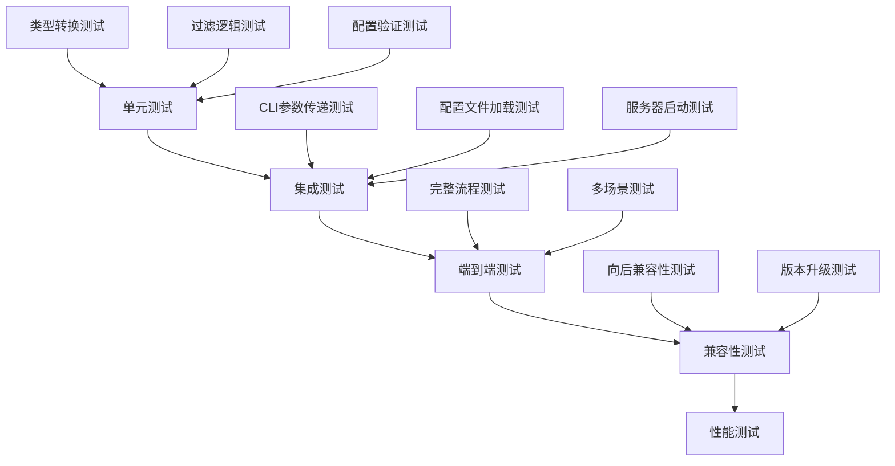

# MCP Swagger 兼容性测试验证方案

## 1. 测试策略概述

本文档详细说明了验证 `mcp-swagger-parser` 和 `mcp-swagger-server` 包兼容性修复的测试方案，确保新增的 `operationFilter` 功能正常工作，同时保持向后兼容性。

## 2. 测试分层架构



## 3. 单元测试方案

### 3.1 mcp-swagger-parser 单元测试

#### 3.1.1 操作过滤逻辑测试

**文件：** `packages/mcp-swagger-parser/tests/operation-filter.test.ts`

```typescript
import { describe, it, expect, beforeEach } from 'jest';
import { Transformer } from '../src/transformer';
import { OperationFilter, TransformerOptions } from '../src/transformer/types';

describe('OperationFilter', () => {
  let transformer: Transformer;
  let mockOpenApiSpec: any;
  
  beforeEach(() => {
    transformer = new Transformer();
    mockOpenApiSpec = {
      openapi: '3.0.0',
      info: { title: 'Test API', version: '1.0.0' },
      paths: {
        '/users': {
          get: {
            operationId: 'getUsers',
            tags: ['users', 'public'],
            parameters: [
              { name: 'limit', in: 'query', required: false, schema: { type: 'number' } }
            ],
            responses: {
              '200': { description: 'Success' },
              '400': { description: 'Bad Request' }
            }
          },
          post: {
            operationId: 'createUser',
            tags: ['users'],
            parameters: [
              { name: 'user', in: 'body', required: true, schema: { type: 'object' } }
            ],
            responses: {
              '201': { description: 'Created' },
              '400': { description: 'Bad Request' }
            }
          }
        },
        '/admin/users': {
          delete: {
            operationId: 'deleteUser',
            tags: ['admin'],
            responses: {
              '204': { description: 'Deleted' },
              '403': { description: 'Forbidden' }
            }
          }
        },
        '/internal/health': {
          get: {
            operationId: 'healthCheck',
            tags: ['internal'],
            deprecated: true,
            responses: {
              '200': { description: 'OK' }
            }
          }
        }
      }
    };
  });
  
  describe('HTTP Methods Filtering', () => {
    it('should include only specified methods', async () => {
      const filter: OperationFilter = {
        methods: { include: ['GET', 'POST'] }
      };
      
      const result = await transformer.transformFromOpenAPI(mockOpenApiSpec, {
        operationFilter: filter
      });
      
      expect(result).toHaveLength(3); // getUsers, createUser, healthCheck
      expect(result.map(tool => tool.name)).toEqual(
        expect.arrayContaining(['getUsers', 'createUser', 'healthCheck'])
      );
    });
    
    it('should exclude specified methods', async () => {
      const filter: OperationFilter = {
        methods: { exclude: ['DELETE'] }
      };
      
      const result = await transformer.transformFromOpenAPI(mockOpenApiSpec, {
        operationFilter: filter
      });
      
      expect(result.map(tool => tool.name)).not.toContain('deleteUser');
    });
    
    it('should handle case insensitive method names', async () => {
      const filter: OperationFilter = {
        methods: { include: ['get', 'post'] }
      };
      
      const result = await transformer.transformFromOpenAPI(mockOpenApiSpec, {
        operationFilter: filter
      });
      
      expect(result.length).toBeGreaterThan(0);
    });
  });
  
  describe('Path Filtering', () => {
    it('should include paths matching patterns', async () => {
      const filter: OperationFilter = {
        paths: { include: ['/users*'] }
      };
      
      const result = await transformer.transformFromOpenAPI(mockOpenApiSpec, {
        operationFilter: filter
      });
      
      const operationIds = result.map(tool => tool.name);
      expect(operationIds).toContain('getUsers');
      expect(operationIds).toContain('createUser');
      expect(operationIds).not.toContain('healthCheck');
    });
    
    it('should exclude paths matching patterns', async () => {
      const filter: OperationFilter = {
        paths: { exclude: ['/admin/*', '/internal/*'] }
      };
      
      const result = await transformer.transformFromOpenAPI(mockOpenApiSpec, {
        operationFilter: filter
      });
      
      const operationIds = result.map(tool => tool.name);
      expect(operationIds).not.toContain('deleteUser');
      expect(operationIds).not.toContain('healthCheck');
      expect(operationIds).toContain('getUsers');
    });
    
    it('should handle wildcard patterns correctly', async () => {
      const filter: OperationFilter = {
        paths: { include: ['*/users'] }
      };
      
      const result = await transformer.transformFromOpenAPI(mockOpenApiSpec, {
        operationFilter: filter
      });
      
      const operationIds = result.map(tool => tool.name);
      expect(operationIds).toContain('getUsers');
      expect(operationIds).toContain('createUser');
      expect(operationIds).toContain('deleteUser');
    });
  });
  
  describe('Operation ID Filtering', () => {
    it('should include operations by ID patterns', async () => {
      const filter: OperationFilter = {
        operationIds: { include: ['get*', 'create*'] }
      };
      
      const result = await transformer.transformFromOpenAPI(mockOpenApiSpec, {
        operationFilter: filter
      });
      
      const operationIds = result.map(tool => tool.name);
      expect(operationIds).toContain('getUsers');
      expect(operationIds).toContain('createUser');
      expect(operationIds).not.toContain('deleteUser');
    });
    
    it('should exclude operations by ID patterns', async () => {
      const filter: OperationFilter = {
        operationIds: { exclude: ['delete*', '*health*'] }
      };
      
      const result = await transformer.transformFromOpenAPI(mockOpenApiSpec, {
        operationFilter: filter
      });
      
      const operationIds = result.map(tool => tool.name);
      expect(operationIds).not.toContain('deleteUser');
      expect(operationIds).not.toContain('healthCheck');
    });
  });
  
  describe('Status Code Filtering', () => {
    it('should include operations with specified status codes', async () => {
      const filter: OperationFilter = {
        statusCodes: { include: [201] }
      };
      
      const result = await transformer.transformFromOpenAPI(mockOpenApiSpec, {
        operationFilter: filter
      });
      
      expect(result.map(tool => tool.name)).toContain('createUser');
      expect(result.map(tool => tool.name)).not.toContain('getUsers');
    });
    
    it('should exclude operations with specified status codes', async () => {
      const filter: OperationFilter = {
        statusCodes: { exclude: [403, 404] }
      };
      
      const result = await transformer.transformFromOpenAPI(mockOpenApiSpec, {
        operationFilter: filter
      });
      
      expect(result.map(tool => tool.name)).not.toContain('deleteUser');
    });
  });
  
  describe('Parameter Filtering', () => {
    it('should filter by required parameters', async () => {
      const filter: OperationFilter = {
        parameters: { required: true }
      };
      
      const result = await transformer.transformFromOpenAPI(mockOpenApiSpec, {
        operationFilter: filter
      });
      
      expect(result.map(tool => tool.name)).toContain('createUser');
      expect(result.map(tool => tool.name)).not.toContain('getUsers');
    });
    
    it('should filter by parameter types', async () => {
      const filter: OperationFilter = {
        parameters: { types: ['object'] }
      };
      
      const result = await transformer.transformFromOpenAPI(mockOpenApiSpec, {
        operationFilter: filter
      });
      
      expect(result.map(tool => tool.name)).toContain('createUser');
    });
  });
  
  describe('Custom Filter Function', () => {
    it('should apply custom filter logic', async () => {
      const filter: OperationFilter = {
        custom: (operation, path, method) => {
          return !operation.deprecated && method === 'GET';
        }
      };
      
      const result = await transformer.transformFromOpenAPI(mockOpenApiSpec, {
        operationFilter: filter
      });
      
      expect(result.map(tool => tool.name)).toContain('getUsers');
      expect(result.map(tool => tool.name)).not.toContain('healthCheck'); // deprecated
      expect(result.map(tool => tool.name)).not.toContain('createUser'); // POST
    });
  });
  
  describe('Combined Filters', () => {
    it('should apply multiple filter conditions', async () => {
      const filter: OperationFilter = {
        methods: { include: ['GET', 'POST'] },
        paths: { exclude: ['/internal/*'] },
        statusCodes: { include: [200, 201] }
      };
      
      const result = await transformer.transformFromOpenAPI(mockOpenApiSpec, {
        operationFilter: filter
      });
      
      const operationIds = result.map(tool => tool.name);
      expect(operationIds).toContain('getUsers');
      expect(operationIds).toContain('createUser');
      expect(operationIds).not.toContain('healthCheck'); // internal path
      expect(operationIds).not.toContain('deleteUser'); // DELETE method
    });
  });
});
```

#### 3.1.2 类型兼容性测试

**文件：** `packages/mcp-swagger-parser/tests/types-compatibility.test.ts`

```typescript
import { describe, it, expect } from 'jest';
import { TransformerOptions, OperationFilter } from '../src/transformer/types';

describe('Type Compatibility', () => {
  it('should accept all valid TransformerOptions fields', () => {
    const options: TransformerOptions = {
      baseUrl: 'https://api.example.com',
      includeDeprecated: false,
      includeTags: ['public'],
      excludeTags: ['internal'],
      requestTimeout: 5000,
      pathPrefix: '/api/v1',
      operationFilter: {
        methods: { include: ['GET'] }
      }
    };
    
    expect(options).toBeDefined();
    expect(options.operationFilter).toBeDefined();
  });
  
  it('should accept all valid OperationFilter fields', () => {
    const filter: OperationFilter = {
      methods: {
        include: ['GET', 'POST'],
        exclude: ['DELETE']
      },
      paths: {
        include: ['/api/*'],
        exclude: ['/admin/*']
      },
      operationIds: {
        include: ['get*'],
        exclude: ['delete*']
      },
      statusCodes: {
        include: [200, 201],
        exclude: [404, 500]
      },
      parameters: {
        required: true,
        types: ['string', 'number']
      },
      custom: (operation, path, method) => true
    };
    
    expect(filter).toBeDefined();
    expect(typeof filter.custom).toBe('function');
  });
});
```

### 3.2 mcp-swagger-server 单元测试

#### 3.2.1 类型转换测试

**文件：** `packages/mcp-swagger-server/tests/transformer.test.ts`

```typescript
import { describe, it, expect, beforeEach } from 'jest';
import { Transformer } from '../src/lib/Transformer';
import { TransformOptions } from '../src/types/core';
import { OperationFilter } from 'mcp-swagger-parser/src/transformer/types';

describe('Transformer', () => {
  let transformer: Transformer;
  
  beforeEach(() => {
    transformer = new Transformer();
  });
  
  describe('buildTransformerOptions', () => {
    it('should convert TransformOptions to TransformerOptions correctly', () => {
      const transformOptions: TransformOptions = {
        baseUrl: 'https://api.example.com',
        includeDeprecated: false,
        requestTimeout: 5000,
        pathPrefix: '/api',
        tagFilter: {
          include: ['public'],
          exclude: ['internal']
        },
        operationFilter: {
          methods: { include: ['GET'] }
        },
        customHeaders: {
          static: { 'X-API-Key': 'test' }
        },
        debugHeaders: true
      };
      
      const result = (transformer as any).buildTransformerOptions(transformOptions);
      
      expect(result.baseUrl).toBe('https://api.example.com');
      expect(result.includeDeprecated).toBe(false);
      expect(result.requestTimeout).toBe(5000);
      expect(result.pathPrefix).toBe('/api');
      expect(result.includeTags).toEqual(['public']);
      expect(result.excludeTags).toEqual(['internal']);
      expect(result.operationFilter).toEqual({ methods: { include: ['GET'] } });
      expect(result.customHeaders).toBeDefined();
      expect(result.debugHeaders).toBe(true);
    });
    
    it('should handle backward compatibility with tagFilter', () => {
      const transformOptions: TransformOptions = {
        tagFilter: {
          include: ['v1'],
          exclude: ['deprecated']
        }
      };
      
      const result = (transformer as any).buildTransformerOptions(transformOptions);
      
      expect(result.includeTags).toEqual(['v1']);
      expect(result.excludeTags).toEqual(['deprecated']);
    });
    
    it('should prioritize direct tags over tagFilter', () => {
      const transformOptions: TransformOptions = {
        includeTags: ['direct'],
        tagFilter: {
          include: ['filter']
        }
      };
      
      const result = (transformer as any).buildTransformerOptions(transformOptions);
      
      expect(result.includeTags).toEqual(['direct']);
    });
    
    it('should handle missing optional fields', () => {
      const transformOptions: TransformOptions = {};
      
      const result = (transformer as any).buildTransformerOptions(transformOptions);
      
      expect(result).toBeDefined();
      expect(result.baseUrl).toBeUndefined();
      expect(result.operationFilter).toBeUndefined();
    });
  });
  
  describe('transformFromOpenAPI', () => {
    it('should apply server-side post-processing', async () => {
      const mockSpec = {
        openapi: '3.0.0',
        info: { title: 'Test', version: '1.0.0' },
        paths: {
          '/test': {
            get: {
              operationId: 'getTest',
              responses: { '200': { description: 'OK' } }
            }
          }
        }
      };
      
      const options: TransformOptions = {
        operationIdPrefix: 'api_',
        enableAuth: true,
        authConfig: {
          type: 'bearer',
          token: 'test-token'
        }
      };
      
      const result = await transformer.transformFromOpenAPI(mockSpec, options);
      
      expect(result).toBeDefined();
      expect(result.length).toBeGreaterThan(0);
      // 验证操作ID前缀和认证配置的应用
    });
  });
});
```

#### 3.2.2 配置验证测试

**文件：** `packages/mcp-swagger-server/tests/validation.test.ts`

```typescript
import { describe, it, expect } from 'jest';
import { validateOperationFilter, validateTransformOptions } from '../src/utils/validation';
import { OperationFilter } from 'mcp-swagger-parser/src/transformer/types';
import { TransformOptions } from '../src/types/core';

describe('Configuration Validation', () => {
  describe('validateOperationFilter', () => {
    it('should validate valid filter configuration', () => {
      const filter: OperationFilter = {
        methods: { include: ['GET', 'POST'] },
        paths: { exclude: ['/admin/*'] },
        statusCodes: { include: [200, 201] }
      };
      
      const result = validateOperationFilter(filter);
      
      expect(result.isValid).toBe(true);
      expect(result.errors).toHaveLength(0);
    });
    
    it('should detect invalid HTTP methods', () => {
      const filter: OperationFilter = {
        methods: { include: ['INVALID', 'GET'] }
      };
      
      const result = validateOperationFilter(filter);
      
      expect(result.isValid).toBe(false);
      expect(result.errors).toContain(expect.stringContaining('Invalid HTTP methods'));
    });
    
    it('should detect invalid status codes', () => {
      const filter: OperationFilter = {
        statusCodes: { include: [99, 600] }
      };
      
      const result = validateOperationFilter(filter);
      
      expect(result.isValid).toBe(false);
      expect(result.errors).toContain(expect.stringContaining('Invalid status codes'));
    });
    
    it('should detect conflicting include/exclude methods', () => {
      const filter: OperationFilter = {
        methods: {
          include: ['GET', 'POST'],
          exclude: ['POST', 'DELETE']
        }
      };
      
      const result = validateOperationFilter(filter);
      
      expect(result.warnings).toContain(expect.stringContaining('Conflicting methods'));
    });
    
    it('should validate path patterns', () => {
      const filter: OperationFilter = {
        paths: { include: ['[invalid'] } // 无效的正则表达式
      };
      
      const result = validateOperationFilter(filter);
      
      expect(result.isValid).toBe(false);
      expect(result.errors).toContain(expect.stringContaining('Invalid path pattern'));
    });
  });
  
  describe('validateTransformOptions', () => {
    it('should validate valid transform options', () => {
      const options: TransformOptions = {
        baseUrl: 'https://api.example.com',
        requestTimeout: 5000,
        operationFilter: {
          methods: { include: ['GET'] }
        }
      };
      
      const result = validateTransformOptions(options);
      
      expect(result.isValid).toBe(true);
      expect(result.errors).toHaveLength(0);
    });
    
    it('should detect invalid baseUrl', () => {
      const options: TransformOptions = {
        baseUrl: 'invalid-url'
      };
      
      const result = validateTransformOptions(options);
      
      expect(result.isValid).toBe(false);
      expect(result.errors).toContain(expect.stringContaining('Invalid baseUrl'));
    });
    
    it('should detect invalid timeout values', () => {
      const options: TransformOptions = {
        requestTimeout: -1000
      };
      
      const result = validateTransformOptions(options);
      
      expect(result.isValid).toBe(false);
      expect(result.errors).toContain(expect.stringContaining('requestTimeout must be greater than 0'));
    });
    
    it('should warn about very high timeout values', () => {
      const options: TransformOptions = {
        requestTimeout: 600000 // 10 minutes
      };
      
      const result = validateTransformOptions(options);
      
      expect(result.isValid).toBe(true);
      expect(result.warnings).toContain(expect.stringContaining('requestTimeout is very high'));
    });
  });
});
```

## 4. 集成测试方案

### 4.1 CLI 参数传递测试

**文件：** `packages/mcp-swagger-server/tests/integration/cli-integration.test.ts`

```typescript
import { describe, it, expect, beforeEach, afterEach } from 'jest';
import { spawn, ChildProcess } from 'child_process';
import path from 'path';
import fs from 'fs/promises';
import { createTestOpenApiSpec, createTestConfig } from '../helpers/test-utils';

describe('CLI Integration Tests', () => {
  let testSpecFile: string;
  let testConfigFile: string;
  let cliProcess: ChildProcess;
  
  beforeEach(async () => {
    // 创建测试用的 OpenAPI 规范文件
    testSpecFile = path.join(__dirname, '../temp/test-spec.json');
    await fs.writeFile(testSpecFile, JSON.stringify(createTestOpenApiSpec()));
    
    // 创建测试配置文件
    testConfigFile = path.join(__dirname, '../temp/test-config.json');
    await fs.writeFile(testConfigFile, JSON.stringify(createTestConfig()));
  });
  
  afterEach(async () => {
    if (cliProcess) {
      cliProcess.kill();
    }
    
    // 清理测试文件
    try {
      await fs.unlink(testSpecFile);
      await fs.unlink(testConfigFile);
    } catch (error) {
      // 忽略清理错误
    }
  });
  
  describe('Filter Parameters', () => {
    it('should apply method filtering via CLI', (done) => {
      const args = [
        '--openapi-file', testSpecFile,
        '--include-methods', 'GET,POST',
        '--transport', 'stdio',
        '--dry-run'
      ];
      
      cliProcess = spawn('node', [path.join(__dirname, '../../dist/cli.js'), ...args]);
      
      let output = '';
      cliProcess.stdout?.on('data', (data) => {
        output += data.toString();
      });
      
      cliProcess.on('close', (code) => {
        expect(code).toBe(0);
        
        const result = JSON.parse(output);
        expect(result.tools).toBeDefined();
        
        // 验证只包含 GET 和 POST 方法的工具
        const methods = result.tools.map((tool: any) => tool.method);
        expect(methods.every((method: string) => ['GET', 'POST'].includes(method))).toBe(true);
        
        done();
      });
    });
    
    it('should apply path filtering via CLI', (done) => {
      const args = [
        '--openapi-file', testSpecFile,
        '--exclude-paths', '/admin/*,/internal/*',
        '--transport', 'stdio',
        '--dry-run'
      ];
      
      cliProcess = spawn('node', [path.join(__dirname, '../../dist/cli.js'), ...args]);
      
      let output = '';
      cliProcess.stdout?.on('data', (data) => {
        output += data.toString();
      });
      
      cliProcess.on('close', (code) => {
        expect(code).toBe(0);
        
        const result = JSON.parse(output);
        const paths = result.tools.map((tool: any) => tool.path);
        
        // 验证排除了指定路径
        expect(paths.every((path: string) => 
          !path.startsWith('/admin') && !path.startsWith('/internal')
        )).toBe(true);
        
        done();
      });
    });
    
    it('should combine multiple filter parameters', (done) => {
      const args = [
        '--openapi-file', testSpecFile,
        '--include-methods', 'GET',
        '--exclude-paths', '/admin/*',
        '--include-status', '200,201',
        '--transport', 'stdio',
        '--dry-run'
      ];
      
      cliProcess = spawn('node', [path.join(__dirname, '../../dist/cli.js'), ...args]);
      
      let output = '';
      cliProcess.stdout?.on('data', (data) => {
        output += data.toString();
      });
      
      cliProcess.on('close', (code) => {
        expect(code).toBe(0);
        
        const result = JSON.parse(output);
        
        // 验证所有过滤条件都生效
        expect(result.tools.length).toBeGreaterThan(0);
        
        result.tools.forEach((tool: any) => {
          expect(tool.method).toBe('GET');
          expect(tool.path).not.toMatch(/^\/admin/);
          expect([200, 201]).toContain(tool.statusCode);
        });
        
        done();
      });
    });
  });
  
  describe('Configuration File Integration', () => {
    it('should load filter configuration from file', (done) => {
      const filterConfig = {
        methods: { include: ['GET'] },
        paths: { exclude: ['/admin/*'] }
      };
      
      const filterConfigFile = path.join(__dirname, '../temp/filter-config.json');
      
      fs.writeFile(filterConfigFile, JSON.stringify(filterConfig))
        .then(() => {
          const args = [
            '--openapi-file', testSpecFile,
            '--filter-config', filterConfigFile,
            '--transport', 'stdio',
            '--dry-run'
          ];
          
          cliProcess = spawn('node', [path.join(__dirname, '../../dist/cli.js'), ...args]);
          
          let output = '';
          cliProcess.stdout?.on('data', (data) => {
            output += data.toString();
          });
          
          cliProcess.on('close', async (code) => {
            expect(code).toBe(0);
            
            const result = JSON.parse(output);
            
            // 验证配置文件中的过滤条件生效
            result.tools.forEach((tool: any) => {
              expect(tool.method).toBe('GET');
              expect(tool.path).not.toMatch(/^\/admin/);
            });
            
            // 清理配置文件
            await fs.unlink(filterConfigFile);
            done();
          });
        });
    });
    
    it('should merge CLI parameters with config file', (done) => {
      const filterConfig = {
        methods: { include: ['GET', 'POST'] }
      };
      
      const filterConfigFile = path.join(__dirname, '../temp/filter-config.json');
      
      fs.writeFile(filterConfigFile, JSON.stringify(filterConfig))
        .then(() => {
          const args = [
            '--openapi-file', testSpecFile,
            '--filter-config', filterConfigFile,
            '--exclude-paths', '/admin/*', // CLI 参数应该与配置文件合并
            '--transport', 'stdio',
            '--dry-run'
          ];
          
          cliProcess = spawn('node', [path.join(__dirname, '../../dist/cli.js'), ...args]);
          
          let output = '';
          cliProcess.stdout?.on('data', (data) => {
            output += data.toString();
          });
          
          cliProcess.on('close', async (code) => {
            expect(code).toBe(0);
            
            const result = JSON.parse(output);
            
            // 验证配置文件和 CLI 参数都生效
            result.tools.forEach((tool: any) => {
              expect(['GET', 'POST']).toContain(tool.method);
              expect(tool.path).not.toMatch(/^\/admin/);
            });
            
            await fs.unlink(filterConfigFile);
            done();
          });
        });
    });
  });
});
```

### 4.2 配置文件加载测试

**文件：** `packages/mcp-swagger-server/tests/integration/config-loading.test.ts`

```typescript
import { describe, it, expect, beforeEach, afterEach } from 'jest';
import path from 'path';
import fs from 'fs/promises';
import { loadConfig, mergeConfigurations } from '../src/config/loader';
import { ConfigFile } from '../src/config/types';

describe('Configuration Loading', () => {
  let tempConfigFile: string;
  
  beforeEach(() => {
    tempConfigFile = path.join(__dirname, '../temp/test-config.json');
  });
  
  afterEach(async () => {
    try {
      await fs.unlink(tempConfigFile);
    } catch (error) {
      // 忽略清理错误
    }
  });
  
  it('should load valid configuration file', async () => {
    const config: ConfigFile = {
      server: {
        port: 3000,
        transport: 'stdio'
      },
      transform: {
        baseUrl: 'https://api.example.com',
        operationFilter: {
          methods: { include: ['GET', 'POST'] },
          paths: { exclude: ['/admin/*'] }
        }
      }
    };
    
    await fs.writeFile(tempConfigFile, JSON.stringify(config, null, 2));
    
    const loadedConfig = await loadConfig(tempConfigFile);
    
    expect(loadedConfig).toEqual(config);
    expect(loadedConfig.transform?.operationFilter).toBeDefined();
  });
  
  it('should handle missing configuration file', async () => {
    const nonExistentFile = path.join(__dirname, '../temp/non-existent.json');
    
    await expect(loadConfig(nonExistentFile)).rejects.toThrow();
  });
  
  it('should validate configuration structure', async () => {
    const invalidConfig = {
      transform: {
        operationFilter: {
          methods: { include: ['INVALID_METHOD'] }
        }
      }
    };
    
    await fs.writeFile(tempConfigFile, JSON.stringify(invalidConfig));
    
    await expect(loadConfig(tempConfigFile)).rejects.toThrow(/Invalid HTTP methods/);
  });
  
  it('should merge multiple configuration sources', () => {
    const baseConfig: ConfigFile = {
      transform: {
        baseUrl: 'https://api.example.com',
        operationFilter: {
          methods: { include: ['GET'] }
        }
      }
    };
    
    const overrideConfig: Partial<ConfigFile> = {
      transform: {
        operationFilter: {
          paths: { exclude: ['/admin/*'] }
        }
      }
    };
    
    const merged = mergeConfigurations(baseConfig, overrideConfig);
    
    expect(merged.transform?.baseUrl).toBe('https://api.example.com');
    expect(merged.transform?.operationFilter?.methods).toEqual({ include: ['GET'] });
    expect(merged.transform?.operationFilter?.paths).toEqual({ exclude: ['/admin/*'] });
  });
});
```

## 5. 端到端测试方案

### 5.1 完整流程测试

**文件：** `packages/mcp-swagger-server/tests/e2e/full-workflow.test.ts`

```typescript
import { describe, it, expect, beforeAll, afterAll } from 'jest';
import { spawn, ChildProcess } from 'child_process';
import path from 'path';
import fs from 'fs/promises';
import { createComplexOpenApiSpec } from '../helpers/test-utils';

describe('End-to-End Workflow Tests', () => {
  let testSpecFile: string;
  let serverProcess: ChildProcess;
  
  beforeAll(async () => {
    // 创建复杂的测试 OpenAPI 规范
    testSpecFile = path.join(__dirname, '../temp/complex-spec.json');
    await fs.writeFile(testSpecFile, JSON.stringify(createComplexOpenApiSpec()));
  });
  
  afterAll(async () => {
    if (serverProcess) {
      serverProcess.kill();
    }
    
    try {
      await fs.unlink(testSpecFile);
    } catch (error) {
      // 忽略清理错误
    }
  });
  
  describe('Real-world Scenarios', () => {
    it('should handle large OpenAPI specification with complex filtering', (done) => {
      const args = [
        '--openapi-file', testSpecFile,
        '--include-methods', 'GET,POST,PUT',
        '--exclude-paths', '/admin/*,/internal/*,/debug/*',
        '--include-status', '200,201,204',
        '--require-params',
        '--transport', 'stdio'
      ];
      
      serverProcess = spawn('node', [path.join(__dirname, '../../dist/cli.js'), ...args]);
      
      let toolsReceived = 0;
      let errorOccurred = false;
      
      serverProcess.stdout?.on('data', (data) => {
        try {
          const message = JSON.parse(data.toString());
          
          if (message.method === 'tools/list') {
            toolsReceived = message.result?.tools?.length || 0;
          }
        } catch (error) {
          // 忽略非 JSON 消息
        }
      });
      
      serverProcess.stderr?.on('data', (data) => {
        console.error('Server error:', data.toString());
        errorOccurred = true;
      });
      
      // 等待服务器启动并发送工具列表请求
      setTimeout(() => {
        const listToolsRequest = {
          jsonrpc: '2.0',
          id: 1,
          method: 'tools/list'
        };
        
        serverProcess.stdin?.write(JSON.stringify(listToolsRequest) + '\n');
        
        // 等待响应
        setTimeout(() => {
          expect(errorOccurred).toBe(false);
          expect(toolsReceived).toBeGreaterThan(0);
          
          serverProcess.kill();
          done();
        }, 2000);
      }, 1000);
    }, 10000);
    
    it('should maintain performance with complex filters', (done) => {
      const startTime = Date.now();
      
      const args = [
        '--openapi-file', testSpecFile,
        '--include-methods', 'GET,POST,PUT,DELETE,PATCH',
        '--exclude-paths', '/test/*',
        '--include-operations', '*User*,*Product*,*Order*',
        '--include-status', '200,201,202,204,400,401,403,404,422,500',
        '--transport', 'stdio'
      ];
      
      serverProcess = spawn('node', [path.join(__dirname, '../../dist/cli.js'), ...args]);
      
      let serverReady = false;
      
      serverProcess.stdout?.on('data', (data) => {
        if (!serverReady && data.toString().includes('Server started')) {
          serverReady = true;
          
          const initTime = Date.now() - startTime;
          
          // 验证启动时间在合理范围内（< 5秒）
          expect(initTime).toBeLessThan(5000);
          
          serverProcess.kill();
          done();
        }
      });
      
      // 超时保护
      setTimeout(() => {
        if (!serverReady) {
          serverProcess.kill();
          done.fail('Server failed to start within timeout');
        }
      }, 8000);
    }, 10000);
  });
  
  describe('Error Handling', () => {
    it('should handle invalid filter configurations gracefully', (done) => {
      const args = [
        '--openapi-file', testSpecFile,
        '--include-methods', 'INVALID_METHOD',
        '--transport', 'stdio'
      ];
      
      serverProcess = spawn('node', [path.join(__dirname, '../../dist/cli.js'), ...args]);
      
      let errorMessage = '';
      
      serverProcess.stderr?.on('data', (data) => {
        errorMessage += data.toString();
      });
      
      serverProcess.on('close', (code) => {
        expect(code).not.toBe(0); // 应该以错误码退出
        expect(errorMessage).toContain('Invalid HTTP methods');
        done();
      });
    });
    
    it('should handle missing OpenAPI file gracefully', (done) => {
      const args = [
        '--openapi-file', '/non/existent/file.json',
        '--transport', 'stdio'
      ];
      
      serverProcess = spawn('node', [path.join(__dirname, '../../dist/cli.js'), ...args]);
      
      let errorMessage = '';
      
      serverProcess.stderr?.on('data', (data) => {
        errorMessage += data.toString();
      });
      
      serverProcess.on('close', (code) => {
        expect(code).not.toBe(0);
        expect(errorMessage).toContain('file not found');
        done();
      });
    });
  });
});
```

## 6. 兼容性测试方案

### 6.1 向后兼容性测试

**文件：** `packages/mcp-swagger-server/tests/compatibility/backward-compatibility.test.ts`

```typescript
import { describe, it, expect } from 'jest';
import { Transformer } from '../src/lib/Transformer';
import { TransformOptions } from '../src/types/core';

describe('Backward Compatibility', () => {
  let transformer: Transformer;
  
  beforeEach(() => {
    transformer = new Transformer();
  });
  
  describe('Legacy Configuration Support', () => {
    it('should support legacy tagFilter configuration', async () => {
      const legacyOptions: TransformOptions = {
        tagFilter: {
          include: ['public', 'v1'],
          exclude: ['internal', 'deprecated']
        }
      };
      
      const mockSpec = {
        openapi: '3.0.0',
        info: { title: 'Test', version: '1.0.0' },
        paths: {
          '/public': {
            get: {
              operationId: 'getPublic',
              tags: ['public'],
              responses: { '200': { description: 'OK' } }
            }
          },
          '/internal': {
            get: {
              operationId: 'getInternal',
              tags: ['internal'],
              responses: { '200': { description: 'OK' } }
            }
          }
        }
      };
      
      const result = await transformer.transformFromOpenAPI(mockSpec, legacyOptions);
      
      expect(result.length).toBe(1);
      expect(result[0].name).toBe('getPublic');
    });
    
    it('should support mixed legacy and new configuration', async () => {
      const mixedOptions: TransformOptions = {
        tagFilter: {
          include: ['public']
        },
        operationFilter: {
          methods: { include: ['GET'] }
        }
      };
      
      const mockSpec = {
        openapi: '3.0.0',
        info: { title: 'Test', version: '1.0.0' },
        paths: {
          '/public': {
            get: {
              operationId: 'getPublic',
              tags: ['public'],
              responses: { '200': { description: 'OK' } }
            },
            post: {
              operationId: 'postPublic',
              tags: ['public'],
              responses: { '201': { description: 'Created' } }
            }
          }
        }
      };
      
      const result = await transformer.transformFromOpenAPI(mockSpec, mixedOptions);
      
      expect(result.length).toBe(1);
      expect(result[0].name).toBe('getPublic');
    });
  });
  
  describe('API Compatibility', () => {
    it('should maintain existing method signatures', () => {
      // 验证现有的公共方法签名没有改变
      expect(typeof transformer.transformFromOpenAPI).toBe('function');
      expect(typeof transformer.transformFromUrl).toBe('function');
      expect(typeof transformer.transformFromFile).toBe('function');
      
      // 验证方法参数兼容性
      const transformFromOpenAPI = transformer.transformFromOpenAPI;
      expect(transformFromOpenAPI.length).toBe(2); // spec, options
    });
    
    it('should accept undefined options parameter', async () => {
      const mockSpec = {
        openapi: '3.0.0',
        info: { title: 'Test', version: '1.0.0' },
        paths: {}
      };
      
      // 应该能够处理 undefined options
      await expect(transformer.transformFromOpenAPI(mockSpec)).resolves.toBeDefined();
      await expect(transformer.transformFromOpenAPI(mockSpec, undefined)).resolves.toBeDefined();
    });
  });
});
```

### 6.2 版本升级测试

**文件：** `packages/mcp-swagger-server/tests/compatibility/version-upgrade.test.ts`

```typescript
import { describe, it, expect } from 'jest';
import path from 'path';
import fs from 'fs/promises';
import { loadLegacyConfig, migrateConfig } from '../src/config/migration';

describe('Version Upgrade Compatibility', () => {
  describe('Configuration Migration', () => {
    it('should migrate v1.x configuration to v2.x', async () => {
      const v1Config = {
        server: {
          port: 3000
        },
        openapi: {
          url: 'https://api.example.com/openapi.json'
        },
        filters: {
          includeTags: ['public'],
          excludeTags: ['internal']
        }
      };
      
      const migratedConfig = migrateConfig(v1Config);
      
      expect(migratedConfig.transform?.operationFilter).toBeDefined();
      expect(migratedConfig.transform?.tagFilter).toEqual({
        include: ['public'],
        exclude: ['internal']
      });
    });
    
    it('should handle missing configuration sections', () => {
      const incompleteConfig = {
        server: {
          port: 3000
        }
      };
      
      const migratedConfig = migrateConfig(incompleteConfig);
      
      expect(migratedConfig).toBeDefined();
      expect(migratedConfig.server?.port).toBe(3000);
    });
  });
  
  describe('CLI Argument Compatibility', () => {
    it('should support deprecated CLI arguments with warnings', () => {
      const deprecatedArgs = [
        '--include-tags', 'public,v1',
        '--exclude-tags', 'internal'
      ];
      
      // 模拟 CLI 参数解析
      const parsedOptions = parseCliArgs(deprecatedArgs);
      
      expect(parsedOptions.tagFilter).toEqual({
        include: ['public', 'v1'],
        exclude: ['internal']
      });
      
      // 验证警告消息
      expect(parsedOptions.warnings).toContain(
        expect.stringContaining('deprecated')
      );
    });
  });
});
```

## 7. 性能测试方案

### 7.1 过滤性能测试

**文件：** `packages/mcp-swagger-server/tests/performance/filtering-performance.test.ts`

```typescript
import { describe, it, expect } from 'jest';
import { Transformer } from '../src/lib/Transformer';
import { generateLargeOpenApiSpec } from '../helpers/performance-utils';
import { OperationFilter } from 'mcp-swagger-parser/src/transformer/types';

describe('Filtering Performance', () => {
  let transformer: Transformer;
  let largeSpec: any;
  
  beforeAll(() => {
    transformer = new Transformer();
    largeSpec = generateLargeOpenApiSpec(1000); // 1000 个操作
  });
  
  it('should handle large specifications efficiently', async () => {
    const startTime = Date.now();
    
    const result = await transformer.transformFromOpenAPI(largeSpec);
    
    const duration = Date.now() - startTime;
    
    expect(result.length).toBe(1000);
    expect(duration).toBeLessThan(5000); // 应该在 5 秒内完成
  });
  
  it('should maintain performance with complex filters', async () => {
    const complexFilter: OperationFilter = {
      methods: { include: ['GET', 'POST'] },
      paths: { exclude: ['/admin/*', '/internal/*', '/debug/*'] },
      operationIds: { include: ['*User*', '*Product*'] },
      statusCodes: { include: [200, 201, 204] },
      parameters: { required: true }
    };
    
    const startTime = Date.now();
    
    const result = await transformer.transformFromOpenAPI(largeSpec, {
      operationFilter: complexFilter
    });
    
    const duration = Date.now() - startTime;
    
    expect(result.length).toBeGreaterThan(0);
    expect(duration).toBeLessThan(8000); // 复杂过滤应该在 8 秒内完成
  });
  
  it('should scale linearly with specification size', async () => {
    const sizes = [100, 500, 1000];
    const durations: number[] = [];
    
    for (const size of sizes) {
      const spec = generateLargeOpenApiSpec(size);
      const startTime = Date.now();
      
      await transformer.transformFromOpenAPI(spec, {
        operationFilter: {
          methods: { include: ['GET'] }
        }
      });
      
      durations.push(Date.now() - startTime);
    }
    
    // 验证时间复杂度接近线性
    const ratio1 = durations[1] / durations[0];
    const ratio2 = durations[2] / durations[1];
    
    expect(ratio1).toBeLessThan(10); // 不应该是指数级增长
    expect(ratio2).toBeLessThan(5);
  });
});
```

## 8. 测试工具和辅助函数

### 8.1 测试数据生成器

**文件：** `packages/mcp-swagger-server/tests/helpers/test-utils.ts`

```typescript
export function createTestOpenApiSpec() {
  return {
    openapi: '3.0.0',
    info: {
      title: 'Test API',
      version: '1.0.0'
    },
    paths: {
      '/users': {
        get: {
          operationId: 'getUsers',
          tags: ['users', 'public'],
          parameters: [
            {
              name: 'limit',
              in: 'query',
              required: false,
              schema: { type: 'number' }
            }
          ],
          responses: {
            '200': { description: 'Success' },
            '400': { description: 'Bad Request' }
          }
        },
        post: {
          operationId: 'createUser',
          tags: ['users'],
          requestBody: {
            required: true,
            content: {
              'application/json': {
                schema: { type: 'object' }
              }
            }
          },
          responses: {
            '201': { description: 'Created' },
            '400': { description: 'Bad Request' }
          }
        }
      },
      '/admin/users': {
        delete: {
          operationId: 'deleteUser',
          tags: ['admin'],
          parameters: [
            {
              name: 'id',
              in: 'path',
              required: true,
              schema: { type: 'string' }
            }
          ],
          responses: {
            '204': { description: 'Deleted' },
            '403': { description: 'Forbidden' },
            '404': { description: 'Not Found' }
          }
        }
      },
      '/internal/health': {
        get: {
          operationId: 'healthCheck',
          tags: ['internal'],
          deprecated: true,
          responses: {
            '200': { description: 'OK' }
          }
        }
      }
    }
  };
}

export function createTestConfig() {
  return {
    server: {
      port: 3000,
      transport: 'stdio'
    },
    transform: {
      baseUrl: 'https://api.example.com',
      includeDeprecated: false,
      operationFilter: {
        methods: { include: ['GET', 'POST'] },
        paths: { exclude: ['/internal/*'] }
      }
    }
  };
}

export function createComplexOpenApiSpec() {
  // 生成包含多种场景的复杂 OpenAPI 规范
  const paths: any = {};
  
  // 生成不同类型的端点
  const categories = ['users', 'products', 'orders', 'admin', 'internal', 'debug'];
  const methods = ['get', 'post', 'put', 'delete', 'patch'];
  const statusCodes = [200, 201, 204, 400, 401, 403, 404, 422, 500];
  
  categories.forEach(category => {
    methods.forEach(method => {
      const path = `/${category}`;
      const operationId = `${method}${category.charAt(0).toUpperCase() + category.slice(1)}`;
      
      if (!paths[path]) {
        paths[path] = {};
      }
      
      paths[path][method] = {
        operationId,
        tags: [category],
        deprecated: category === 'debug',
        parameters: method === 'get' ? [
          {
            name: 'limit',
            in: 'query',
            required: false,
            schema: { type: 'number' }
          }
        ] : method === 'post' ? [
          {
            name: 'data',
            in: 'body',
            required: true,
            schema: { type: 'object' }
          }
        ] : undefined,
        responses: Object.fromEntries(
          statusCodes.slice(0, 3).map(code => [
            code.toString(),
            { description: `Response ${code}` }
          ])
        )
      };
    });
  });
  
  return {
    openapi: '3.0.0',
    info: {
      title: 'Complex Test API',
      version: '1.0.0'
    },
    paths
  };
}
```

### 8.2 性能测试工具

**文件：** `packages/mcp-swagger-server/tests/helpers/performance-utils.ts`

```typescript
export function generateLargeOpenApiSpec(operationCount: number) {
  const paths: any = {};
  
  for (let i = 0; i < operationCount; i++) {
    const path = `/resource${i}`;
    const operationId = `getResource${i}`;
    
    paths[path] = {
      get: {
        operationId,
        tags: [`tag${i % 10}`],
        parameters: [
          {
            name: 'id',
            in: 'path',
            required: true,
            schema: { type: 'string' }
          }
        ],
        responses: {
          '200': { description: 'Success' },
          '404': { description: 'Not Found' }
        }
      }
    };
  }
  
  return {
    openapi: '3.0.0',
    info: {
      title: 'Large Test API',
      version: '1.0.0'
    },
    paths
  };
}

export function measureExecutionTime<T>(
  fn: () => Promise<T>
): Promise<{ result: T; duration: number }> {
  return new Promise(async (resolve) => {
    const startTime = Date.now();
    const result = await fn();
    const duration = Date.now() - startTime;
    
    resolve({ result, duration });
  });
}

export function createPerformanceReport(
  testName: string,
  measurements: { size: number; duration: number }[]
) {
  const report = {
    testName,
    measurements,
    averageDuration: measurements.reduce((sum, m) => sum + m.duration, 0) / measurements.length,
    maxDuration: Math.max(...measurements.map(m => m.duration)),
    minDuration: Math.min(...measurements.map(m => m.duration))
  };
  
  console.log(`Performance Report: ${testName}`);
  console.log(`Average Duration: ${report.averageDuration}ms`);
  console.log(`Max Duration: ${report.maxDuration}ms`);
  console.log(`Min Duration: ${report.minDuration}ms`);
  
  return report;
}
```

## 9. 持续集成配置

### 9.1 GitHub Actions 配置

**文件：** `.github/workflows/compatibility-tests.yml`

```yaml
name: Compatibility Tests

on:
  push:
    branches: [ main, develop ]
  pull_request:
    branches: [ main ]

jobs:
  compatibility-tests:
    runs-on: ubuntu-latest
    
    strategy:
      matrix:
        node-version: [16.x, 18.x, 20.x]
    
    steps:
    - uses: actions/checkout@v3
    
    - name: Use Node.js ${{ matrix.node-version }}
      uses: actions/setup-node@v3
      with:
        node-version: ${{ matrix.node-version }}
        cache: 'npm'
    
    - name: Install dependencies
      run: |
        npm ci
        cd packages/mcp-swagger-parser && npm ci
        cd ../mcp-swagger-server && npm ci
    
    - name: Build packages
      run: |
        npm run build
        cd packages/mcp-swagger-parser && npm run build
        cd ../mcp-swagger-server && npm run build
    
    - name: Run unit tests
      run: |
        cd packages/mcp-swagger-parser && npm test
        cd ../mcp-swagger-server && npm test
    
    - name: Run integration tests
      run: |
        cd packages/mcp-swagger-server && npm run test:integration
    
    - name: Run compatibility tests
      run: |
        cd packages/mcp-swagger-server && npm run test:compatibility
    
    - name: Run performance tests
      run: |
        cd packages/mcp-swagger-server && npm run test:performance

## 10. 测试执行计划

### 10.1 开发阶段测试

```bash
# 1. 单元测试（开发过程中持续执行）
npm run test:unit

# 2. 集成测试（功能完成后执行）
npm run test:integration

# 3. 兼容性测试（修改完成后执行）
npm run test:compatibility
```

### 10.2 发布前测试

```bash
# 完整测试套件
npm run test:all

# 性能基准测试
npm run test:performance

# 端到端测试
npm run test:e2e
```

### 10.3 测试覆盖率要求

- **单元测试覆盖率**: ≥ 90%
- **集成测试覆盖率**: ≥ 80%
- **关键路径覆盖率**: 100%

## 11. 测试数据管理

### 11.1 测试数据结构

```
tests/
├── fixtures/
│   ├── openapi-specs/
│   │   ├── simple-api.json
│   │   ├── complex-api.json
│   │   └── large-api.json
│   ├── configs/
│   │   ├── basic-config.json
│   │   ├── filter-config.json
│   │   └── legacy-config.json
│   └── expected-results/
│       ├── filtered-tools.json
│       └── validation-errors.json
├── helpers/
├── unit/
├── integration/
├── e2e/
└── performance/
```

### 11.2 测试环境配置

```json
{
  "testEnvironment": "node",
  "setupFilesAfterEnv": ["<rootDir>/tests/setup.ts"],
  "testMatch": [
    "<rootDir>/tests/**/*.test.ts"
  ],
  "collectCoverageFrom": [
    "src/**/*.ts",
    "!src/**/*.d.ts",
    "!src/tests/**"
  ],
  "coverageThreshold": {
    "global": {
      "branches": 80,
      "functions": 90,
      "lines": 90,
      "statements": 90
    }
  }
}
```

## 12. 问题排查指南

### 12.1 常见问题及解决方案

| 问题 | 可能原因 | 解决方案 |
|------|----------|----------|
| 类型转换失败 | 接口不匹配 | 检查 TransformOptions 到 TransformerOptions 的映射 |
| 过滤不生效 | 配置传递问题 | 验证配置在整个调用链中的传递 |
| 性能下降 | 过滤逻辑复杂 | 优化过滤算法，添加缓存 |
| 兼容性问题 | 破坏性变更 | 检查向后兼容性实现 |

### 12.2 调试技巧

```typescript
// 启用调试模式
const options: TransformOptions = {
  debugHeaders: true,
  operationFilter: {
    // 过滤配置
  }
};

// 添加日志输出
console.log('Transform options:', JSON.stringify(options, null, 2));
console.log('Filtered operations:', filteredOperations.length);
```

## 13. 总结

本测试验证方案提供了全面的测试策略，确保：

1. **功能正确性**: 通过单元测试和集成测试验证所有功能
2. **兼容性保证**: 通过向后兼容性测试确保现有用户不受影响
3. **性能要求**: 通过性能测试确保系统在大规模使用下的稳定性
4. **质量保证**: 通过持续集成确保代码质量

通过执行这套完整的测试方案，可以确保 `mcp-swagger-parser` 和 `mcp-swagger-server` 包的兼容性修复是成功和可靠的。
```

