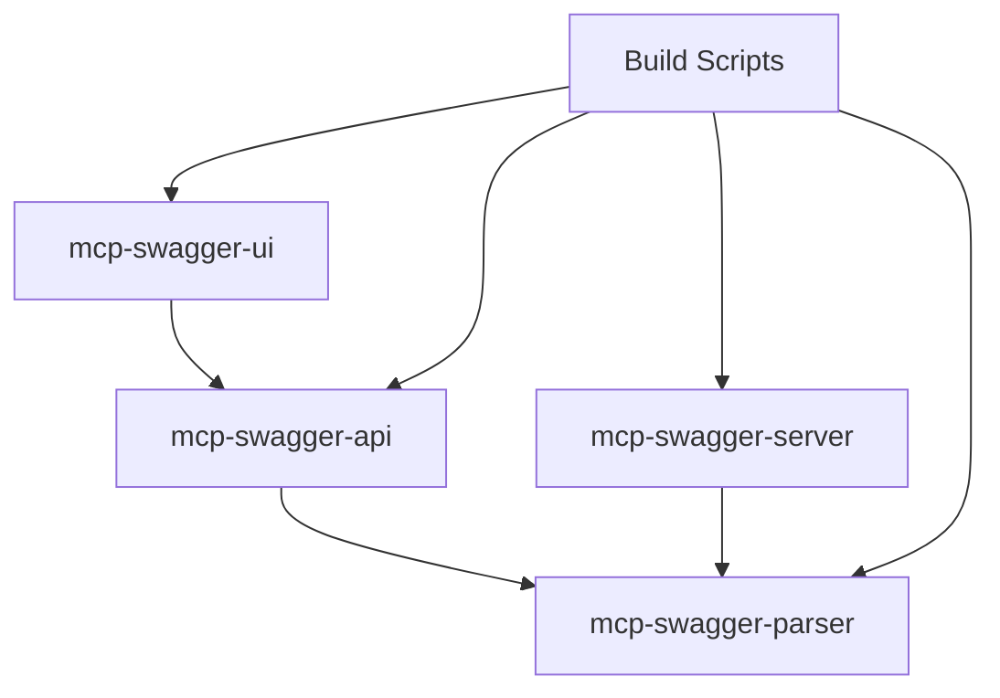

# MCP Swagger Server 🚀

<div align="center">

[](https://www.typescriptlang.org/)
[](https://nodejs.org/)
[](https://vuejs.org/)
[](https://nestjs.com/)
[](LICENSE)

**A comprehensive monorepo solution for converting OpenAPI/Swagger specifications to Model Context Protocol (MCP) format**

Transform your REST APIs into AI-native tools with zero configuration

[🚀 Quick Start](#quick-start) • [🏗️ Architecture](#architecture) • [📚 Documentation](#documentation) • [🛠️ Development](#development)

**Languages**: English | [中文](README_ZH.md)

</div>

---

## 🎯 Overview

MCP Swagger Server is a **production-ready monorepo** that bridges the gap between traditional REST APIs and AI assistants through the Model Context Protocol (MCP). It provides a complete solution with modern web interface, enterprise-grade backend services, and intelligent build systems.

### 🌟 Key Highlights

- **🏗️ Monorepo Architecture**: Advanced dependency management with automated build orchestration
- **🔄 Zero Configuration**: Paste your OpenAPI spec and get MCP tools instantly
- **🎯 AI-Native**: Purpose-built for LLM and AI assistant integration
- **🚀 Production Ready**: Enterprise-grade architecture with comprehensive monitoring
- **🔌 Multi-Protocol**: Support for HTTP, WebSocket, and Stdio transports

## 🏗️ Architecture

### 📦 Core Packages

```
mcp-swagger-server/
├── packages/
│   ├── mcp-swagger-parser/     # 🔧 Core OpenAPI parser engine
│   ├── mcp-swagger-server/     # ⚙️ MCP protocol server
│   ├── mcp-swagger-ui/         # 🎨 Modern Vue.js web interface
│   └── mcp-swagger-api/        # 🔗 NestJS REST API backend
├── scripts/                    # 🔨 Build automation & tooling
├── docs/                       # 📚 Comprehensive documentation
└── shared configurations       # ⚙️ TypeScript, ESLint, etc.
```

### 🔄 Data Flow Architecture

```
┌─────────────────────────────────────────────────────────────────┐
│                        MCP Swagger Server                       │
├─────────────────────────────────────────────────────────────────┤
│                                                                 │
│  ┌─────────────┐    ┌─────────────┐    ┌─────────────────┐    │
│  │   Web UI    │    │  REST API   │    │  MCP Protocol   │    │
│  │  (Vue.js)   │───▶│  (NestJS)   │───▶│    Server       │    │
│  └─────────────┘    └─────────────┘    └─────────────────┘    │
│         │                   │                     │            │
│         ▼                   ▼                     ▼            │
│  ┌─────────────┐    ┌─────────────┐    ┌─────────────────┐    │
│  │  UI State   │    │ Validation  │    │  Tool Registry  │    │
│  │ Management  │    │  & Parsing  │    │   & Execution   │    │
│  └─────────────┘    └─────────────┘    └─────────────────┘    │
│                                                                 │
├─────────────────────────────────────────────────────────────────┤
│                     Shared Parser Engine                       │
│              (@mcp-swagger/parser - TypeScript)                │
└─────────────────────────────────────────────────────────────────┘
```

### 🧩 Package Dependencies



## ✨ Features

### 🎨 Modern Web Interface
- **Elegant Design**: Clean, intuitive user interface
- **Responsive Layout**: Desktop and mobile optimized
- **Real-time Preview**: Live OpenAPI visualization
- **Drag & Drop**: File upload with URL input support
- **Advanced Configuration**: Flexible conversion parameters

### ⚡ Intelligent Parser Engine
- **Multi-format Support**: JSON, YAML, URL, and raw objects
- **Smart Detection**: Auto-recognition of OpenAPI 2.0/3.x specifications
- **Flexible Filtering**: Filter by HTTP methods, tags, and paths
- **Type Safety**: Full TypeScript support with automatic inference
- **Error Handling**: Comprehensive validation and error reporting

### 🔌 Multi-Protocol Transport
- **Stdio Transport**: Command-line integration for desktop apps
- **SSE (Server-Sent Events)**: Real-time web communication
- **HTTP Streaming**: Bidirectional streaming communication
- **Health Monitoring**: Built-in status checks and diagnostics

### 🏗️ Enterprise Architecture
- **Monorepo Management**: Automated dependency resolution
- **Build Orchestration**: Intelligent build order with parallel processing
- **Type Sharing**: Seamless TypeScript types across packages
- **Development Tools**: Hot reload, diagnostic tools, and automation

## 🚀 Quick Start

### Prerequisites
- Node.js ≥ 18.0.0
- pnpm ≥ 8.0.0 (recommended)
- TypeScript ≥ 5.0.0

### Installation

```bash
# Clone the repository
git clone https://github.com/your-username/mcp-swagger-server.git
cd mcp-swagger-server

# Install dependencies
pnpm install

# Build all packages
pnpm build
```

### 🎨 Launch Web Interface

```bash
# Start the development server
pnpm dev:ui

# Open in browser
open http://localhost:3000
```

### ⚙️ Start MCP Server

```bash
# Navigate to MCP server package
cd packages/mcp-swagger-server

# Start with different transports
pnpm start:stdio      # CLI integration
pnpm start:sse         # Web real-time communication
pnpm start:streamable  # HTTP streaming

# Development mode with hot reload
pnpm dev
```

### 🔗 Launch REST API Backend

```bash
# Navigate to API package
cd packages/mcp-swagger-api

# Start development server
pnpm start:dev

# API available at http://localhost:3000
# Swagger docs at http://localhost:3000/api
```

## 🛠️ Development

### 🔨 Build System

Our intelligent build system handles complex dependency relationships:

```bash
# Build all packages in correct order
pnpm build

# Build only backend packages (skip UI)
pnpm build:packages

# Development mode with watch
pnpm dev

# Clean build artifacts
pnpm clean
```

### 📊 Project Health

```bash
# Run comprehensive diagnostics
pnpm diagnostic

# Check all package health
pnpm lint
pnpm type-check

# Run tests across all packages
pnpm test
```

### 🧪 Testing & Debugging

```bash
# Health check for MCP server
curl http://localhost:3322/health

# Debug with MCP Inspector
npx @modelcontextprotocol/inspector node packages/mcp-swagger-server/dist/index.js

# Enable debug logging
DEBUG=mcp:* node packages/mcp-swagger-server/dist/index.js
```

## 🔧 Usage Examples

### 🌐 Web Interface

1. **Open the web interface** at `http://localhost:3000`
2. **Input your API**: Upload file, paste URL, or input text
3. **Configure options**: Select transport, filters, and optimization
4. **Convert & Download**: Get your MCP configuration

### 💻 Programmatic Usage

```typescript
// Using the parser directly
import { parseOpenAPI } from '@mcp-swagger/parser';

const mcpTools = await parseOpenAPI({
  source: 'https://api.example.com/openapi.json',
  options: {
    transport: 'http',
    includeDeprecated: false,
    methods: ['GET', 'POST']
  }
});

// Using the MCP server
import { createMcpServer } from 'mcp-swagger-server';

const server = await createMcpServer({
  transport: 'sse',
  port: 3322
});

await server.start();
```

### 🔌 Integration with AI Assistants

```json
// Claude Desktop configuration
{
  "mcpServers": {
    "swagger-converter": {
      "command": "node",
      "args": ["packages/mcp-swagger-server/dist/index.js"],
      "env": {
        "NODE_ENV": "production"
      }
    }
  }
}
```

## 📚 Documentation

### 📖 Core Documentation
- [🏗️ Architecture Overview](docs/technical-architecture.md)
- [🎨 Frontend Guide](docs/mcp-swagger-ui-technical-documentation.md)
- [🔧 Backend Implementation](docs/nestjs-implementation-guide.md)
- [🚀 Development Guide](docs/mcp-swagger-ui-development-guide.md)

### 🗺️ Planning & Roadmap
- [📋 Project Roadmap](docs/project-roadmap-and-planning.md)
- [⚡ Weekly Tasks](docs/immediate-tasks-week1.md)
- [🔄 Migration Guide](docs/migration-summary.md)

## 🛠️ Technology Stack

### Frontend (mcp-swagger-ui)
- **Framework**: Vue 3 + Composition API
- **UI Library**: Element Plus + Custom Components
- **State Management**: Pinia
- **Build Tool**: Vite
- **Languages**: TypeScript + SCSS

### Backend (mcp-swagger-api)
- **Framework**: NestJS 10+
- **Protocol**: Model Context Protocol (MCP)
- **Validation**: class-validator + class-transformer
- **Documentation**: Swagger/OpenAPI
- **Security**: Helmet, CORS, Rate limiting

### Core Engine (mcp-swagger-parser)
- **Parser**: Custom OpenAPI 3.x parser
- **Validation**: Zod schema validation
- **Transform**: Advanced AST transformation
- **Types**: Comprehensive TypeScript definitions

### Infrastructure
- **Package Manager**: pnpm with workspace support
- **Build System**: Custom orchestration with Rollup/Vite
- **Linting**: ESLint + Prettier
- **Testing**: Jest + Vue Test Utils

## 🌟 Use Cases

### 🤖 AI Assistant Integration
Connect Claude, ChatGPT, or custom AI assistants to your REST APIs through standardized MCP protocol.

### 🔄 API Modernization
Transform legacy REST APIs into AI-friendly tools without changing existing infrastructure.

### 🎯 Rapid Prototyping
Quickly convert API specifications into interactive tools for testing and development.

### 📊 Enterprise Scale
Scale MCP tool generation across multiple APIs and services in enterprise environments.

## 🤝 Contributing

We welcome contributions! Please see our [Contributing Guide](CONTRIBUTING.md) for details.

### Development Workflow

1. Fork and clone the repository
2. Create a feature branch (`git checkout -b feature/amazing-feature`)
3. Make your changes and add tests
4. Ensure all checks pass (`pnpm lint && pnpm type-check`)
5. Commit your changes (`git commit -m 'feat: add amazing feature'`)
6. Push and create a Pull Request

### Code Standards

- **TypeScript**: Strict mode with comprehensive type annotations
- **ESLint**: Follow project ESLint configuration
- **Prettier**: Consistent code formatting
- **Conventional Commits**: Use conventional commit message format

## 📊 Project Status

### ✅ Completed Components

| Component | Status | Description |
|-----------|--------|-------------|
| **Parser Engine** | 🟢 100% | Core OpenAPI parser with full type support |
| **Build System** | 🟢 100% | Intelligent build orchestration |
| **Web Interface** | 🟢 90% | Modern Vue.js UI with responsive design |
| **MCP Server** | 🟢 90% | Multi-transport protocol server |
| **REST API** | 🟢 95% | NestJS backend with comprehensive endpoints |
| **Documentation** | 🟢 100% | Complete technical documentation |

### 🚧 In Progress

- **Testing Suite**: Comprehensive test coverage
- **Performance Optimization**: Large file handling
- **Advanced Features**: Custom transformation rules

### 🎯 Roadmap

- **Enterprise Features**: Authentication, rate limiting, analytics
- **Plugin System**: Custom parsers and transformers
- **Cloud Deployment**: Docker containers and CI/CD
- **Performance**: Caching and optimization

## 📄 License

This project is licensed under the MIT License - see the [LICENSE](LICENSE) file for details.

## 🙏 Acknowledgments

- [Model Context Protocol](https://modelcontextprotocol.io/) for the protocol specification
- [OpenAPI Initiative](https://www.openapis.org/) for API standardization
- [Vue.js](https://vuejs.org/) and [NestJS](https://nestjs.com/) communities
- All contributors and supporters of this project

---

<div align="center">

**Built with ❤️ by ZhaoYaNan(ZTE) 17761978041**

[⭐ Star this repo](../../stargazers) • [🐛 Report issues](../../issues) • [💬 Discussions](../../discussions)

</div>
