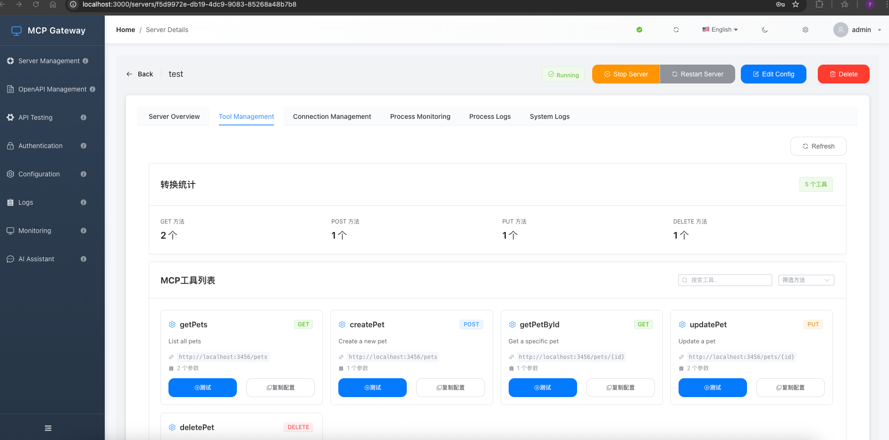

# MCP Swagger Server(mss)

<div align="center">

[](https://www.typescriptlang.org/)
[](https://nodejs.org/)
[](LICENSE)
[](https://archestra.ai/mcp-catalog/zaizaizhao__mcp-swagger-server)

**将 OpenAPI/Swagger 规范转换为 Model Context Protocol (MCP) 格式的工具**

零配置将您的 REST API 转换为 AI 可调用的工具

[🚀 快速开始](#快速开始) • [📖 使用指南](#使用指南) • [🛠️ 开发](#开发)

**Languages**: [English](README_EN.md) | 中文

</div>

---
## 🎬 快速演示


## 🎯 项目截图



## 🎯 项目简介

MCP Swagger Server 是一个将 OpenAPI/Swagger 规范转换为 Model Context Protocol (MCP) 格式的工具。

### 📦 项目结构

```
mcp-swagger-server/
├── packages/
│   ├── mcp-swagger-server/     # 🔧 核心 MCP 服务器 (可用)
│   ├── mcp-swagger-parser/     # 📝 OpenAPI 解析器 (可用)
│   ├── mcp-swagger-ui/         # 🎨 Web 界面 (开发中)
│   └── mcp-swagger-api/        # 🔗 REST API 后端 (可用)
└── scripts/                    # 🔨 构建脚本
```

### ✨ 核心特性

- **🔄 零配置转换**: 输入 OpenAPI 规范，立即获得 MCP 工具
- **🎯 渐进式命令行**: 提供逐步引导的命令行界面，方便用户配置
- **🔌 多传输协议**: 支持 SSE、Streamable 和 Stdio 传输
- **🔐 安全认证**: 支持 Bearer Token 认证保护 API 访问

## 🚀 快速开始

### 环境要求

- Node.js ≥ 20.0.0
- pnpm ≥ 8.0.0 (推荐)

### 安装

```bash
npm i mcp-swagger-server -g
```

### 命令说明

- `mss`：交互式终端界面（默认）
- `mcp-swagger-server` / `mcp-swagger`：标准命令行（适合脚本和 AI 客户端集成）
- `mss --openapi ...`：直接启动模式（跳过交互界面）

> 说明：交互式会话模式下不支持 STDIO 启动；如需 STDIO，请使用 `mss --openapi ... --transport stdio`（兼容别名：`mcp-swagger-server --transport stdio ...`）。

### 快速启动
#### 交互式启动（推荐新手）
```bash 
mss
```
#### 一键启动（非交互）
```bash 
mss --openapi https://api.example.com/openapi.json \
  --operation-filter-methods GET \
  --operation-filter-methods POST \
  --transport streamable \
  --auth-type bearer \
  --bearer-token "your-token-here"

# 使用配置文件
mss --config config.json
```

## 📖 使用指南

#### 命令行选项

```bash
# 基本用法
mss [选项]

# 选项：
--openapi, -o       OpenAPI 规范的 URL 或文件路径
--transport, -t     传输协议 (stdio|sse|streamable)
--port, -p          端口号
--endpoint, -e      自定义端点路径 (默认 sse:/sse, streamable:/mcp)
--base-url          覆盖 API 基础 URL（优先级最高）
--watch, -w         监控文件变化
--env               环境变量文件路径 (.env)

# Bearer Token 认证选项：
--auth-type         认证类型 (bearer)
--bearer-token      直接指定 Bearer Token
--bearer-env        从环境变量读取 Token
--config, -c        配置文件路径
--custom-header     自定义请求头 "Key=Value" (可重复)
--custom-header-env 环境变量请求头 "Key=VAR_NAME" (可重复)
--custom-headers-config  自定义请求头配置文件 (JSON)
--debug-headers     请求头调试日志

# 操作过滤选项：
--operation-filter-methods <method>         HTTP方法过滤 (可重复) [示例: GET]
--operation-filter-paths <path>             路径过滤 (支持通配符, 可重复) [示例: /api/*]
--operation-filter-operation-ids <id>       操作ID过滤 (可重复) [示例: getUserById]
--operation-filter-status-codes <code>      状态码过滤 (可重复) [示例: 200]
--operation-filter-parameters <param>       参数过滤 (可重复) [示例: userId]
```

> 提示：如果要在 `mss` 中直接启动（跳过交互界面），请显式传入 `--openapi` 参数。若 OpenAPI 文档中的 `servers.url` 是相对路径（如 `/v1`），请优先使用远程 URL 加载文档，或显式传入 `--base-url`。Swagger 2.0 文档会在启动时自动转换为 OpenAPI 3.x（含 `host/basePath` 映射）。

### 🔐 Bearer Token 认证

`mcp-swagger-server` 支持 Bearer Token 认证，可以保护需要身份验证的 API 访问。

#### 认证方式

**1. 直接指定 Token**
```bash
mss --auth-type bearer --bearer-token "your-token-here" --openapi https://api.example.com/openapi.json --transport streamable
```

#### 环境变量配置

创建 `.env` 文件：
```env
# 基础配置
MCP_PORT=3322
MCP_TRANSPORT=stdio
MCP_OPENAPI_URL=https://api.example.com/openapi.json
MCP_ENDPOINT=/mcp
MCP_BASE_URL=https://api.example.com/v1

# 认证配置
MCP_AUTH_TYPE=bearer
API_TOKEN=your-bearer-token-here
```

### 🤖 与 AI 助手集成

#### Claude Desktop 配置

```json
{
  "mcpServers": {
    "swagger-converter": {
      "command": "mss",
      "args": [
        "--openapi", "https://petstore.swagger.io/v2/swagger.json",
        "--transport", "stdio"
      ]
    },
    "secured-api": {
      "command": "mss",
      "args": [
        "--openapi", "https://api.example.com/openapi.json",
        "--transport", "stdio",
        "--auth-type", "bearer",
        "--bearer-env", "API_TOKEN"
      ],
      "env": {
        "API_TOKEN": "your-bearer-token-here"
      }
    }
  }
}
```

## 🛠️ 开发

### 构建系统

```bash
# 构建所有包
pnpm build

# 仅构建后端包
pnpm build:packages

# 开发模式
pnpm dev

# 清理构建产物
pnpm clean
```
## 🤝 贡献

欢迎贡献！请先阅读 [贡献指南](CONTRIBUTING.md)。

## 📄 许可证

MIT License - 详见 [LICENSE](LICENSE) 文件。

---

<div align="center">

**Built with ❤️ by ZhaoYaNan(ZTE)**

[⭐ Star](../../stargazers) • [🐛 Issues](../../issues) • [💬 Discussions](../../discussions)

</div>
