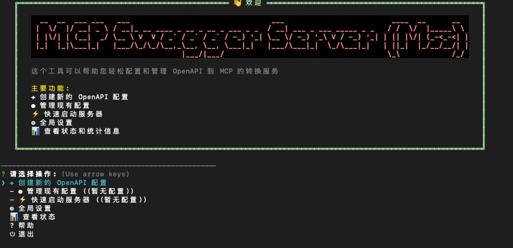

# MCP Swagger Server(mss)

<div align="center">

[](https://www.typescriptlang.org/)
[](https://nodejs.org/)
[](LICENSE)

**A tool that converts OpenAPI/Swagger specifications to Model Context Protocol (MCP) format**

**Languages**: English | [中文](README.md)

</div>

---
## 🎬 Quick Demo


## 🎯 Project Screenshots


## 🎯 Project Overview

MCP Swagger Server is a tool that converts OpenAPI/Swagger specifications to Model Context Protocol (MCP) format.

### 📦 Project Structure

```
mcp-swagger-server/
├── packages/
│   ├── mcp-swagger-server/     # 🔧 Core MCP Server (Available)
│   ├── mcp-swagger-parser/     # 📝 OpenAPI Parser (Available)
│   └── mcp-swagger-api/        # 🔗 REST API Backend (Available)
└── scripts/                    # 🔨 Build Scripts
```

### ✨ Core Features

- **🔄 Zero Configuration**: Input OpenAPI spec, get MCP tools instantly
- **🎯 Progressive Command Line**: Provides step-by-step guided command line interface for easy user configuration
- **🖥️ Terminal-first workflow**: CLI and interactive terminal are the primary user experience
- **🔌 Multi-Transport**: Support for SSE, Streamable, and Stdio transports
- **🔐 Secure Authentication**: Bearer Token authentication to protect API access

## 🚀 Quick Start

### Prerequisites

- Node.js ≥ 20.0.0
- pnpm ≥ 8.0.0 (recommended)

### Installation

```bash
npm i mcp-swagger-server -g
```

### Command Guide

- `mss`: interactive terminal UI (default)
- `mcp-swagger-server` / `mcp-swagger`: standard CLI (best for scripts and AI client integration)
- `mss --openapi ...`: direct mode (skip interactive UI)

> Note: interactive session mode does not support starting STDIO servers. Use `mss --openapi ... --transport stdio` (alias still works: `mcp-swagger-server --transport stdio ...`) for STDIO.

### Quick Launch
#### Interactive Launch (recommended for first-time setup)
```bash 
mss
```
#### One-Command Launch (non-interactive)
```bash 
mss --openapi https://api.example.com/openapi.json \
  --operation-filter-methods GET \
  --operation-filter-methods POST \
  --transport streamable \
  --auth-type bearer \
  --bearer-token "your-token-here"

# Using configuration file
mss --config config.json
```

## 📖 Usage Guide

### 🔧 `mcp-swagger-server` Package

This is the core package of the project, providing complete MCP server functionality.

#### Installation and Usage

```bash
# Global installation
npm install -g mcp-swagger-server

# Command line usage
mss --openapi https://petstore.swagger.io/v2/swagger.json --transport streamable --port 3322
```

#### Supported Transport Protocols

- **stdio**: For command-line integration
- **sse**: Server-Sent Events, suitable for web applications
- **streamable**: HTTP streaming transport, suitable for modern web applications

#### Command Line Options

```bash
# Basic usage
mss [options]

# Options:
--openapi, -o       OpenAPI specification URL or file path
--transport, -t     Transport protocol (stdio|sse|streamable)
--port, -p          Port number
--endpoint, -e      Custom endpoint path (default: sse=/sse, streamable=/mcp)
--base-url          Override API base URL (highest priority)
--watch, -w         Monitor file changes
--env               Environment file path (.env)

# Bearer Token authentication options:
--auth-type         Authentication type (bearer)
--bearer-token      Directly specify Bearer Token
--bearer-env        Read token from environment variable
--config, -c        Configuration file path
--custom-header     Custom header "Key=Value" (repeatable)
--custom-header-env Environment header "Key=VAR_NAME" (repeatable)
--custom-headers-config  Custom headers config file (JSON)
--debug-headers     Enable header debug logging

# Operation filtering options:
--operation-filter-methods <method>         HTTP method filtering (repeatable) [Example: GET]
--operation-filter-paths <path>             Path filtering (supports wildcards, repeatable) [Example: /api/*]
--operation-filter-operation-ids <id>       Operation ID filtering (repeatable) [Example: getUserById]
--operation-filter-status-codes <code>      Status code filtering (repeatable) [Example: 200]
--operation-filter-parameters <param>       Parameter filtering (repeatable) [Example: userId]
```

> Note: to use direct mode with `mss`, you must pass `--openapi`. If your OpenAPI spec uses relative `servers.url` values (for example `/v1`), prefer loading from a remote URL, or set `--base-url` explicitly. Swagger 2.0 specs are auto-converted to OpenAPI 3.x on startup (including `host/basePath` mapping).

#### Examples

```bash
# Use local OpenAPI file
mss --openapi ./swagger.json --transport sse --port 3322

# Use remote OpenAPI URL
mss --openapi https://api.example.com/openapi.json --transport streamable --port 3323

# Monitor file changes
mss --openapi ./api.yaml --transport stdio --watch

# Use Bearer Token authentication
mss --openapi https://api.example.com/openapi.json --auth-type bearer --bearer-token "your-token-here" --transport sse --port 3322

# Read token from environment variable
export API_TOKEN="your-token-here"
mss --openapi https://api.example.com/openapi.json --auth-type bearer --bearer-env API_TOKEN --transport stdio

# Using operation filtering options
# Include only GET and POST method endpoints
mss --openapi https://api.example.com/openapi.json \
  --operation-filter-methods GET \
  --operation-filter-methods POST \
  --transport streamable

# Include only specific path endpoints
mss --openapi https://api.example.com/openapi.json \
  --operation-filter-paths "/api/users/*" \
  --operation-filter-paths "/api/orders/*" \
  --transport streamable

# Include only specific operation ID endpoints
mss --openapi https://api.example.com/openapi.json \
  --operation-filter-operation-ids "getUserById" \
  --operation-filter-operation-ids "createUser" \
  --transport streamable

# Include only specific status code endpoints
mss --openapi https://api.example.com/openapi.json \
  --operation-filter-status-codes "200" \
  --operation-filter-status-codes "201" \
  --operation-filter-status-codes "204" \
  --transport streamable

# Include only endpoints with specific parameters
mss --openapi https://api.example.com/openapi.json \
  --operation-filter-parameters "userId" \
  --operation-filter-parameters "email" \
  --transport streamable

# Combine multiple filtering options
mss --openapi https://api.example.com/openapi.json \
  --operation-filter-methods GET \
  --operation-filter-methods POST \
  --operation-filter-paths "/api/users/*" \
  --operation-filter-status-codes "200" \
  --operation-filter-status-codes "201" \
  --transport streamable
```

### 🔐 Bearer Token Authentication

`mcp-swagger-server` supports Bearer Token authentication to protect API access that requires authentication.

#### Authentication Methods

**1. Direct Token Specification**
```bash
mss --auth-type bearer --bearer-token "your-token-here" --openapi https://api.example.com/openapi.json --transport streamable
```

**2. Environment Variable Method**
```bash
# Set environment variable
export API_TOKEN="your-token-here"

# Use environment variable
mss --auth-type bearer --bearer-env API_TOKEN --openapi https://api.example.com/openapi.json
```

**3. Configuration File Method**
```json
{
  "transport": "sse",
  "port": 3322,
  "openapi": "https://api.example.com/openapi.json",
  "auth": {
    "type": "bearer",
    "bearer": {
      "token": "your-token-here",
      "source": "static"
    }
  }
}
```

```bash
# Use configuration file
mss --config config.json
```

#### Environment Variable Configuration

Create a `.env` file:
```env
# Basic configuration
MCP_PORT=3322
MCP_TRANSPORT=stdio
MCP_OPENAPI_URL=https://api.example.com/openapi.json
MCP_ENDPOINT=/mcp
MCP_BASE_URL=https://api.example.com/v1

# Authentication configuration
MCP_AUTH_TYPE=bearer
API_TOKEN=your-bearer-token-here
```

### 🤖 AI Assistant Integration

#### Claude Desktop Configuration

```json
{
  "mcpServers": {
    "swagger-converter": {
      "command": "mss",
      "args": [
        "--openapi", "https://petstore.swagger.io/v2/swagger.json",
        "--transport", "stdio"
      ]
    },
    "secured-api": {
      "command": "mss",
      "args": [
        "--openapi", "https://api.example.com/openapi.json",
        "--transport", "stdio",
        "--auth-type", "bearer",
        "--bearer-env", "API_TOKEN"
      ],
      "env": {
        "API_TOKEN": "your-bearer-token-here"
      }
    }
  }
}
```

#### Programmatic Usage

```typescript
import axios from 'axios';
import { createMcpServer, startStreamableMcpServer } from 'mcp-swagger-server';

const openApiData = (await axios.get('https://api.example.com/openapi.json')).data;

const server = await createMcpServer({
  openApiData,
  authConfig: {
    type: 'bearer',
    bearer: {
      source: 'static',
      token: 'your-token-here'
    }
  }
});

await startStreamableMcpServer(server, '/mcp', 3322);
```

## 🛠️ Development

### Build System

```bash
# Build all packages
pnpm build

# Build core workspace packages
pnpm build:packages

# Terminal development mode (CLI / parser watch)
pnpm dev

# Clean build artifacts
pnpm clean
```

### Testing and Debugging

```bash
# Run tests
pnpm test

# Code linting
pnpm lint

# Type checking
pnpm type-check

# Project health check
pnpm diagnostic
```

### MCP Server Development

```bash
cd packages/mcp-swagger-server

# Development mode startup
pnpm dev

# Run CLI tools
pnpm cli --help

# Debug with MCP Inspector
npx @modelcontextprotocol/inspector node dist/index.js
```

## 📊 Project Status

| Package | Status | Description |
|---------|--------|-------------|
| `mcp-swagger-server` | ✅ Available | Core MCP server with multi-transport support |
| `mcp-swagger-parser` | ✅ Available | OpenAPI parser and conversion tools |
| `mcp-swagger-api` | ✅ Available | NestJS REST API backend |

## 🤝 Contributing

Contributions are welcome! Please read the [Contributing Guide](CONTRIBUTING.md) first.

## 📄 License

MIT License - see the [LICENSE](LICENSE) file for details.

---

<div align="center">

**Built with ❤️ by ZhaoYaNan(ZTE)**

[⭐ Star](../../stargazers) • [🐛 Issues](../../issues) • [💬 Discussions](../../discussions)

</div>
