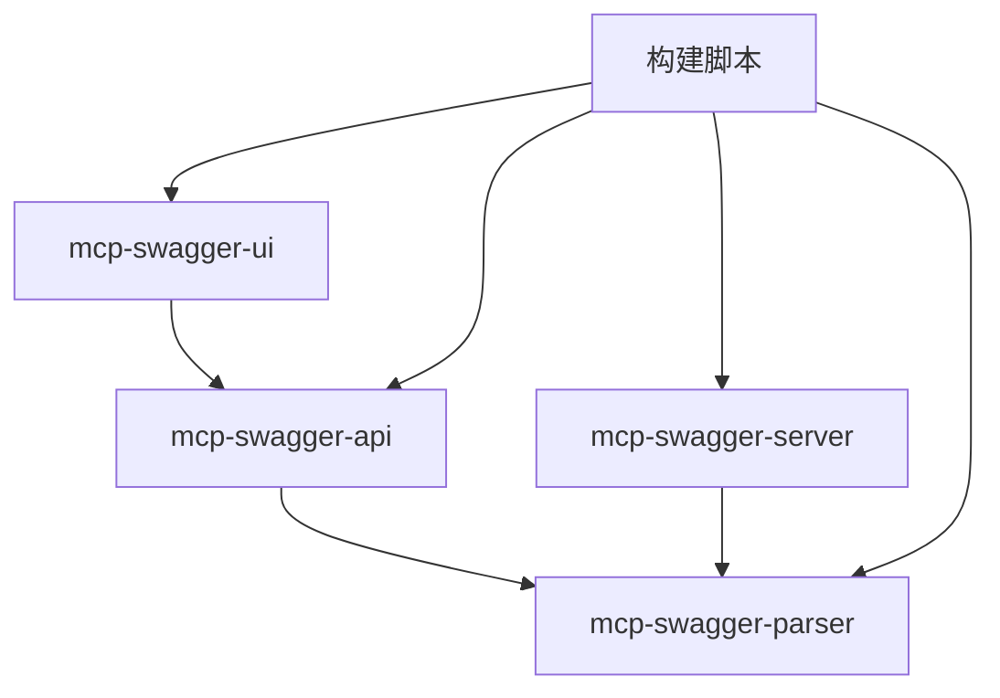

# MCP Swagger Server 🚀

<div align="center">

[](https://www.typescriptlang.org/)
[](https://nodejs.org/)
[](https://vuejs.org/)
[](https://nestjs.com/)
[](LICENSE)

**将 OpenAPI/Swagger 规范转换为 Model Context Protocol (MCP) 格式的企业级 Monorepo 解决方案**

零配置将您的 REST API 转换为 AI 原生工具

[🚀 快速开始](#快速开始) • [🏗️ 架构设计](#架构设计) • [📚 文档](#文档) • [🛠️ 开发指南](#开发指南)

**Languages**: [English](README_EN.md) | 中文

</div>

---

## 🎯 项目概述

MCP Swagger Server 是一个**生产就绪的 Monorepo**，通过 Model Context Protocol (MCP) 连接传统 REST API 与 AI 助手。它提供了完整的解决方案，包括现代化 Web 界面、企业级后端服务和智能构建系统。

### � 核心亮点

- **🏗️ Monorepo 架构**: 先进的依赖管理与自动化构建编排
- **🔄 零配置转换**: 粘贴 OpenAPI 规范即可获得 MCP 工具
- **🎯 AI 原生设计**: 专为 LLM 和 AI 助手集成而构建
- **🚀 生产就绪**: 企业级架构与全面监控
- **🔌 多协议支持**: 支持 HTTP、WebSocket 和 Stdio 传输

## �️ 架构设计

### 📦 核心包结构

```
mcp-swagger-server/
├── packages/
│   ├── mcp-swagger-parser/     # 🔧 核心 OpenAPI 解析引擎
│   ├── mcp-swagger-server/     # ⚙️ MCP 协议服务器
│   ├── mcp-swagger-ui/         # 🎨 现代化 Vue.js Web 界面
│   └── mcp-swagger-api/        # 🔗 NestJS REST API 后端
├── scripts/                    # 🔨 构建自动化和工具
├── docs/                       # 📚 完整技术文档
└── 共享配置文件                 # ⚙️ TypeScript、ESLint 等
```

### 🔄 数据流架构

```
┌─────────────────────────────────────────────────────────────────┐
│                     MCP Swagger Server                         │
├─────────────────────────────────────────────────────────────────┤
│                                                                 │
│  ┌─────────────┐    ┌─────────────┐    ┌─────────────────┐    │
│  │   Web UI    │    │  REST API   │    │  MCP Protocol   │    │
│  │  (Vue.js)   │───▶│  (NestJS)   │───▶│    Server       │    │
│  └─────────────┘    └─────────────┘    └─────────────────┘    │
│         │                   │                     │            │
│         ▼                   ▼                     ▼            │
│  ┌─────────────┐    ┌─────────────┐    ┌─────────────────┐    │
│  │  UI 状态    │    │ 验证解析    │    │  工具注册       │    │
│  │  管理       │    │  服务       │    │  与执行         │    │
│  └─────────────┘    └─────────────┘    └─────────────────┘    │
│                                                                 │
├─────────────────────────────────────────────────────────────────┤
│                     共享解析引擎                                │
│              (@mcp-swagger/parser - TypeScript)                │
└─────────────────────────────────────────────────────────────────┘
```

### 🧩 包依赖关系



## ✨ 核心特性

### 🎨 现代化 Web 界面
- **优雅设计**: 简洁直观的用户界面
- **响应式布局**: 桌面端和移动端优化
- **实时预览**: OpenAPI 规范可视化
- **拖拽上传**: 文件上传与 URL 输入支持
- **高级配置**: 灵活的转换参数设置

### ⚡ 智能解析引擎
- **多格式支持**: JSON、YAML、URL 和原始对象
- **智能检测**: 自动识别 OpenAPI 2.0/3.x 规范
- **灵活过滤**: 按 HTTP 方法、标签和路径过滤
- **类型安全**: 完整的 TypeScript 支持与自动推断
- **错误处理**: 全面的验证和错误报告

### 🔌 多协议传输
- **Stdio 传输**: 桌面应用命令行集成
- **SSE (Server-Sent Events)**: Web 实时通信
- **HTTP 流**: 双向流通信
- **健康监控**: 内置状态检查和诊断

### 🏗️ 企业级架构
- **Monorepo 管理**: 自动化依赖解析
- **构建编排**: 智能构建顺序与并行处理
- **类型共享**: 跨包的无缝 TypeScript 类型
- **开发工具**: 热重载、诊断工具和自动化

## 🚀 快速开始

### 环境要求
- Node.js ≥ 18.0.0
- pnpm ≥ 8.0.0 (推荐)
- TypeScript ≥ 5.0.0

### 安装

```bash
# 克隆仓库
git clone https://github.com/your-username/mcp-swagger-server.git
cd mcp-swagger-server

# 安装依赖
pnpm install

# 构建所有包
pnpm build
```

### 🎨 启动 Web 界面

```bash
# 启动开发服务器
pnpm dev:ui

# 在浏览器中打开
open http://localhost:3000
```

### ⚙️ 启动 MCP 服务器

```bash
# 进入 MCP 服务器包
cd packages/mcp-swagger-server

# 使用不同传输方式启动
pnpm start:stdio      # CLI 集成
pnpm start:sse         # Web 实时通信
pnpm start:streamable  # HTTP 流

# 开发模式（热重载）
pnpm dev
```

### � 启动 REST API 后端

```bash
# 进入 API 包
cd packages/mcp-swagger-api

# 启动开发服务器
pnpm start:dev

# API 可在 http://localhost:3000 访问
# Swagger 文档在 http://localhost:3000/api
```

## �️ 开发指南

### 🔨 构建系统

我们的智能构建系统处理复杂的依赖关系：

```bash
# 按正确顺序构建所有包
pnpm build

# 仅构建后端包（跳过 UI）
pnpm build:packages

# 开发模式（监听模式）
pnpm dev

# 清理构建产物
pnpm clean
```

### 📊 项目健康状态

```bash
# 运行综合诊断
pnpm diagnostic

# 检查所有包健康状态
pnpm lint
pnpm type-check

# 跨所有包运行测试
pnpm test
```

### 🧪 测试与调试

```bash
# MCP 服务器健康检查
curl http://localhost:3322/health

# 使用 MCP Inspector 调试
npx @modelcontextprotocol/inspector node packages/mcp-swagger-server/dist/index.js

# 启用调试日志
DEBUG=mcp:* node packages/mcp-swagger-server/dist/index.js
```

## 🔧 使用示例

### � Web 界面

1. **打开 Web 界面**: 访问 `http://localhost:3000`
2. **输入您的 API**: 上传文件、粘贴 URL 或输入文本
3. **配置选项**: 选择传输、过滤器和优化
4. **转换并下载**: 获取您的 MCP 配置

### 💻 编程式使用

```typescript
// 直接使用解析器
import { parseOpenAPI } from '@mcp-swagger/parser';

const mcpTools = await parseOpenAPI({
  source: 'https://api.example.com/openapi.json',
  options: {
    transport: 'http',
    includeDeprecated: false,
    methods: ['GET', 'POST']
  }
});

// 使用 MCP 服务器
import { createMcpServer } from 'mcp-swagger-server';

const server = await createMcpServer({
  transport: 'sse',
  port: 3322
});

await server.start();
```

### 🔌 与 AI 助手集成

```json
// Claude Desktop 配置
{
  "mcpServers": {
    "swagger-converter": {
      "command": "node",
      "args": ["packages/mcp-swagger-server/dist/index.js"],
      "env": {
        "NODE_ENV": "production"
      }
    }
  }
}
```

## 📚 文档

### � 核心文档
- [🏗️ 架构概览](docs/technical-architecture.md)
- [🎨 前端指南](docs/mcp-swagger-ui-technical-documentation.md)
- [🔧 后端实现](docs/nestjs-implementation-guide.md)
- [� 开发指南](docs/mcp-swagger-ui-development-guide.md)

### 🗺️ 规划与路线图
- [📋 项目路线图](docs/project-roadmap-and-planning.md)
- [⚡ 每周任务](docs/immediate-tasks-week1.md)
- [🔄 迁移指南](docs/migration-summary.md)

## 🛠️ 技术栈

### 前端 (mcp-swagger-ui)
- **框架**: Vue 3 + Composition API
- **UI 库**: Element Plus + 自定义组件
- **状态管理**: Pinia
- **构建工具**: Vite
- **语言**: TypeScript + SCSS

### 后端 (mcp-swagger-api)
- **框架**: NestJS 10+
- **协议**: Model Context Protocol (MCP)
- **验证**: class-validator + class-transformer
- **文档**: Swagger/OpenAPI
- **安全**: Helmet、CORS、速率限制

### 核心引擎 (mcp-swagger-parser)
- **解析器**: 自定义 OpenAPI 3.x 解析器
- **验证**: Zod 模式验证
- **转换**: 高级 AST 转换
- **类型**: 全面的 TypeScript 定义

### 基础设施
- **包管理器**: pnpm 与 workspace 支持
- **构建系统**: 自定义编排与 Rollup/Vite
- **代码检查**: ESLint + Prettier
- **测试**: Jest + Vue Test Utils

## 🌟 使用场景

### 🤖 AI 助手集成
通过标准化 MCP 协议将 Claude、ChatGPT 或自定义 AI 助手连接到您的 REST API。

### � API 现代化
在不更改现有基础设施的情况下，将传统 REST API 转换为 AI 友好的工具。

### 🎯 快速原型
快速将 API 规范转换为交互式工具，用于测试和开发。

### 📊 企业规模
在企业环境中跨多个 API 和服务扩展 MCP 工具生成。

## 🤝 贡献指南

我们欢迎贡献！请查看我们的 [贡献指南](CONTRIBUTING.md) 了解详情。

### 开发工作流

1. Fork 并克隆仓库
2. 创建功能分支 (`git checkout -b feature/amazing-feature`)
3. 进行更改并添加测试
4. 确保所有检查通过 (`pnpm lint && pnpm type-check`)
5. 提交更改 (`git commit -m 'feat: add amazing feature'`)
6. 推送并创建 Pull Request

### 代码标准

- **TypeScript**: 严格模式，全面的类型注解
- **ESLint**: 遵循项目 ESLint 配置
- **Prettier**: 一致的代码格式化
- **约定式提交**: 使用约定式提交消息格式

## � 项目状态

### ✅ 已完成组件

| 组件 | 状态 | 描述 |
|------|------|------|
| **解析引擎** | � 100% | 具有完整类型支持的核心 OpenAPI 解析器 |
| **构建系统** | � 100% | 智能构建编排 |
| **Web 界面** | 🟢 90% | 响应式设计的现代 Vue.js UI |
| **MCP 服务器** | 🟢 90% | 多传输协议服务器 |
| **REST API** | � 95% | 具有全面端点的 NestJS 后端 |
| **文档** | 🟢 100% | 完整的技术文档 |

### 🚧 进行中

- **测试套件**: 全面的测试覆盖
- **性能优化**: 大文件处理
- **高级功能**: 自定义转换规则

### � 路线图

- **企业功能**: 认证、速率限制、分析
- **插件系统**: 自定义解析器和转换器
- **云部署**: Docker 容器和 CI/CD
- **性能**: 缓存和优化

## 📄 许可证

本项目基于 MIT 许可证 - 查看 [LICENSE](LICENSE) 文件了解详情。

## � 致谢

- [Model Context Protocol](https://modelcontextprotocol.io/) 提供协议规范
- [OpenAPI Initiative](https://www.openapis.org/) 提供 API 标准化
- [Vue.js](https://vuejs.org/) 和 [NestJS](https://nestjs.com/) 社区
- 本项目的所有贡献者和支持者

---

<div align="center">

**由 ZhaoYaNan(ZTE) 17761978041 用 ❤️ 构建**

[⭐ Star 此仓库](../../stargazers) • [🐛 报告问题](../../issues) • [💬 讨论](../../discussions)

</div>
