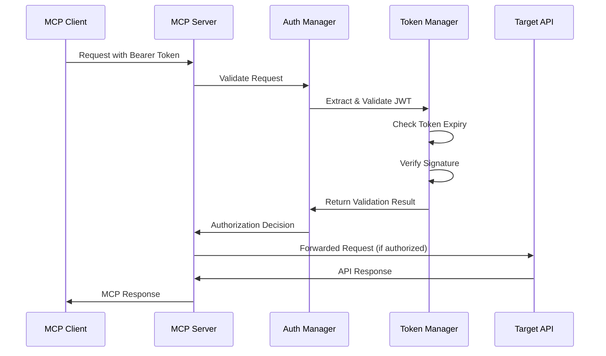

# Bearer Token认证方案设计文档

## 1. 概述

本文档详细描述了 mcp-swagger-server 的 Bearer Token 认证方案设计，该方案遵循企业级安全标准，具备高度的可扩展性，为后续集成其他认证机制（如OAuth 2.0、API Key、Basic Auth等）提供基础架构。

## 2. 设计目标

### 2.1 核心目标
- **安全性**：确保API调用的安全性，防止未授权访问
- **可扩展性**：为未来集成多种认证机制提供灵活的架构
- **标准化**：遵循OpenAPI规范和JWT标准
- **性能**：最小化认证过程对系统性能的影响
- **兼容性**：与现有MCP协议和Swagger规范完全兼容

### 2.2 技术要求
- 支持JWT Bearer Token认证
- 支持令牌的动态验证和刷新
- 提供多种令牌存储方式（内存、文件、数据库）
- 支持自定义认证逻辑
- 提供详细的认证日志和审计

## 3. 技术架构

### 3.1 整体架构图

```
┌─────────────────────────────────────────────────────────────────┐
│                    MCP Swagger Server                           │
├─────────────────────────────────────────────────────────────────┤
│                 Authentication Layer                            │
│  ┌─────────────────┐  ┌─────────────────┐  ┌─────────────────┐ │
│  │   Auth Manager  │  │  Token Manager  │  │  Policy Engine  │ │
│  │                 │  │                 │  │                 │ │
│  │ - Route Auth    │  │ - JWT Validate  │  │ - Access Rules  │ │
│  │ - Middleware    │  │ - Token Store   │  │ - Permissions   │ │
│  │ - Exception     │  │ - Refresh Logic │  │ - Rate Limit    │ │
│  └─────────────────┘  └─────────────────┘  └─────────────────┘ │
├─────────────────────────────────────────────────────────────────┤
│                   Transport Layer                               │
│  ┌─────────────────┐  ┌─────────────────┐  ┌─────────────────┐ │
│  │   HTTP/HTTPS    │  │   WebSocket     │  │   Stream/SSE    │ │
│  │                 │  │                 │  │                 │ │
│  │ - Bearer Header │  │ - Auth Frame    │  │ - Auth Meta     │ │
│  │ - CORS Support  │  │ - Reconnect     │  │ - Stream Auth   │ │
│  └─────────────────┘  └─────────────────┘  └─────────────────┘ │
├─────────────────────────────────────────────────────────────────┤
│                     Core MCP Layer                              │
│  ┌─────────────────┐  ┌─────────────────┐  ┌─────────────────┐ │
│  │   Tool Manager  │  │  OpenAPI Parser │  │   MCP Protocol  │ │
│  │                 │  │                 │  │                 │ │
│  │ - Secured Tools │  │ - Auth Schemas  │  │ - Secure Comm   │ │
│  │ - Access Control│  │ - Security Defs │  │ - Error Handle  │ │
│  └─────────────────┘  └─────────────────┘  └─────────────────┘ │
└─────────────────────────────────────────────────────────────────┘
```

### 3.2 认证流程



## 4. 核心组件设计

### 4.1 AuthManager (认证管理器)

```typescript
interface AuthManager {
  // 验证请求
  validateRequest(request: McpRequest): Promise<AuthResult>;
  
  // 注册认证提供者
  registerProvider(provider: AuthProvider): void;
  
  // 获取用户上下文
  getUserContext(token: string): Promise<UserContext>;
  
  // 检查权限
  checkPermission(user: UserContext, resource: string, action: string): boolean;
}
```

**核心职责**：
- 统一的认证入口点
- 多认证提供者管理
- 权限验证和访问控制
- 认证异常处理

### 4.2 TokenManager (令牌管理器)

```typescript
interface TokenManager {
  // 验证JWT令牌
  validateJWT(token: string): Promise<JWTPayload>;
  
  // 刷新令牌
  refreshToken(refreshToken: string): Promise<TokenPair>;
  
  // 撤销令牌
  revokeToken(token: string): Promise<void>;
  
  // 获取令牌信息
  getTokenInfo(token: string): Promise<TokenInfo>;
}
```

**核心职责**：
- JWT令牌的验证和解析
- 令牌生命周期管理
- 令牌黑名单维护
- 令牌存储和缓存

### 4.3 PolicyEngine (策略引擎)

```typescript
interface PolicyEngine {
  // 评估访问策略
  evaluatePolicy(context: AuthContext, resource: string): Promise<PolicyResult>;
  
  // 加载策略规则
  loadPolicies(policies: Policy[]): void;
  
  // 动态更新策略
  updatePolicy(policyId: string, policy: Policy): void;
}
```

**核心职责**：
- 基于角色的访问控制(RBAC)
- 基于属性的访问控制(ABAC)
- 动态策略评估
- 审计日志记录

## 5. 数据结构设计

### 5.1 JWT Payload结构

```typescript
interface JWTPayload {
  // 标准Claims
  sub: string;          // 用户ID
  iss: string;          // 发行者
  aud: string;          // 受众
  exp: number;          // 过期时间
  iat: number;          // 发行时间
  nbf?: number;         // 生效时间
  jti?: string;         // JWT ID
  
  // 自定义Claims
  roles: string[];      // 用户角色
  permissions: string[]; // 用户权限
  scope: string;        // 权限范围
  tenant?: string;      // 租户信息
  metadata?: Record<string, any>; // 扩展元数据
}
```

### 5.2 用户上下文

```typescript
interface UserContext {
  userId: string;
  username: string;
  email?: string;
  roles: string[];
  permissions: string[];
  tenant?: string;
  metadata?: Record<string, any>;
  tokenExp: number;
  tokenIat: number;
}
```

### 5.3 认证配置

```typescript
interface AuthConfig {
  // JWT配置
  jwt: {
    secret: string;
    algorithm: 'HS256' | 'RS256' | 'ES256';
    expiresIn: string;
    issuer: string;
    audience: string;
  };
  
  // 策略配置
  policies: {
    enabled: boolean;
    defaultPolicy: 'allow' | 'deny';
    customPolicies: Policy[];
  };
  
  // 存储配置
  storage: {
    type: 'memory' | 'redis' | 'file';
    config: Record<string, any>;
  };
  
  // 日志配置
  logging: {
    enabled: boolean;
    level: 'debug' | 'info' | 'warn' | 'error';
    auditLog: boolean;
  };
}
```

## 6. 扩展性设计

### 6.1 认证提供者接口

```typescript
interface AuthProvider {
  name: string;
  type: 'jwt' | 'oauth' | 'apikey' | 'basic' | 'custom';
  
  // 验证认证信息
  validate(credentials: any): Promise<AuthResult>;
  
  // 提取认证信息
  extract(request: McpRequest): Promise<any>;
  
  // 获取用户信息
  getUserInfo(credentials: any): Promise<UserInfo>;
}
```

### 6.2 多认证方案支持

```typescript
interface MultiAuthConfig {
  // 主认证方案
  primary: AuthProvider;
  
  // 备用认证方案
  fallback?: AuthProvider[];
  
  // 认证策略
  strategy: 'first-success' | 'all-required' | 'custom';
  
  // 自定义逻辑
  customLogic?: (results: AuthResult[]) => AuthResult;
}
```

### 6.3 中间件支持

```typescript
interface AuthMiddleware {
  // 前置处理
  beforeAuth?: (request: McpRequest) => Promise<McpRequest>;
  
  // 后置处理
  afterAuth?: (request: McpRequest, result: AuthResult) => Promise<void>;
  
  // 错误处理
  onError?: (error: Error, request: McpRequest) => Promise<void>;
}
```

## 7. 安全考虑

### 7.1 令牌安全

- **加密传输**：所有令牌通过HTTPS传输
- **短期有效**：JWT令牌设置合理的过期时间
- **签名验证**：使用强加密算法验证令牌完整性
- **黑名单机制**：维护已撤销令牌的黑名单

### 7.2 访问控制

- **最小权限原则**：用户只获得必要的权限
- **动态权限**：支持运行时权限调整
- **审计追踪**：记录所有认证和授权活动
- **异常检测**：识别异常访问模式

### 7.3 防护措施

- **频率限制**：防止暴力破解攻击
- **IP白名单**：限制访问来源
- **会话管理**：安全的会话生命周期管理
- **敏感信息脱敏**：日志中不记录敏感信息

## 8. 性能优化

### 8.1 缓存策略

- **令牌缓存**：缓存已验证的令牌信息
- **用户缓存**：缓存用户上下文信息
- **策略缓存**：缓存评估结果
- **黑名单缓存**：快速检查已撤销令牌

### 8.2 异步处理

- **非阻塞验证**：使用异步验证逻辑
- **批量操作**：支持批量令牌验证
- **后台任务**：后台清理过期令牌
- **预加载**：预加载常用策略和配置

## 9. 监控和日志

### 9.1 认证指标

- **认证成功率**：监控认证成功/失败比例
- **令牌使用情况**：追踪令牌的使用频率
- **响应时间**：监控认证过程的性能
- **错误率**：追踪认证相关错误

### 9.2 审计日志

```typescript
interface AuthAuditLog {
  timestamp: Date;
  userId?: string;
  action: 'login' | 'logout' | 'access' | 'denied';
  resource: string;
  ip: string;
  userAgent: string;
  result: 'success' | 'failure';
  reason?: string;
  metadata?: Record<string, any>;
}
```

## 10. 配置管理

### 10.1 环境变量配置

```bash
# JWT配置
JWT_SECRET=your-secret-key
JWT_ALGORITHM=HS256
JWT_EXPIRES_IN=1h
JWT_ISSUER=mcp-swagger-server
JWT_AUDIENCE=mcp-clients

# 认证配置
AUTH_ENABLED=true
AUTH_REQUIRED_PATHS=/api/v1/secure/*
AUTH_EXCLUDED_PATHS=/api/v1/public/*,/health

# 存储配置
AUTH_STORAGE_TYPE=memory
AUTH_CACHE_TTL=300

# 日志配置
AUTH_LOG_LEVEL=info
AUTH_AUDIT_ENABLED=true
```

### 10.2 配置文件格式

```yaml
# auth-config.yaml
auth:
  jwt:
    secret: ${JWT_SECRET}
    algorithm: HS256
    expiresIn: 1h
    issuer: mcp-swagger-server
    audience: mcp-clients
  
  policies:
    enabled: true
    defaultPolicy: deny
    customPolicies:
      - name: admin-access
        rules:
          - resource: "*"
            actions: ["*"]
            roles: ["admin"]
      
      - name: user-access
        rules:
          - resource: "/api/v1/tools/*"
            actions: ["read", "execute"]
            roles: ["user"]
  
  storage:
    type: memory
    config:
      maxSize: 10000
      ttl: 300
  
  logging:
    enabled: true
    level: info
    auditLog: true
```

## 11. 部署注意事项

### 11.1 环境要求

- **Node.js版本**：>= 18.0.0
- **内存要求**：最低512MB，推荐1GB+
- **网络要求**：支持HTTPS和WebSocket
- **存储要求**：根据令牌缓存策略确定

### 11.2 安全部署

- **HTTPS强制**：生产环境必须使用HTTPS
- **密钥管理**：使用安全的密钥管理系统
- **网络隔离**：限制不必要的网络访问
- **定期更新**：保持依赖库的最新版本

## 12. 测试策略

### 12.1 单元测试

- **令牌验证测试**：测试各种令牌验证场景
- **权限检查测试**：测试权限验证逻辑
- **配置加载测试**：测试配置解析和验证
- **错误处理测试**：测试异常情况处理

### 12.2 集成测试

- **端到端认证**：完整的认证流程测试
- **多传输层测试**：HTTP、WebSocket、SSE认证
- **并发测试**：高并发场景下的认证性能
- **安全测试**：各种攻击场景的防护测试

## 13. 迁移计划

### 13.1 向后兼容

- **渐进式启用**：支持认证的逐步启用
- **双模式运行**：同时支持认证和非认证模式
- **配置迁移**：提供配置迁移工具
- **平滑升级**：最小化停机时间

### 13.2 数据迁移

- **令牌格式升级**：支持新旧令牌格式
- **用户数据迁移**：用户权限信息迁移
- **配置格式升级**：配置文件格式升级
- **数据备份**：迁移前的数据备份

## 14. 未来扩展

### 14.1 高级认证特性

- **多因素认证(MFA)**：短信、邮件、TOTP验证
- **生物识别**：指纹、面部识别支持
- **设备信任**：设备指纹和信任管理
- **地理位置**：基于位置的访问控制

### 14.2 企业级集成

- **LDAP/AD集成**：企业目录服务集成
- **SAML支持**：单点登录支持
- **OAuth 2.0提供者**：作为OAuth提供者
- **API网关集成**：与企业API网关集成

---

本设计文档为 mcp-swagger-server 的 Bearer Token 认证方案提供了完整的技术架构和实现指导。该方案不仅满足当前的安全需求，还为未来的扩展提供了坚实的基础。
