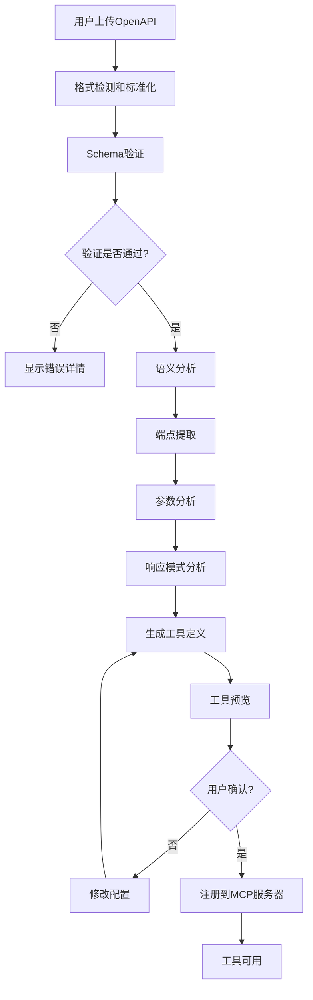

# MCP-Centered Architecture Design
# 以MCP协议转换为核心的完整架构设计方案

## 🎯 架构愿景与核心价值

### 项目使命
构建一个完整的OpenAPI到MCP(Model Context Protocol)转换生态系统，让AI助手能够通过标准化协议与REST API无缝交互，实现真正的AI-Native API集成。

### 核心价值主张
1. **AI-First设计**: 专为AI助手和大语言模型设计的API桥接方案
2. **协议标准化**: 基于MCP标准协议，确保与各种AI系统的兼容性
3. **开发体验优化**: 提供直观的可视化界面和完整的开发工具链
4. **企业级可靠性**: 支持高并发、容错、监控和扩展

## 🏗️ 系统架构总览

```
┌─────────────────────────────────────────────────────────────────────────────────┐
│                           AI Assistant Layer                                    │
│  ┌─────────────┐ ┌─────────────┐ ┌─────────────┐ ┌─────────────┐             │
│  │   Claude    │ │    GPT-4    │ │   Gemini    │ │   Custom    │             │
│  │ Integration │ │ Integration │ │ Integration │ │     LLM     │             │
│  └─────────────┘ └─────────────┘ └─────────────┘ └─────────────┘             │
└─────────────────────────┼───────────────────────────────────────────────────────┘
                          │ MCP Protocol Communication
                          ▼
┌─────────────────────────────────────────────────────────────────────────────────┐
│                        MCP Protocol Layer                                       │
│  ┌─────────────┐ ┌─────────────┐ ┌─────────────┐ ┌─────────────┐             │
│  │    STDIO    │ │     SSE     │ │ WebSocket   │ │   HTTP/2    │             │
│  │  Transport  │ │  Transport  │ │  Transport  │ │  Transport  │             │
│  └─────────────┘ └─────────────┘ └─────────────┘ └─────────────┘             │
└─────────────────────────┼───────────────────────────────────────────────────────┘
                          │ MCP Server Communication
                          ▼
┌─────────────────────────────────────────────────────────────────────────────────┐
│                    MCP Swagger Server Core                                      │
│  ┌─────────────────────────────────────────────────────────────┐               │
│  │                   MCP Tools Registry                        │               │
│  │  ┌─────────────┐ ┌─────────────┐ ┌─────────────┐          │               │
│  │  │Dynamic Tools│ │Static Tools │ │Custom Tools │          │               │
│  │  │From OpenAPI │ │Predefined   │ │User Defined │          │               │
│  │  └─────────────┘ └─────────────┘ └─────────────┘          │               │
│  └─────────────────────────────────────────────────────────────┘               │
│                                │                                               │
│  ┌─────────────────────────────────────────────────────────────┐               │
│  │                OpenAPI Processing Engine                    │               │
│  │  ┌─────────────┐ ┌─────────────┐ ┌─────────────┐          │               │
│  │  │   Parser    │ │  Validator  │ │ Transformer │          │               │
│  │  │Multi-format │ │Schema Check │ │OpenAPI→MCP │          │               │
│  │  └─────────────┘ └─────────────┘ └─────────────┘          │               │
│  └─────────────────────────────────────────────────────────────┘               │
└─────────────────────────┼───────────────────────────────────────────────────────┘
                          │ Management & Configuration
                          ▼
┌─────────────────────────────────────────────────────────────────────────────────┐
│                      Management & UI Layer                                      │
│  ┌─────────────────────────────────────────────────────────────┐               │
│  │                   Web Management UI                         │               │
│  │  ┌─────────────┐ ┌─────────────┐ ┌─────────────┐          │               │
│  │  │  OpenAPI    │ │   Config    │ │   Monitor   │          │               │
│  │  │   Editor    │ │  Manager    │ │  Dashboard  │          │               │
│  │  └─────────────┘ └─────────────┘ └─────────────┘          │               │
│  └─────────────────────────────────────────────────────────────┘               │
│                                │                                               │
│  ┌─────────────────────────────────────────────────────────────┐               │
│  │                  API Gateway Service                        │               │
│  │  ┌─────────────┐ ┌─────────────┐ ┌─────────────┐          │               │
│  │  │ RESTful API │ │   GraphQL   │ │   WebSocket │          │               │
│  │  │  Endpoints  │ │   Gateway   │ │   Events    │          │               │
│  │  └─────────────┘ └─────────────┘ └─────────────┘          │               │
│  └─────────────────────────────────────────────────────────────┘               │
└─────────────────────────┼───────────────────────────────────────────────────────┘
                          │ Data & External Services
                          ▼
┌─────────────────────────────────────────────────────────────────────────────────┐
│                     Data & Integration Layer                                    │
│  ┌─────────────┐ ┌─────────────┐ ┌─────────────┐ ┌─────────────┐             │
│  │  File Sys   │ │   Cache     │ │  External   │ │   Config    │             │
│  │   Storage   │ │   Redis     │ │    APIs     │ │   Store     │             │
│  └─────────────┘ └─────────────┘ └─────────────┘ └─────────────┘             │
└─────────────────────────────────────────────────────────────────────────────────┘
```

## 🧠 AI-Centric设计理念

### 为什么选择MCP协议？

```
传统API集成方式 vs MCP协议方式

┌─────────────────────────────────┐  ┌─────────────────────────────────┐
│        传统方式 ❌               │  │        MCP方式 ✅               │
├─────────────────────────────────┤  ├─────────────────────────────────┤
│ AI需要理解复杂的API文档          │  │ AI通过标准化工具描述理解API      │
│ 每个API都有不同的调用方式        │  │ 统一的工具调用接口              │
│ 错误处理和重试逻辑复杂          │  │ 标准化错误处理和重试机制        │
│ 安全认证方式各异                │  │ 统一的认证和授权模式            │
│ 难以进行API组合和编排           │  │ 支持工具链和复杂任务编排        │
│ 缺乏语义理解和上下文传递        │  │ 丰富的元数据和上下文支持        │
└─────────────────────────────────┘  └─────────────────────────────────┘
```

### MCP协议的AI优势

1. **语义化工具描述**: AI能够理解工具的用途、参数和返回值
2. **标准化接口**: 统一的调用方式，降低AI的学习成本
3. **上下文保持**: 支持多轮对话和状态管理
4. **错误恢复**: 标准化的错误处理让AI能够智能重试
5. **工具发现**: AI可以动态发现和学习新的API工具

## 🔄 核心转换流程设计

### OpenAPI → MCP转换管道

```
┌─────────────────────────────────────────────────────────────────────────────────┐
│                        OpenAPI Input Sources                                    │
│  ┌─────────────┐ ┌─────────────┐ ┌─────────────┐ ┌─────────────┐             │
│  │  URL Load   │ │ File Upload │ │Text Paste   │ │Live Sync    │             │
│  │swagger.json │ │ .json/.yaml │ │Manual Input │ │Auto Refresh │             │
│  └─────────────┘ └─────────────┘ └─────────────┘ └─────────────┘             │
└─────────────────────────┼───────────────────────────────────────────────────────┘
                          │ Normalization
                          ▼
┌─────────────────────────────────────────────────────────────────────────────────┐
│                     Parsing & Validation Stage                                  │
│  ┌─────────────────────────────────────────────────────────────┐               │
│  │            Multi-Format Parser (@mcp-swagger/parser)        │               │
│  │  ┌─────────────┐ ┌─────────────┐ ┌─────────────┐          │               │
│  │  │ OpenAPI 3.x │ │Swagger 2.0  │ │  Postman    │          │               │    
│  │  │   Parser    │ │   Parser    │ │  Collection │          │               │
│  │  └─────────────┘ └─────────────┘ └─────────────┘          │               │
│  └─────────────────────────────────────────────────────────────┘               │
│                                │                                               │
│  ┌─────────────────────────────────────────────────────────────┐               │
│  │                    Schema Validation                        │               │
│  │  ┌─────────────┐ ┌─────────────┐ ┌─────────────┐          │               │
│  │  │Spec Format  │ │Security     │ │Deprecation  │          │               │
│  │  │Validation   │ │Validation   │ │Detection    │          │               │
│  │  └─────────────┘ └─────────────┘ └─────────────┘          │               │
│  └─────────────────────────────────────────────────────────────┘               │
└─────────────────────────┼───────────────────────────────────────────────────────┘
                          │ Extraction & Analysis
                          ▼
┌─────────────────────────────────────────────────────────────────────────────────┐
│                      Analysis & Extraction Stage                                │
│  ┌─────────────────────────────────────────────────────────────┐               │
│  │                  Semantic Analysis                          │               │
│  │  ┌─────────────┐ ┌─────────────┐ ┌─────────────┐          │               │
│  │  │  Endpoint   │ │ Parameter   │ │  Response   │          │               │
│  │  │  Analysis   │ │ Analysis    │ │  Analysis   │          │               │
│  │  └─────────────┘ └─────────────┘ └─────────────┘          │               │
│  └─────────────────────────────────────────────────────────────┘               │
│                                │                                               │
│  ┌─────────────────────────────────────────────────────────────┐               │
│  │                 Smart Grouping & Tagging                    │               │
│  │  ┌─────────────┐ ┌─────────────┐ ┌─────────────┐          │               │
│  │  │   By Tags   │ │ By Resource │ │ By Function │          │               │
│  │  │   Group     │ │    Group    │ │    Group    │          │               │
│  │  └─────────────┘ └─────────────┘ └─────────────┘          │               │
│  └─────────────────────────────────────────────────────────────┘               │
└─────────────────────────┼───────────────────────────────────────────────────────┘
                          │ MCP Tools Generation
                          ▼
┌─────────────────────────────────────────────────────────────────────────────────┐
│                        MCP Tools Generation Stage                               │
│  ┌─────────────────────────────────────────────────────────────┐               │
│  │                  Tool Definition Generator                   │               │
│  │  ┌─────────────┐ ┌─────────────┐ ┌─────────────┐          │               │
│  │  │    Name     │ │Description  │ │   Schema    │          │               │
│  │  │ Generation  │ │ Generation  │ │ Generation  │          │               │
│  │  └─────────────┘ └─────────────┘ └─────────────┘          │               │
│  └─────────────────────────────────────────────────────────────┘               │
│                                │                                               │
│  ┌─────────────────────────────────────────────────────────────┐               │
│  │                 Handler Implementation                       │               │
│  │  ┌─────────────┐ ┌─────────────┐ ┌─────────────┐          │               │
│  │  │   HTTP      │ │ Auth Handle │ │Error Handle │          │               │
│  │  │  Execution  │ │             │ │             │          │               │
│  │  └─────────────┘ └─────────────┘ └─────────────┘          │               │
│  └─────────────────────────────────────────────────────────────┘               │
└─────────────────────────┼───────────────────────────────────────────────────────┘
                          │ MCP Server Registration
                          ▼
┌─────────────────────────────────────────────────────────────────────────────────┐
│                      MCP Server Integration                                     │
│  ┌─────────────────────────────────────────────────────────────┐               │
│  │                    Tools Registry                           │               │
│  │  ┌─────────────┐ ┌─────────────┐ ┌─────────────┐          │               │
│  │  │ Dynamic Reg │ │  Lifecycle  │ │ Hot Reload  │          │               │
│  │  │             │ │ Management  │ │             │          │               │
│  │  └─────────────┘ └─────────────┘ └─────────────┘          │               │
│  └─────────────────────────────────────────────────────────────┘               │
└─────────────────────────────────────────────────────────────────────────────────┘
```

## 🏢 三层架构详细设计

### 第一层: MCP Swagger Server (核心MCP服务)

```typescript
// 核心MCP服务器架构
class MCPSwaggerServer {
  private mcpServer: McpServer;
  private toolsRegistry: ToolsRegistry;
  private configManager: ConfigManager;
  
  constructor() {
    this.mcpServer = new McpServer({
      name: "mcp-swagger-server",
      version: "2.0.0",
      description: "Advanced OpenAPI to MCP Tools Bridge"
    });
    
    this.toolsRegistry = new ToolsRegistry();
    this.configManager = new ConfigManager();
  }
  
  // 动态工具注册
  async registerOpenAPITools(spec: OpenAPISpec, config: ConversionConfig) {
    const tools = await this.transformOpenAPIToMCPTools(spec, config);
    
    for (const tool of tools) {
      await this.toolsRegistry.register(tool);
      this.mcpServer.registerTool(tool.name, tool.definition, tool.handler);
    }
  }
  
  // 工具发现与元数据
  async getAvailableTools(): Promise<ToolMetadata[]> {
    return this.toolsRegistry.getAllToolsMetadata();
  }
  
  // 热重载支持
  async reloadConfiguration(newConfig: ServerConfig) {
    await this.configManager.update(newConfig);
    await this.refreshTools();
  }
}
```

**核心特性：**
- 🔧 **动态工具注册**: 支持运行时动态添加/移除工具
- 🔄 **热重载**: 配置变更无需重启服务
- 📊 **工具发现**: AI可以查询可用工具列表
- 🛡️ **安全管理**: 工具级别的权限控制
- 📈 **性能监控**: 工具调用统计和性能分析

### 第二层: Management API Service (管理和配置服务)

```typescript
// API网关服务架构
class ManagementAPIService {
  private express: Express;
  private mcpServerManager: MCPServerManager;
  private configService: ConfigurationService;
  
  constructor() {
    this.express = express();
    this.setupMiddlewares();
    this.setupRoutes();
  }
  
  private setupRoutes() {
    // OpenAPI管理接口
    this.express.use('/api/v1/openapi', openAPIRoutes);
    // MCP服务器管理接口  
    this.express.use('/api/v1/mcp', mcpServerRoutes);
    // 配置管理接口
    this.express.use('/api/v1/config', configRoutes);
    // 监控和统计接口
    this.express.use('/api/v1/metrics', metricsRoutes);
  }
}
```

**API接口设计：**

```yaml
# OpenAPI管理接口
POST /api/v1/openapi/parse
  - 解析OpenAPI规范
  - 返回解析结果和验证信息

POST /api/v1/openapi/validate  
  - 验证OpenAPI规范有效性
  - 返回详细的验证报告

POST /api/v1/openapi/convert
  - 转换OpenAPI为MCP工具定义
  - 支持自定义转换配置

# MCP服务器管理接口
GET /api/v1/mcp/servers
  - 获取MCP服务器列表和状态

POST /api/v1/mcp/servers
  - 创建新的MCP服务器实例

PUT /api/v1/mcp/servers/:id/tools
  - 更新服务器的工具配置

GET /api/v1/mcp/tools
  - 获取所有可用工具列表

# 配置管理接口
GET /api/v1/config/profiles
  - 获取配置文件列表

POST /api/v1/config/profiles
  - 创建新的配置文件

PUT /api/v1/config/profiles/:id
  - 更新配置文件

# 监控和统计接口
GET /api/v1/metrics/tools
  - 获取工具使用统计

GET /api/v1/metrics/performance
  - 获取性能指标

GET /api/v1/metrics/health
  - 健康检查接口
```

### 第三层: Web Management UI (可视化管理界面)

```vue
<!-- 主要组件架构 -->
<template>
  <div class="mcp-management-console">
    <!-- 顶部导航 -->
    <McpNavigation />
    
    <!-- 主要内容区域 -->
    <div class="main-content">
      <!-- 侧边栏 -->
      <McpSidebar />
      
      <!-- 内容区域 -->
      <router-view>
        <!-- OpenAPI管理页面 -->
        <OpenAPIManager />
        
        <!-- MCP服务器监控页面 -->
        <MCPServerDashboard />
        
        <!-- 工具配置页面 -->
        <ToolsConfiguration />
        
        <!-- 性能监控页面 -->
        <PerformanceMonitor />
      </router-view>
    </div>
  </div>
</template>
```

**UI功能模块：**

1. **OpenAPI编辑器**
   - 支持JSON/YAML格式
   - 实时语法检查
   - 智能补全
   - 预览和验证

2. **MCP工具预览**
   - 工具列表展示
   - 参数和返回值预览
   - 测试工具调用
   - 工具文档生成

3. **服务器监控面板**
   - 实时状态监控
   - 性能指标图表
   - 错误日志查看
   - 调用统计分析

4. **配置管理界面**
   - 可视化配置编辑
   - 配置文件版本管理
   - 配置模板和预设
   - 批量配置操作

## 🔄 完整工作流程

### 1. OpenAPI导入和解析流程



### 2. MCP工具生成策略

```typescript
interface ToolGenerationStrategy {
  // 工具命名策略
  naming: {
    pattern: 'path-based' | 'operation-id' | 'custom';
    prefix?: string;
    suffix?: string;
    casing: 'camelCase' | 'snake_case' | 'kebab-case';
  };
  
  // 参数处理策略
  parameters: {
    queryParams: 'flatten' | 'group' | 'optional';
    pathParams: 'required' | 'validate-type';
    bodyParams: 'direct' | 'wrapped' | 'schema-ref';
  };
  
  // 响应处理策略
  responses: {
    format: 'raw' | 'structured' | 'typed';
    errorHandling: 'throw' | 'return-error' | 'structured';
    caching: boolean;
  };
  
  // 安全策略
  security: {
    authRequired: boolean;
    scopeValidation: boolean;
    rateLimiting: boolean;
  };
}
```

### 3. 智能工具分组

```typescript
class IntelligentToolGrouping {
  // 基于语义的分组
  async groupBySemantics(tools: MCPTool[]): Promise<ToolGroup[]> {
    const groups: ToolGroup[] = [];
    
    // 按资源类型分组
    const resourceGroups = this.groupByResource(tools);
    
    // 按操作类型分组  
    const operationGroups = this.groupByOperation(tools);
    
    // 按业务领域分组
    const domainGroups = this.groupByDomain(tools);
    
    return this.mergeGroups([resourceGroups, operationGroups, domainGroups]);
  }
  
  // 生成工具关系图
  async generateToolRelationships(tools: MCPTool[]): Promise<ToolRelationshipGraph> {
    // 分析工具之间的依赖关系
    // 识别常用工具组合
    // 构建推荐使用流程
  }
}
```

## 🚀 AI-Native特性设计

### 1. 智能工具发现

```typescript
class AIToolDiscovery {
  // 基于自然语言的工具搜索
  async searchToolsByIntent(intent: string): Promise<MCPTool[]> {
    // 使用语义搜索匹配工具描述
    const semanticMatches = await this.semanticSearch(intent);
    
    // 分析用户意图
    const intentAnalysis = await this.analyzeIntent(intent);
    
    // 返回最相关的工具
    return this.rankTools(semanticMatches, intentAnalysis);
  }
  
  // 工具使用建议
  async suggestToolUsage(context: ConversationContext): Promise<ToolSuggestion[]> {
    // 基于对话上下文推荐工具
    // 考虑历史使用模式
    // 提供使用示例
  }
}
```

### 2. 上下文感知执行

```typescript
class ContextAwareExecution {
  // 智能参数推断
  async inferParameters(tool: MCPTool, context: ExecutionContext): Promise<ToolParameters> {
    // 从对话上下文中提取参数
    // 使用历史调用数据
    // 应用默认值和约束
  }
  
  // 执行结果优化
  async optimizeResults(result: ToolResult, context: ExecutionContext): Promise<OptimizedResult> {
    // 格式化为AI友好的格式
    // 提取关键信息
    // 生成结果摘要
  }
}
```

### 3. 学习和适应机制

```typescript
class AdaptiveLearning {
  // 使用模式学习
  async learnUsagePatterns(usage: ToolUsageData[]): Promise<UsageInsights> {
    // 分析工具使用频率
    // 识别常用参数组合
    // 发现工具调用序列
  }
  
  // 性能优化建议
  async generateOptimizationSuggestions(metrics: PerformanceMetrics): Promise<OptimizationSuggestion[]> {
    // 基于性能数据提供优化建议
    // 识别瓶颈和改进点
    // 推荐配置调整
  }
}
```

## 📊 企业级特性

### 1. 高可用性设计

```yaml
# Kubernetes部署配置
apiVersion: apps/v1
kind: Deployment
metadata:
  name: mcp-swagger-server
spec:
  replicas: 3
  strategy:
    type: RollingUpdate
    rollingUpdate:
      maxSurge: 1
      maxUnavailable: 0
  template:
    spec:
      containers:
      - name: mcp-server
        image: mcp-swagger-server:latest
        ports:
        - containerPort: 3322
        livenessProbe:
          httpGet:
            path: /health
            port: 3322
          initialDelaySeconds: 30
          periodSeconds: 10
        readinessProbe:
          httpGet:
            path: /ready
            port: 3322
          initialDelaySeconds: 5
          periodSeconds: 5
        resources:
          requests:
            memory: "256Mi"
            cpu: "250m"
          limits:
            memory: "512Mi"
            cpu: "500m"
```

### 2. 监控和可观测性

```typescript
class ObservabilityStack {
  // 指标收集
  setupMetrics() {
    // Prometheus指标
    this.setupPrometheusMetrics();
    
    // 自定义业务指标
    this.setupCustomMetrics();
  }
  
  // 链路追踪
  setupTracing() {
    // OpenTelemetry集成
    this.setupOpenTelemetry();
    
    // 工具调用链追踪
    this.setupToolCallTracing();
  }
  
  // 日志聚合
  setupLogging() {
    // 结构化日志
    this.setupStructuredLogging();
    
    // 日志聚合和搜索
    this.setupLogAggregation();
  }
}
```

### 3. 安全性设计

```typescript
class SecurityFramework {
  // 认证和授权
  setupAuth() {
    // JWT认证
    this.setupJWTAuth();
    
    // RBAC权限控制
    this.setupRBAC();
    
    // API密钥管理
    this.setupAPIKeyManagement();
  }
  
  // 数据保护
  setupDataProtection() {
    // 数据加密
    this.setupEncryption();
    
    // 敏感数据脱敏
    this.setupDataMasking();
    
    // 审计日志
    this.setupAuditLogging();
  }
}
```

## 🛣️ 实施路线图

### Phase 1: 核心架构重构 (2-3周)

```
Week 1-2: MCP Server核心重构
├── 重新设计MCP Server架构
├── 实现动态工具注册机制
├── 添加工具生命周期管理
└── 实现基础监控和日志

Week 3: Management API开发
├── 设计和实现RESTful API
├── 添加OpenAPI解析和验证接口
├── 实现配置管理接口
└── 集成认证和授权
```

### Phase 2: 智能化特性开发 (3-4周)

```
Week 4-5: AI-Native特性
├── 实现智能工具发现
├── 添加上下文感知执行
├── 开发参数推断机制
└── 实现结果优化

Week 6-7: 学习和适应
├── 实现使用模式学习
├── 添加性能优化建议
├── 开发智能配置推荐
└── 实现A/B测试框架
```

### Phase 3: 企业级特性 (2-3周)

```
Week 8-9: 高可用性和监控
├── 实现集群部署支持
├── 添加健康检查和自动恢复
├── 集成监控和告警系统
└── 实现性能基准测试

Week 10: 安全性和合规
├── 实现企业级安全特性
├── 添加审计和合规支持
├── 实现数据保护机制
└── 安全漏洞扫描和修复
```

### Phase 4: UI和用户体验 (2-3周)

```
Week 11-12: Web UI重构
├── 设计现代化的管理界面
├── 实现实时监控面板
├── 添加可视化配置编辑器
└── 集成工具测试和调试

Week 13: 文档和培训
├── 完善API文档和SDK
├── 制作用户指南和教程
├── 录制演示视频
└── 准备技术支持材料
```

## 🎯 成功指标

### 技术指标
- **性能**: 工具调用延迟 < 100ms (P95)
- **可用性**: 系统可用性 > 99.9%
- **扩展性**: 支持 > 1000个并发MCP连接
- **准确性**: OpenAPI解析成功率 > 99%

### 用户体验指标
- **易用性**: 新用户完成首次配置时间 < 5分钟
- **效率**: AI工具发现准确率 > 90%
- **满意度**: 用户满意度评分 > 4.5/5
- **采用率**: 企业用户留存率 > 85%

## 💡 创新亮点

1. **AI-First架构**: 专为AI助手设计的API桥接方案
2. **智能工具发现**: 基于自然语言的工具搜索和推荐
3. **上下文感知**: 智能参数推断和结果优化
4. **学习适应**: 基于使用模式的持续优化
5. **企业就绪**: 高可用、安全、可监控的生产级方案

这个架构设计将OpenAPI到MCP的转换提升到了一个全新的高度，不仅仅是简单的协议转换，而是构建了一个完整的AI-Native API生态系统，为AI助手与现有API的集成提供了最佳实践和企业级解决方案。
